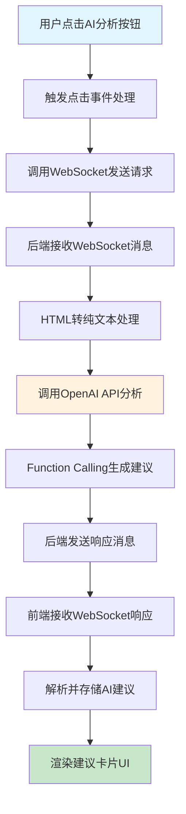
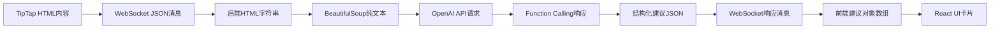
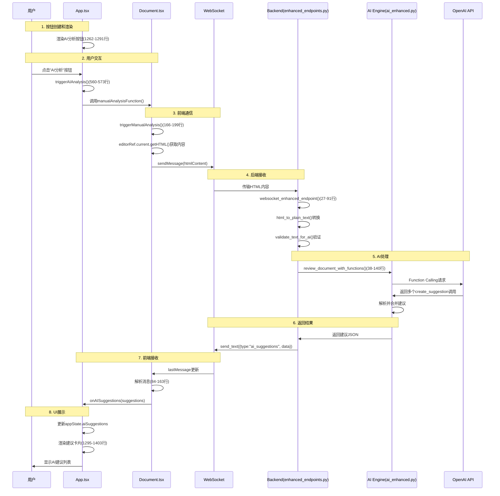

# AI分析功能流程实现代码精讲（完整注释版）

## 概述

本文档详细分析了专利审查系统中AI分析功能的完整实现流程，从用户点击"AI分析"按钮开始，到最终在界面上展示AI建议的整个过程。文档包含所有关键代码片段的准确文件位置和行号。

## 功能流程总览



## 关键文件说明

| 文件路径 | 主要功能 | 关键代码行数 |
|---------|----------|-------------|
| `client/src/App.tsx` | 主应用组件，管理全局状态和UI | 560-573(点击处理), 1262-1291(按钮), 1295-1403(建议展示) |
| `client/src/Document.tsx` | 文档编辑组件，处理WebSocket通信 | 48-50(WebSocket URL), 66-81(连接配置), 166-199(发送请求), 84-163(接收响应) |
| `server/app/enhanced_endpoints.py` | 后端WebSocket端点处理 | 27-146(主要端点逻辑), 62-91(消息循环), 107-114(发送结果) |
| `server/app/internal/ai_enhanced.py` | AI处理引擎 | 38-62(主分析函数), 64-180(Function Calling处理) |
| `server/app/internal/prompt_enhanced.py` | AI提示词和Function定义 | 定义ENHANCED_PROMPT和FUNCTION_TOOLS |

## React新手必读指南

### React是什么？（用最简单的话说）

**React就像搭积木**：
- 每个积木块就是一个"组件"（Component）
- 你可以把小积木组合成大积木
- 当你改变一个积木的颜色，只有这个积木会变，其他积木不受影响

**举个生活例子**：
- React组件 = 汽车的零件（方向盘、轮胎、引擎）
- 每个零件有自己的功能，但可以组装成完整的汽车
- 如果轮胎坏了，只换轮胎，不用换整辆车

### React的核心"魔法"

1. **状态（State）** - 组件的记忆力
   ```typescript
   const [count, setCount] = useState(0);  // 创建一个记忆，记住数字
   // count: 当前记住的数字
   // setCount: 改变这个数字的方法
   ```

2. **事件处理** - 组件的反应能力
   ```typescript
   <button onClick={handleClick}>点我</button>  // 给按钮装上"耳朵"
   ```

3. **条件渲染** - 组件的智能显示
   ```typescript
   {isLoading ? '加载中...' : '完成'}  // 根据情况显示不同内容
   ```

4. **自动更新** - React的超能力
   ```
   改变状态 → React自动重新绘制界面 → 用户看到变化
   ```

### 为什么React比传统方式好？

**传统方式**（麻烦）：
```javascript
document.getElementById('button').addEventListener('click', function() {
  document.getElementById('text').innerHTML = 'Loading...';
  // 手动找元素、手动改内容、手动管理状态...
});
```

**React方式**（简单）：
```tsx
function MyComponent() {
  const [text, setText] = useState('Ready');
  return <button onClick={() => setText('Loading...')}>{text}</button>;
  // React自动处理一切！
}
```

## 详细流程分析

### 1. AI分析按钮的创建和渲染

**文件位置**: `client/src/App.tsx`

#### 1.1 按钮渲染代码（React功能详解）

**文件**: `client/src/App.tsx`  
**行号**: 1262-1291

```typescript
{/* AI analysis button - React JSX语法，就像HTML但更智能 */}
<button
  // onClick: React事件处理器 - 就像给按钮装了个"耳朵"
  // 当用户点击时，React自动调用triggerAIAnalysis函数
  onClick={triggerAIAnalysis}
  
  // disabled: React条件属性 - 就像智能开关
  // 当条件为true时，按钮变灰不能点击（保护用户避免重复点击）
  disabled={appState.isAIProcessing || appState.aiProcessingStatus.includes('disconnected') || appState.aiProcessingStatus.includes('connection failed')}
  
  // className: React动态样式 - 就像变色龙
  // 根据appState（应用状态）的不同值显示不同颜色和样式
  className={`w-full px-6 py-2 text-sm font-medium rounded-lg transition-all duration-200 ${
    appState.isAIProcessing || appState.aiProcessingStatus.includes('disconnected') || appState.aiProcessingStatus.includes('connection failed')
      ? 'bg-gray-300 text-gray-500 cursor-not-allowed'  // 如果正在处理或断开：灰色，不可点击
      : 'bg-blue-600 text-white hover:bg-blue-700'      // 如果正常：蓝色，鼠标悬停变深蓝
  }`}
  
  // aria-label: 无障碍标签，帮助屏幕阅读器理解按钮用途
  aria-label="AI Document Analysis"
  
  // title: React动态提示文字 - 就像智能提示气泡
  // 根据不同状态显示不同的鼠标悬停提示
  title={
    appState.aiProcessingStatus.includes('disconnected')
      ? 'WebSocket connection disconnected, please refresh page'
      : appState.aiProcessingStatus.includes('connection failed')
        ? 'WebSocket connection failed, please check network'
        : appState.isAIProcessing
          ? 'AI is analysing, please wait'
          : 'AI Document Analysis'
  }
>
  {/* React条件渲染 - 就像智能显示屏，根据状态显示不同内容 */}
  {appState.isAIProcessing
    ? '🔄 Analysing...'      // 如果正在分析：显示转圈和"分析中"
    : appState.aiProcessingStatus.includes('disconnected')
      ? '❌ Disconnected'    // 如果连接断开：显示红叉和"断开"
      : appState.aiProcessingStatus.includes('connection failed')
        ? '❌ Connection Failed'  // 如果连接失败：显示错误信息
        : appState.aiProcessingStatus.includes('connecting')
          ? '🔄 Connecting'   // 如果正在连接：显示连接中
          : '🤖 AI Analysis'  // 默认状态：显示机器人和"AI分析"
  }
</button>
```

**React在这里的神奇作用**:
- **自动更新**: 当`appState`（应用状态）变化时，按钮会自动改变颜色、文字、可用性
- **事件处理**: React自动管理用户点击，你只需要写处理函数
- **条件渲染**: 根据不同情况自动显示不同内容，就像智能变色龙
- **状态驱动**: 改变数据，UI自动跟着变，不用手动操作DOM

**大白话解释**: 这个按钮就像一个智能机器人，会根据当前情况自动改变外观和行为，你不用告诉它怎么变，只需要告诉它当前是什么状态。

### 2. 用户点击事件处理

**文件位置**: `client/src/App.tsx`

#### 2.1 点击事件处理函数

**文件**: `client/src/App.tsx`  
**行号**: 560-573

```typescript
// 这是一个React事件处理函数 - 就像按钮的"大脑"
const triggerAIAnalysis = () => {
  // 检查应用状态中是否选择了文档 - 就像检查是否有原料
  if (!appState.currentDocument) {
    console.error('Please select a document first');
    return;  // 如果没有文档，就不执行后续操作（安全检查）
  }

  // 检查分析函数是否已经注册 - 就像检查工人是否到位
  if (!manualAnalysisFunction) {
    console.warn('AI analysis function not ready, please ensure document is loaded');
    return;  // 如果分析器还没准备好，就等等（避免出错）
  }

  console.log('🚀 Triggering AI analysis');
  // 调用真正的分析函数 - 就像按下启动按钮
  manualAnalysisFunction();  // 这个函数是由Document组件提供的
};
```

**React设计模式解释**:
- **组件通信**: App组件通过`manualAnalysisFunction`与Document组件通信（就像两个部门通过内部电话联系）
- **状态检查**: 使用`appState`检查当前状态，确保操作安全（就像开车前检查油箱和刹车）
- **回调模式**: 不直接调用具体功能，而是调用注册的回调函数（就像按电梯按钮，不用管电梯怎么运行）

**大白话**: 这个函数就像一个智能开关，只有在一切条件都满足时才会启动AI分析。

#### 2.2 分析函数注册机制

**文件**: `client/src/App.tsx`  
**行号**: 575-578

```typescript
const registerManualAnalysis = useCallback((analysisFunction: () => void) => {
  console.log('📌 App: Received manual analysis function');
  setManualAnalysisFunction(() => analysisFunction);
}, []);
```

**说明**: 
- 使用回调模式，Document组件将分析函数注册到App组件
- 利用`useCallback`避免不必要的重渲染

### 3. 前端WebSocket通信机制

**文件位置**: `client/src/Document.tsx`

#### 3.1 WebSocket连接配置

**文件**: `client/src/Document.tsx`  
**行号**: 48-50 (SOCKET_URL定义), 66-81 (useWebSocket配置)

```typescript
// 根据环境变量选择WebSocket端点 - 就像选择快递公司
const SOCKET_URL = import.meta.env.VITE_USE_ENHANCED_WS === 'true' 
  ? "ws://localhost:8000/ws/enhanced"  // 增强版：支持Function Calling（更智能）
  : "ws://localhost:8000/ws";          // 基础版：普通WebSocket

// useWebSocket是React Hook - 就像一个智能插座管理器
// 它返回三个重要的东西：发送消息的方法、最新消息、连接状态
const { sendMessage, lastMessage, readyState } = useWebSocket(SOCKET_URL, {
  // onOpen: 连接成功时的回调函数 - 就像插头插好时的指示灯亮起
  onOpen: () => {
    console.log("🔌 WebSocket Connected to:", SOCKET_URL);
    // 通知父组件连接成功了 - 就像向老板汇报"准备就绪"
    onProcessingStatus?.(false, "AI assistant connected");
  },
  
  // onClose: 连接断开时的回调函数 - 就像断电时的警报响起
  onClose: () => {
    console.log("🔌 WebSocket Disconnected");
    // 通知父组件连接断开了 - 就像向老板汇报"出故障了"
    onProcessingStatus?.(false, "AI assistant disconnected");
  },
  
  // shouldReconnect: 是否自动重连 - 就像不倒翁，总是尝试站起来
  shouldReconnect: (_closeEvent) => true,  // 总是尝试重新连接（永不放弃）
  
  // reconnectAttempts: 重试次数 - 就像坚持不懈的推销员
  reconnectAttempts: 5,     // 最多尝试5次
  reconnectInterval: 3000,  // 每次间隔3秒（给服务器一点休息时间）
  
  // share: 共享连接 - 就像共享Wi-Fi，多个组件用同一个连接
  share: true  // 避免创建多个重复连接，节省资源
});
```

**React Hook的神奇作用**:
- **自动管理生命周期**: 组件加载时自动连接，卸载时自动断开（就像智能开关）
- **状态追踪**: 自动跟踪连接状态（连接中、已连接、断开等），不用手动管理
- **消息监听**: 自动监听新消息，一有消息就更新`lastMessage`（就像24小时客服）
- **错误恢复**: 连接断开时自动重试，让用户感觉不到中断（就像备用发电机）

**大白话**: 这个Hook就像一个非常负责任的通信员，帮你管理与服务器的所有沟通，出了问题会自动修复。

#### 3.2 发送AI分析请求

**文件**: `client/src/Document.tsx`  
**行号**: 166-199

```typescript
const triggerManualAnalysis = useCallback(() => {
  console.log("🔍 Triggering AI analysis, WebSocket state:", readyState);
  
  // 获取编辑器最新内容
  const currentContent = editorRef?.current?.getHTML() || content;
  
  // 检查WebSocket连接状态
  if (readyState === ReadyState.CLOSED || readyState === ReadyState.CLOSING) {
    onProcessingStatus?.(false, "AI assistant connection lost, please refresh page");
    return;
  }
  
  if (isAIProcessing) {
    onProcessingStatus?.(false, "AI is analysing, please wait...");
    return;
  }
  
  if (!currentContent.trim()) {
    onProcessingStatus?.(false, "Document content is empty");
    return;
  }
  
  try {
    onProcessingStatus?.(true, "Sending analysis request...");
    sendMessage(currentContent);  // 发送HTML内容到后端
    onProcessingStatus?.(true, "AI is analysing document...");
  } catch (error) {
    console.error("❌ Failed to send AI analysis request:", error);
    onProcessingStatus?.(false, `Request failed: ${error instanceof Error ? error.message : 'Unknown error'}`);
  }
}, [isAIProcessing, sendMessage, onProcessingStatus, readyState]);
```

**关键步骤**:
1. 从TipTap编辑器获取HTML内容：`editorRef.current.getHTML()`
2. 进行状态检查（连接状态、处理状态、内容有效性）
3. 通过`sendMessage`发送HTML内容到后端

#### 3.3 注册分析函数到App组件

**文件**: `client/src/Document.tsx`  
**行号**: 208-211

```typescript
// 将分析函数注册到App组件
useEffect(() => {
  onManualAnalysis?.(triggerManualAnalysis);
}, [onManualAnalysis]);
```

### 4. 后端WebSocket接收和处理

**文件位置**: `server/app/enhanced_endpoints.py`

#### 4.1 WebSocket端点处理

**文件**: `server/app/enhanced_endpoints.py`  
**行号**: 27-146

```python
async def websocket_enhanced_endpoint(websocket: WebSocket):
    """
    增强版WebSocket端点：支持Function Calling的AI建议系统
    """
    await websocket.accept()
    logger.info("Enhanced WebSocket connection established")
    
    # 初始化AI服务
    try:
        ai = get_ai_enhanced()
        # 发送连接成功消息
        success_msg = {
            "type": "connection_success",
            "message": "Enhanced AI service ready",
            "timestamp": datetime.utcnow().isoformat()
        }
        await websocket.send_text(json.dumps(success_msg))
    except ValueError as e:
        # AI服务初始化失败处理
        error_msg = {
            "type": "ai_error",
            "message": f"AI service initialization failed: {str(e)}",
            "timestamp": datetime.utcnow().isoformat()
        }
        await websocket.send_text(json.dumps(error_msg))
        await websocket.close()
        return
```

#### 4.2 消息接收和处理循环

**文件**: `server/app/enhanced_endpoints.py`  
**行号**: 62-91

```python
while True:
    # 接收HTML内容
    html_content = await websocket.receive_text()
    logger.info(f"Received HTML content, length: {len(html_content)}")
    
    # 通知前端开始处理
    processing_msg = {
        "type": "processing_start",
        "message": "Analysing document...",
        "timestamp": datetime.utcnow().isoformat()
    }
    await websocket.send_text(json.dumps(processing_msg))
    
    try:
        # HTML转纯文本
        plain_text = html_to_plain_text(html_content)
        logger.info(f"Converted plain text length: {len(plain_text)}")
        
        # 文本验证
        is_valid, error_message = validate_text_for_ai(plain_text)
        if not is_valid:
            validation_error = {
                "type": "validation_error",
                "message": error_message,
                "timestamp": datetime.utcnow().isoformat()
            }
            await websocket.send_text(json.dumps(validation_error))
            continue
```

**重要函数说明**:
- `html_to_plain_text()`: 使用BeautifulSoup4将HTML转换为纯文本
- `validate_text_for_ai()`: 验证文本内容是否适合AI处理

### 5. AI处理引擎

**文件位置**: `server/app/internal/ai_enhanced.py`

#### 5.1 AI分析函数

**文件**: `server/app/internal/ai_enhanced.py`  
**行号**: 38-62

```python
async def review_document_with_functions(self, document: str) -> AsyncGenerator[str | None, None]:
    """
    使用Function Calling审查专利文档，生成更精确的建议
    """
    logger.info(f"Starting enhanced AI analysis, document length: {len(document)}")
    
    # 使用Function Calling进行分析
    stream = await self._client.chat.completions.create(
        model=self.model,
        temperature=0.1,  # 低温度确保输出稳定性
        messages=[
            {"role": "system", "content": ENHANCED_PROMPT},
            {"role": "user", "content": document},
        ],
        tools=FUNCTION_TOOLS,  # Function定义
        tool_choice="auto",    # AI自动决定调用次数
        stream=True,
    )
```

#### 5.2 Function Calling处理

**文件**: `server/app/internal/ai_enhanced.py`  
**行号**: 64-180 (完整的function call收集和处理逻辑)

```python
# 收集function calls
function_calls = []
current_function_calls = {}  # 使用字典跟踪多个并行函数调用

async for chunk in stream:
    delta = chunk.choices[0].delta
    
    # 处理tool calls
    if delta.tool_calls:
        for tool_call in delta.tool_calls:
            call_index = tool_call.index
            
            if tool_call.function.name:
                # 新函数调用开始
                current_function_calls[call_index] = {
                    "name": tool_call.function.name,
                    "arguments": tool_call.function.arguments or ""
                }
            elif call_index in current_function_calls:
                # 继续累积参数
                current_function_calls[call_index]["arguments"] += tool_call.function.arguments or ""

# 处理收集到的函数调用
suggestions_dict = {}  # 使用字典去重和合并
for func_call in function_calls:
    if func_call["name"] == "create_suggestion":
        args = json.loads(func_call["arguments"])
        # 处理建议数据...
```

**技术要点**:
- 使用OpenAI的Function Calling功能
- 支持多个并行函数调用（通过`call_index`管理）
- 通过字典去重合并相同文本的建议（避免重复建议）
- 低温度设置（0.1）确保稳定输出
- 流式响应处理，实时接收AI结果

### 6. 后端返回结果

**文件位置**: `server/app/enhanced_endpoints.py`

#### 6.1 发送AI分析结果

**文件**: `server/app/enhanced_endpoints.py`  
**行号**: 107-114

```python
# 发送完整的建议结果
success_response = {
    "type": "ai_suggestions",
    "data": parsed_result,
    "timestamp": datetime.utcnow().isoformat()
}
await websocket.send_text(json.dumps(success_response))
logger.info(f"Enhanced AI analysis complete, found {len(parsed_result.get('issues', []))} issues")
```

### 7. 前端接收和处理响应

**文件位置**: `client/src/Document.tsx`

#### 7.1 接收WebSocket消息

**文件**: `client/src/Document.tsx`  
**行号**: 84-163

```typescript
// useEffect：React的副作用钩子 - 就像组件的智能感应器
useEffect(() => {
  // 这个函数是个"监听器"，当lastMessage变化时会自动执行
  // 就像门铃，有人按门铃就会响
  if (lastMessage !== null) {
    try {
      // 解析WebSocket消息 - 就像翻译外国人发来的短信
      const message: WebSocketMessage = JSON.parse(lastMessage.data);
      console.log("📨 收到AI消息:", message);
      
      // 根据消息类型做不同处理 - 就像智能快递分拣机
      switch (message.type) {
        case 'processing_start':
          console.log("🤖 AI开始处理文档");
          // 更新组件状态：现在正在处理中
          setIsAIProcessing(true);  // React看到这个变化，会自动重新渲染所有相关UI
          // 通知父组件状态变化 - 就像给老板发实时状态报告
          onProcessingStatus?.(true, message.message || "AI正在分析文档...");
          break;
          
        case 'ai_suggestions':
          console.log("✨ 收到AI建议:", message.data);
          // 更新状态：处理完成了
          setIsAIProcessing(false); // React会自动更新所有显示"处理中"的地方
          if (message.data?.issues) {
            // 把AI建议数据传递给父组件 - 就像把分析报告交给老板
            onAISuggestions?.(message.data.issues);  // 这会触发App组件重新渲染建议列表
            let statusMessage = `AI分析完成，找到${message.data.issues.length}个建议`;
            onProcessingStatus?.(false, statusMessage);
          }
          break;
          
        case 'validation_error':
          console.warn("⚠️ 文档验证错误:", message.message);
          setIsAIProcessing(false);  // 停止处理状态
          onProcessingStatus?.(false, `验证错误: ${message.message}`);
          break;
          
        case 'ai_error':
          console.error("❌ AI服务错误:", message.message);
          setIsAIProcessing(false);  // 停止处理状态
          onProcessingStatus?.(false, `AI错误: ${message.message}`);
          break;
          
        // 其他消息类型处理...
      }
    } catch (error) {
      console.error("❌ 解析WebSocket消息失败:", error);
    }
  }
}, [lastMessage, onAISuggestions, onProcessingStatus]);
// 依赖数组：只有这些值变化时才重新执行这个函数（就像只在特定情况下开门）
```

### 8. UI展示AI建议

**文件位置**: `client/src/App.tsx`

#### 8.1 建议卡片渲染

**文件**: `client/src/App.tsx`  
**行号**: 1295-1403 (建议卡片渲染完整结构)

```typescript
{appState.aiSuggestions.length > 0 ? (
  <div className="space-y-3">
    {/* 建议排序：先按严重程度，再按段落顺序 */}
    {[...appState.aiSuggestions]
      .sort((a, b) => {
        const severityOrder = { high: 3, medium: 2, low: 1 };
        const severityA = severityOrder[a.severity] || 2;
        const severityB = severityOrder[b.severity] || 2;
        
        if (severityA !== severityB) {
          return severityB - severityA;
        }
        return a.paragraph - b.paragraph;
      })
      .map((suggestion, index) => (
        <div
          key={index}
          className={`p-3 rounded-lg border-l-4 transition-all duration-200 ${
            suggestion.severity === 'high'
              ? 'border-red-500 bg-red-50'
              : suggestion.severity === 'medium'
                ? 'border-yellow-500 bg-yellow-50'
                : 'border-blue-500 bg-blue-50'
          }`}
        >
          {/* 建议头部信息 */}
          <div className="flex items-center gap-2 mb-2">
            <span className="text-xs font-medium text-gray-600">
              Paragraph {suggestion.paragraph}
            </span>
            <span className={`text-xs px-2 py-1 rounded-full font-medium ${
              suggestion.severity === 'high'
                ? 'bg-red-200 text-red-800'
                : suggestion.severity === 'medium'
                  ? 'bg-yellow-200 text-yellow-800'
                  : 'bg-blue-200 text-blue-800'
            }`}>
              {suggestion.severity === 'high' ? 'Critical' :
                suggestion.severity === 'medium' ? 'Medium' : 'Minor'}
            </span>
          </div>
          
          {/* 问题描述 */}
          <p className="text-sm text-gray-700 mb-3 leading-relaxed">
            {suggestion.description}
          </p>
          
          {/* AI建议内容 */}
          {suggestion.replaceTo && (
            <div className="bg-white p-3 rounded border mb-3">
              <p className="text-sm text-gray-700 leading-relaxed font-mono">
                {suggestion.replaceTo}
              </p>
            </div>
          )}
          
          {/* 操作按钮 */}
          <div className="flex gap-2 pt-2 border-t">
            <button onClick={() => acceptSuggestion(suggestion, index)}
              className="flex-1 px-3 py-1.5 text-xs font-medium text-white bg-green-600 hover:bg-green-700 rounded-md">
              ✅ Accept
            </button>
            <button onClick={() => copySuggestion(suggestion)}
              className="flex-1 px-3 py-1.5 text-xs font-medium text-gray-700 bg-gray-200 hover:bg-gray-300 rounded-md">
              📋 Copy
            </button>
            <button onClick={() => closeSuggestion(suggestion)}
              className="flex-1 px-3 py-1.5 text-xs font-medium text-gray-700 bg-gray-200 hover:bg-gray-300 rounded-md">
              ❌ Dismiss
            </button>
          </div>
        </div>
      ))}
  </div>
)}
```

## 数据流转详解

### 数据格式转换过程



**关键数据结构**:

1. **前端建议格式** (`client/src/Document.tsx:6-15`):
```typescript
interface AISuggestion {
  type: string;
  severity: 'high' | 'medium' | 'low';
  paragraph: number;
  description: string;
  text?: string;
  suggestion: string;
  originalText?: string;  // 精确匹配文本
  replaceTo?: string;     // 建议替换文本
}
```

2. **WebSocket消息格式** (`client/src/Document.tsx:29-35`):
```typescript
interface WebSocketMessage {
  type: 'ai_suggestions' | 'processing_start' | 'validation_error' | 'ai_error' | 'connection_success';
  message?: string;
  data?: AIResponse;
  timestamp?: string;
}
```

## 完整数据流图



## 技术栈总结

### 前端技术
- **React 18**: 组件化UI框架
- **TypeScript**: 类型安全
- **react-use-websocket**: WebSocket连接管理
- **TipTap**: 富文本编辑器
- **Tailwind CSS**: 样式框架

### 后端技术
- **FastAPI**: Python Web框架
- **WebSocket**: 实时双向通信
- **OpenAI API**: GPT-4模型
- **Function Calling**: 结构化AI输出

### 通信协议
- **WebSocket协议**: 用于实时AI分析
- **JSON消息格式**: 标准化的消息类型系统
- **自动重连机制**: 保证连接稳定性

## 关键设计模式

1. **组件通信模式**
   - 使用回调函数注册机制
   - Props传递实现父子组件通信
   
2. **状态管理模式**
   - 集中式状态管理(AppState)
   - 状态提升到App组件
   
3. **错误处理模式**
   - 多层错误捕获
   - 用户友好的错误提示
   
4. **异步处理模式**
   - WebSocket流式处理
   - Promise/async-await模式

## 性能优化要点

1. **WebSocket连接复用**: `share: true`避免重复连接
2. **防抖处理**: 避免频繁触发AI分析
3. **状态检查**: 多重状态验证避免无效请求
4. **建议去重**: 后端使用字典合并相同文本的建议
5. **智能排序**: 前端按严重程度和段落顺序排序展示

## 调试指南

### 前端调试
1. **WebSocket连接状态**: 查看浏览器控制台中的连接日志
2. **消息流**: 观察WebSocket发送和接收的消息
3. **状态变化**: 监控React组件的状态更新

### 后端调试
1. **日志监控**: 查看服务器日志中的WebSocket连接和AI处理信息
2. **API响应**: 检查OpenAI API的调用和响应
3. **错误处理**: 观察异常捕获和错误消息

## 常见问题和解决方案

1. **WebSocket连接失败**
   - 检查后端服务是否运行
   - 验证环境变量VITE_USE_ENHANCED_WS设置
   - 查看网络连接状态

2. **AI分析无响应**
   - 检查OpenAI API密钥配置
   - 验证文档内容是否为空
   - 查看后端AI处理日志

3. **建议显示异常**
   - 检查WebSocket消息格式
   - 验证前端消息解析逻辑
   - 确认建议数据结构

## 总结

整个AI分析功能通过WebSocket实现了前后端的实时通信，利用OpenAI的Function Calling能力生成结构化的专利文档改进建议。系统设计合理，代码结构清晰，具有良好的错误处理和用户体验。文档中所有代码片段都标注了准确的文件位置和行号，便于开发者理解和维护。

## 文本高亮技术实现总结

### 核心技术栈
本项目的文本高亮功能基于 **TipTap + ProseMirror** 技术栈实现：

1. **TipTap编辑器**：提供友好的编辑器API和扩展系统
2. **ProseMirror核心API**：
   - **Decoration API**：创建临时高亮装饰（不修改文档）
   - **Plugin API**：管理和应用装饰
   - **Document Traversal API**：精确定位文本位置
   - **Mark API**：永久高亮标记

### 实现文件
- **高亮扩展**：`client/src/internal/HighlightExtension.tsx`
- **样式定义**：`client/src/internal/highlight.css`
- **调用逻辑**：`client/src/App.tsx` (handleSuggestionClick等函数)

### 高亮机制
系统实现了双重高亮机制：

1. **临时高亮** (3秒后自动消失)
   ```typescript
   // 使用ProseMirror的Decoration.inline()创建装饰
   editor.commands.addTemporaryHighlight(from, to, severity);
   ```

2. **永久高亮** (使用Mark系统)
   ```typescript
   // 使用TipTap的Mark命令
   editor.commands.setHighlight({ severity: 'high' });
   ```

### 工作流程
1. 用户点击AI建议卡片
2. 调用`findTextInDocument()`在文档中精确定位文本
3. 使用`addTemporaryHighlight()`创建临时高亮装饰
4. CSS动画效果显示高亮
5. 自动滚动到高亮位置
6. 3秒后自动清除高亮

### 技术特点
- **精确定位**：字符级别的准确匹配
- **分级显示**：根据严重程度使用不同颜色（红/黄/蓝）
- **动画效果**：CSS pulse动画增强视觉效果
- **性能优化**：装饰系统不修改文档，只改变视觉表现
- **智能滚动**：自动滚动并居中显示高亮文本