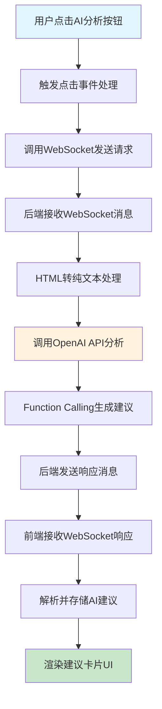
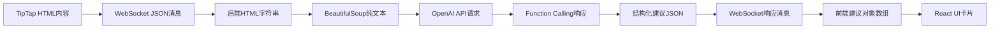
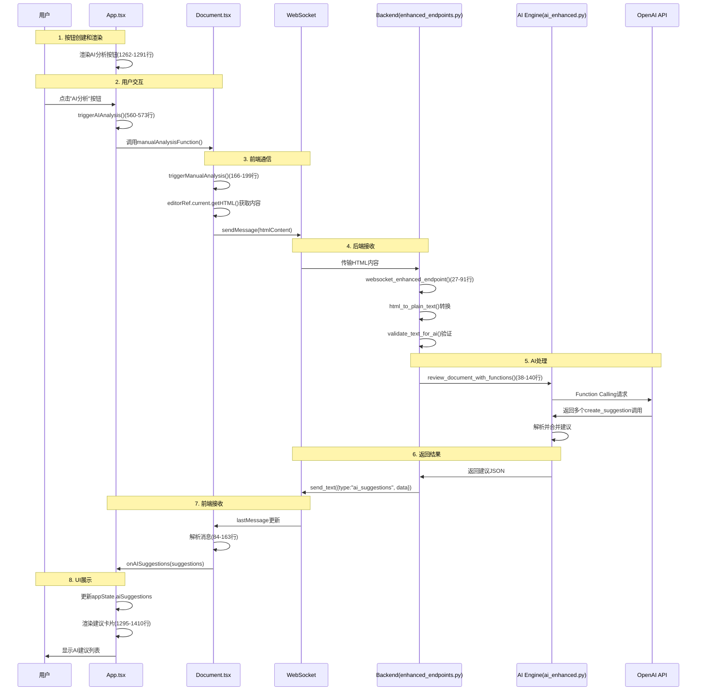

# AI分析功能流程实现代码精讲

## 概述

本文档详细分析了专利审查系统中AI分析功能的完整实现流程，从用户点击"AI分析"按钮开始，到最终在界面上展示AI建议的整个过程。

## 功能流程总览



## 关键文件说明

| 文件路径 | 主要功能 | 关键代码行数 |
|---------|----------|-------------|
| `client/src/App.tsx` | 主应用组件，管理全局状态和UI | 560-573(点击处理), 1262-1291(按钮), 1295-1403(建议展示) |
| `client/src/Document.tsx` | 文档编辑组件，处理WebSocket通信 | 48-50(WebSocket URL), 66-81(连接配置), 166-199(发送请求), 84-163(接收响应) |
| `server/app/enhanced_endpoints.py` | 后端WebSocket端点处理 | 27-146(主要端点逻辑), 62-91(消息循环), 107-114(发送结果) |
| `server/app/internal/ai_enhanced.py` | AI处理引擎 | 38-62(主分析函数), 64-180(Function Calling处理) |
| `server/app/internal/prompt_enhanced.py` | AI提示词和Function定义 | 定义ENHANCED_PROMPT和FUNCTION_TOOLS |

## 详细流程分析

### 1. AI分析按钮的创建和渲染

**文件位置**: `client/src/App.tsx`

#### 1.1 按钮渲染代码

**文件**: `client/src/App.tsx`  
**行号**: 1262-1291

```typescript
{/* AI analysis button */}
<button
  onClick={triggerAIAnalysis}
  disabled={appState.isAIProcessing || appState.aiProcessingStatus.includes('disconnected') || appState.aiProcessingStatus.includes('connection failed')}
  className={`w-full px-6 py-2 text-sm font-medium rounded-lg transition-all duration-200 ${
    appState.isAIProcessing || appState.aiProcessingStatus.includes('disconnected') || appState.aiProcessingStatus.includes('connection failed')
      ? 'bg-gray-300 text-gray-500 cursor-not-allowed'
      : 'bg-blue-600 text-white hover:bg-blue-700'
  }`}
  aria-label="AI Document Analysis"
  title={
    appState.aiProcessingStatus.includes('disconnected')
      ? 'WebSocket connection disconnected, please refresh page'
      : appState.aiProcessingStatus.includes('connection failed')
        ? 'WebSocket connection failed, please check network'
        : appState.isAIProcessing
          ? 'AI is analysing, please wait'
          : 'AI Document Analysis'
  }
>
  {appState.isAIProcessing
    ? '🔄 Analysing...'
    : appState.aiProcessingStatus.includes('disconnected')
      ? '❌ Disconnected'
      : appState.aiProcessingStatus.includes('connection failed')
        ? '❌ Connection Failed'
        : appState.aiProcessingStatus.includes('connecting')
          ? '🔄 Connecting'
          : '🤖 AI Analysis'
  }
</button>
```

**关键点**:
- 按钮根据不同状态显示不同文本（分析中、已断开、连接失败等）
- 使用`appState`管理按钮状态
- 点击事件绑定到`triggerAIAnalysis`函数

### 2. 用户点击事件处理

**文件位置**: `client/src/App.tsx`

#### 2.1 点击事件处理函数

**文件**: `client/src/App.tsx`  
**行号**: 560-573

```typescript
const triggerAIAnalysis = () => {
  if (!appState.currentDocument) {
    console.error('Please select a document first');
    return;
  }

  if (!manualAnalysisFunction) {
    console.warn('AI analysis function not ready, please ensure document is loaded');
    return;
  }

  console.log('🚀 Triggering AI analysis');
  manualAnalysisFunction();
};
```

**关键点**:
- 检查是否选择了文档
- 检查`manualAnalysisFunction`是否已注册
- 调用由Document组件注册的分析函数

#### 2.2 分析函数注册机制

**文件**: `client/src/App.tsx`  
**行号**: 575-578

```typescript
const registerManualAnalysis = useCallback((analysisFunction: () => void) => {
  console.log('📌 App: Received manual analysis function');
  setManualAnalysisFunction(() => analysisFunction);
}, []);
```

### 3. 前端WebSocket通信机制

**文件位置**: `client/src/Document.tsx`

#### 3.1 WebSocket连接配置

**文件**: `client/src/Document.tsx`  
**行号**: 48-50 (SOCKET_URL定义), 66-81 (useWebSocket配置)

```typescript
// 使用增强版WebSocket端点
const SOCKET_URL = import.meta.env.VITE_USE_ENHANCED_WS === 'true' 
  ? "ws://localhost:8000/ws/enhanced"  // 支持Function Calling
  : "ws://localhost:8000/ws";

// 使用react-use-websocket库建立连接
const { sendMessage, lastMessage, readyState } = useWebSocket(SOCKET_URL, {
  onOpen: () => {
    console.log("🔌 WebSocket Connected to:", SOCKET_URL);
    onProcessingStatus?.(false, "AI assistant connected");
  },
  onClose: () => {
    console.log("🔌 WebSocket Disconnected");
    onProcessingStatus?.(false, "AI assistant disconnected");
  },
  shouldReconnect: (_closeEvent) => true,  // 自动重连
  reconnectAttempts: 5,
  reconnectInterval: 3000,
  share: true  // 共享连接，避免重复连接
});
```

**技术要点**:
- 使用`react-use-websocket`库管理WebSocket连接
- 支持自动重连机制（5次重试，3秒间隔）
- 使用`share: true`避免多个组件创建重复连接
- WebSocket状态监控：`ReadyState.CLOSED`、`ReadyState.CLOSING`等

#### 3.2 发送AI分析请求

**文件**: `client/src/Document.tsx`  
**行号**: 166-199

```typescript
const triggerManualAnalysis = useCallback(() => {
  console.log("🔍 Triggering AI analysis, WebSocket state:", readyState);
  
  // 获取编辑器最新内容
  const currentContent = editorRef?.current?.getHTML() || content;
  
  // 检查WebSocket连接状态
  if (readyState === ReadyState.CLOSED || readyState === ReadyState.CLOSING) {
    onProcessingStatus?.(false, "AI assistant connection lost, please refresh page");
    return;
  }
  
  if (isAIProcessing) {
    onProcessingStatus?.(false, "AI is analysing, please wait...");
    return;
  }
  
  if (!currentContent.trim()) {
    onProcessingStatus?.(false, "Document content is empty");
    return;
  }
  
  try {
    onProcessingStatus?.(true, "Sending analysis request...");
    sendMessage(currentContent);  // 发送HTML内容到后端
    onProcessingStatus?.(true, "AI is analysing document...");
  } catch (error) {
    console.error("❌ Failed to send AI analysis request:", error);
    onProcessingStatus?.(false, `Request failed: ${error instanceof Error ? error.message : 'Unknown error'}`);
  }
}, [isAIProcessing, sendMessage, onProcessingStatus, readyState]);
```

**关键步骤**:
1. 从TipTap编辑器获取HTML内容：`editorRef.current.getHTML()`
2. 进行状态检查（连接状态、处理状态、内容有效性）
3. 通过`sendMessage`发送HTML内容到后端

#### 3.3 注册分析函数到App组件

**文件**: `client/src/Document.tsx`  
**行号**: 208-211

```typescript
// 将分析函数注册到App组件
useEffect(() => {
  onManualAnalysis?.(triggerManualAnalysis);
}, [onManualAnalysis]);
```

### 4. 后端WebSocket接收和处理

**文件位置**: `server/app/enhanced_endpoints.py`

#### 4.1 WebSocket端点处理

**文件**: `server/app/enhanced_endpoints.py`  
**行号**: 27-146

```python
async def websocket_enhanced_endpoint(websocket: WebSocket):
    """
    增强版WebSocket端点：支持Function Calling的AI建议系统
    """
    await websocket.accept()
    logger.info("Enhanced WebSocket connection established")
    
    # 初始化AI服务
    try:
        ai = get_ai_enhanced()
        # 发送连接成功消息
        success_msg = {
            "type": "connection_success",
            "message": "Enhanced AI service ready",
            "timestamp": datetime.utcnow().isoformat()
        }
        await websocket.send_text(json.dumps(success_msg))
    except ValueError as e:
        # AI服务初始化失败处理
        error_msg = {
            "type": "ai_error",
            "message": f"AI service initialization failed: {str(e)}",
            "timestamp": datetime.utcnow().isoformat()
        }
        await websocket.send_text(json.dumps(error_msg))
        await websocket.close()
        return
```

#### 4.2 消息接收和处理循环

**文件**: `server/app/enhanced_endpoints.py`  
**行号**: 62-91

```python
while True:
    # 接收HTML内容
    html_content = await websocket.receive_text()
    logger.info(f"Received HTML content, length: {len(html_content)}")
    
    # 通知前端开始处理
    processing_msg = {
        "type": "processing_start",
        "message": "Analysing document...",
        "timestamp": datetime.utcnow().isoformat()
    }
    await websocket.send_text(json.dumps(processing_msg))
    
    try:
        # HTML转纯文本
        plain_text = html_to_plain_text(html_content)
        logger.info(f"Converted plain text length: {len(plain_text)}")
        
        # 文本验证
        is_valid, error_message = validate_text_for_ai(plain_text)
        if not is_valid:
            validation_error = {
                "type": "validation_error",
                "message": error_message,
                "timestamp": datetime.utcnow().isoformat()
            }
            await websocket.send_text(json.dumps(validation_error))
            continue
```

### 5. AI处理引擎

**文件位置**: `server/app/internal/ai_enhanced.py`

#### 5.1 AI分析函数

**文件**: `server/app/internal/ai_enhanced.py`  
**行号**: 38-62

```python
async def review_document_with_functions(self, document: str) -> AsyncGenerator[str | None, None]:
    """
    使用Function Calling审查专利文档，生成更精确的建议
    """
    logger.info(f"Starting enhanced AI analysis, document length: {len(document)}")
    
    # 使用Function Calling进行分析
    stream = await self._client.chat.completions.create(
        model=self.model,
        temperature=0.1,  # 低温度确保输出稳定性
        messages=[
            {"role": "system", "content": ENHANCED_PROMPT},
            {"role": "user", "content": document},
        ],
        tools=FUNCTION_TOOLS,  # Function定义
        tool_choice="auto",    # AI自动决定调用次数
        stream=True,
    )
```

#### 5.2 Function Calling处理

**文件**: `server/app/internal/ai_enhanced.py`  
**行号**: 64-180 (完整的function call收集和处理逻辑)

```python
# 收集function calls
function_calls = []
current_function_calls = {}  # 使用字典跟踪多个并行函数调用

async for chunk in stream:
    delta = chunk.choices[0].delta
    
    # 处理tool calls
    if delta.tool_calls:
        for tool_call in delta.tool_calls:
            call_index = tool_call.index
            
            if tool_call.function.name:
                # 新函数调用开始
                current_function_calls[call_index] = {
                    "name": tool_call.function.name,
                    "arguments": tool_call.function.arguments or ""
                }
            elif call_index in current_function_calls:
                # 继续累积参数
                current_function_calls[call_index]["arguments"] += tool_call.function.arguments or ""

# 处理收集到的函数调用
suggestions_dict = {}  # 使用字典去重和合并
for func_call in function_calls:
    if func_call["name"] == "create_suggestion":
        args = json.loads(func_call["arguments"])
        # 处理建议数据...
```

**技术要点**:
- 使用OpenAI的Function Calling功能
- 支持多个并行函数调用（通过`call_index`管理）
- 通过字典去重合并相同文本的建议（避免重复建议）
- 低温度设置（0.1）确保稳定输出
- 流式响应处理，实时接收AI结果

### 6. 后端返回结果

**文件位置**: `server/app/enhanced_endpoints.py`

#### 6.1 发送AI分析结果

**文件**: `server/app/enhanced_endpoints.py`  
**行号**: 107-114

```python
# 发送完整的建议结果
success_response = {
    "type": "ai_suggestions",
    "data": parsed_result,
    "timestamp": datetime.utcnow().isoformat()
}
await websocket.send_text(json.dumps(success_response))
logger.info(f"Enhanced AI analysis complete, found {len(parsed_result.get('issues', []))} issues")
```

### 7. 前端接收和处理响应

**文件位置**: `client/src/Document.tsx`

#### 7.1 接收WebSocket消息

**文件**: `client/src/Document.tsx`  
**行号**: 84-163

```typescript
useEffect(() => {
  if (lastMessage !== null) {
    try {
      // 解析WebSocket消息
      const message: WebSocketMessage = JSON.parse(lastMessage.data);
      console.log("📨 Received AI message:", message);
      
      // 根据消息类型处理
      switch (message.type) {
        case 'processing_start':
          console.log("🤖 AI started processing document");
          setIsAIProcessing(true);
          onProcessingStatus?.(true, message.message || "AI is analysing document...");
          break;
          
        case 'ai_suggestions':
          console.log("✨ Received AI suggestions:", message.data);
          setIsAIProcessing(false);
          if (message.data?.issues) {
            onAISuggestions?.(message.data.issues);  // 传递建议到App组件
            let statusMessage = `AI analysis complete, found ${message.data.issues.length} suggestions`;
            onProcessingStatus?.(false, statusMessage);
          }
          break;
          
        case 'validation_error':
          console.warn("⚠️ Document validation error:", message.message);
          setIsAIProcessing(false);
          onProcessingStatus?.(false, `Validation error: ${message.message}`);
          break;
          
        case 'ai_error':
          console.error("❌ AI service error:", message.message);
          setIsAIProcessing(false);
          onProcessingStatus?.(false, `AI error: ${message.message}`);
          break;
          
        // 其他消息类型处理...
      }
    } catch (error) {
      console.error("❌ Failed to parse WebSocket message:", error);
    }
  }
}, [lastMessage, onAISuggestions, onProcessingStatus]);
```

### 8. UI展示AI建议

**文件位置**: `client/src/App.tsx`

#### 8.1 建议卡片渲染

**文件**: `client/src/App.tsx`  
**行号**: 1295-1403 (建议卡片渲染完整结构)

```typescript
{appState.aiSuggestions.length > 0 ? (
  <div className="space-y-3">
    {/* 建议排序：先按严重程度，再按段落顺序 */}
    {[...appState.aiSuggestions]
      .sort((a, b) => {
        const severityOrder = { high: 3, medium: 2, low: 1 };
        const severityA = severityOrder[a.severity] || 2;
        const severityB = severityOrder[b.severity] || 2;
        
        if (severityA !== severityB) {
          return severityB - severityA;
        }
        return a.paragraph - b.paragraph;
      })
      .map((suggestion, index) => (
        <div
          key={index}
          className={`p-3 rounded-lg border-l-4 transition-all duration-200 ${
            suggestion.severity === 'high'
              ? 'border-red-500 bg-red-50'
              : suggestion.severity === 'medium'
                ? 'border-yellow-500 bg-yellow-50'
                : 'border-blue-500 bg-blue-50'
          }`}
        >
          {/* 建议头部信息 */}
          <div className="flex items-center gap-2 mb-2">
            <span className="text-xs font-medium text-gray-600">
              Paragraph {suggestion.paragraph}
            </span>
            <span className={`text-xs px-2 py-1 rounded-full font-medium ${
              suggestion.severity === 'high'
                ? 'bg-red-200 text-red-800'
                : suggestion.severity === 'medium'
                  ? 'bg-yellow-200 text-yellow-800'
                  : 'bg-blue-200 text-blue-800'
            }`}>
              {suggestion.severity === 'high' ? 'Critical' :
                suggestion.severity === 'medium' ? 'Medium' : 'Minor'}
            </span>
          </div>
          
          {/* 问题描述 */}
          <p className="text-sm text-gray-700 mb-3 leading-relaxed">
            {suggestion.description}
          </p>
          
          {/* AI建议内容 */}
          {suggestion.replaceTo && (
            <div className="bg-white p-3 rounded border mb-3">
              <p className="text-sm text-gray-700 leading-relaxed font-mono">
                {suggestion.replaceTo}
              </p>
            </div>
          )}
          
          {/* 操作按钮 */}
          <div className="flex gap-2 pt-2 border-t">
            <button onClick={() => acceptSuggestion(suggestion, index)}
              className="flex-1 px-3 py-1.5 text-xs font-medium text-white bg-green-600 hover:bg-green-700 rounded-md">
              ✅ Accept
            </button>
            <button onClick={() => copySuggestion(suggestion)}
              className="flex-1 px-3 py-1.5 text-xs font-medium text-gray-700 bg-gray-200 hover:bg-gray-300 rounded-md">
              📋 Copy
            </button>
            <button onClick={() => closeSuggestion(suggestion)}
              className="flex-1 px-3 py-1.5 text-xs font-medium text-gray-700 bg-gray-200 hover:bg-gray-300 rounded-md">
              ❌ Dismiss
            </button>
          </div>
        </div>
      ))}
  </div>
)}
```

## 数据流转详解

### 数据格式转换过程



**关键数据结构**:

1. **前端建议格式** (`client/src/Document.tsx:6-15`):
```typescript
interface AISuggestion {
  type: string;
  severity: 'high' | 'medium' | 'low';
  paragraph: number;
  description: string;
  text?: string;
  suggestion: string;
  originalText?: string;  // 精确匹配文本
  replaceTo?: string;     // 建议替换文本
}
```

2. **WebSocket消息格式** (`client/src/Document.tsx:29-35`):
```typescript
interface WebSocketMessage {
  type: 'ai_suggestions' | 'processing_start' | 'validation_error' | 'ai_error' | 'connection_success';
  message?: string;
  data?: AIResponse;
  timestamp?: string;
}
```

## 完整数据流图



## 技术栈总结

### 前端技术
- **React 18**: 组件化UI框架
- **TypeScript**: 类型安全
- **react-use-websocket**: WebSocket连接管理
- **TipTap**: 富文本编辑器
- **Tailwind CSS**: 样式框架

### 后端技术
- **FastAPI**: Python Web框架
- **WebSocket**: 实时双向通信
- **OpenAI API**: GPT-4模型
- **Function Calling**: 结构化AI输出

### 通信协议
- **WebSocket协议**: 用于实时AI分析
- **JSON消息格式**: 标准化的消息类型系统
- **自动重连机制**: 保证连接稳定性

## 关键设计模式

1. **组件通信模式**
   - 使用回调函数注册机制
   - Props传递实现父子组件通信
   
2. **状态管理模式**
   - 集中式状态管理(AppState)
   - 状态提升到App组件
   
3. **错误处理模式**
   - 多层错误捕获
   - 用户友好的错误提示
   
4. **异步处理模式**
   - WebSocket流式处理
   - Promise/async-await模式

## 性能优化要点

1. **WebSocket连接复用**: `share: true`避免重复连接
2. **防抖处理**: 避免频繁触发AI分析
3. **状态检查**: 多重状态验证避免无效请求
4. **建议去重**: 后端使用字典合并相同文本的建议
5. **智能排序**: 前端按严重程度和段落顺序排序展示

## FastAPI框架作用分析

### 在AI分析功能中的核心作用

#### 1. **WebSocket端点支持**
```python
# server/app/__main__.py:573-575
@app.websocket("/ws/enhanced")
async def websocket_enhanced_endpoint_wrapper(websocket: WebSocket):
    await websocket_enhanced_endpoint(websocket)
```

**关键作用**:
- 提供原生WebSocket支持，实现**实时双向通信**
- 支持异步处理，不阻塞其他请求
- 自动处理WebSocket连接生命周期

#### 2. **异步请求处理**
```python
# server/app/enhanced_endpoints.py:27-146
async def websocket_enhanced_endpoint(websocket: WebSocket):
    await websocket.accept()
    # 异步处理AI分析请求
    async for chunk in ai.review_document_with_functions(plain_text):
        if chunk:
            response_chunks.append(chunk)
```

**性能优势**:
- **异步I/O处理**: AI API调用不会阻塞服务器
- **并发支持**: 可同时处理多个AI分析请求
- **资源效率**: 避免线程阻塞，提高服务器性能

#### 3. **结构化消息处理**
```python
# 发送标准化消息格式
success_response = {
    "type": "ai_suggestions",
    "data": parsed_result,
    "timestamp": datetime.utcnow().isoformat()
}
await websocket.send_text(json.dumps(success_response))
```

**通信优势**:
- **标准化通信协议**: 定义消息类型和格式
- **自动JSON序列化**: 简化数据传输
- **错误分类处理**: 不同错误类型的消息格式

### FastAPI核心特性体现

#### 1. **类型安全和数据验证**
- **自动数据验证**: 请求数据格式错误时自动返回400错误
- **类型提示**: IDE支持和代码可读性
- **API文档自动生成**: 访问`/docs`查看完整API文档

#### 2. **依赖注入系统**
```python
# 自动资源管理
@app.websocket("/ws/enhanced")
async def websocket_enhanced_endpoint_wrapper(websocket: WebSocket):
    # FastAPI自动处理WebSocket连接
```

#### 3. **异常处理机制**
- **统一错误响应**: 自动捕获和格式化异常
- **HTTP状态码**: 正确的状态码返回
- **日志记录**: 内置请求和错误日志

### 与其他框架对比优势

**vs Flask**:
- ✅ 原生异步支持 (Flask需要额外配置)
- ✅ 自动API文档 (Swagger UI自动生成)
- ✅ WebSocket原生支持 (Flask需要插件)

**vs Django**:
- ✅ 性能更优 (异步处理更高效)
- ✅ 学习曲线平缓 (专注API开发)
- ✅ 现代Python特性 (充分利用async/await)

## 总结

整个AI分析功能通过WebSocket实现了前后端的实时通信，利用OpenAI的Function Calling能力生成结构化的专利文档改进建议。**FastAPI作为后端框架**提供了：

1. **高性能WebSocket支持**: 实现实时AI交互
2. **异步处理能力**: 提高并发性能和资源利用率
3. **类型安全**: 减少开发和调试时间
4. **自动化特性**: API文档生成、数据验证、错误处理

系统设计合理，代码结构清晰，具有良好的错误处理和用户体验。FastAPI的选择使得整个后端系统具备了现代化、高性能、开发友好的特点。