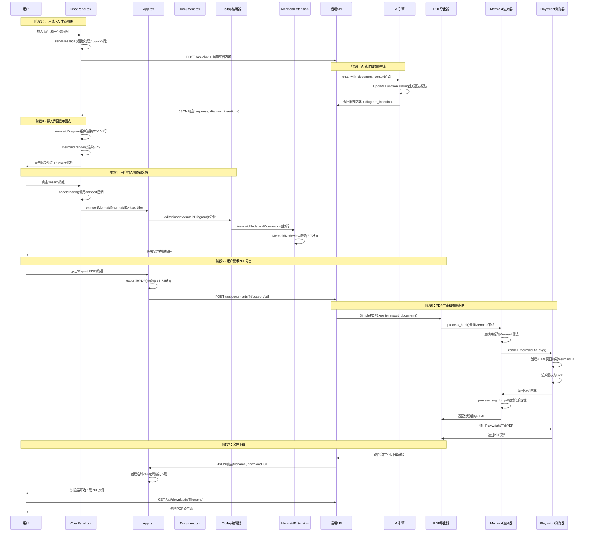

# Mermaid图表与PDF导出功能代码详解（带中文注释）

## 概述

本文档为Mermaid图表生成、插入文档和PDF导出功能的核心代码添加了详细的中文注释，重点解释：
- 组件之间如何调用和通信
- 函数的输入输出参数
- 每个函数的具体作用和目的
- 数据如何在不同组件间流动

## 1. 聊天界面中的Mermaid图表组件

### 1.1 MermaidDiagram组件的作用和结构

```typescript
// 文件：client/src/ChatPanel.tsx (行号: 27-104)

/**
 * MermaidDiagram组件 - 在聊天界面中显示和渲染Mermaid图表
 * 这是一个React函数式组件，专门用来在聊天消息中显示AI生成的图表
 * 
 * 输入参数：
 * - chart: string - Mermaid图表的语法代码（如 "graph TD; A-->B"）
 * - onInsert?: 可选的回调函数，用来把图表插入到文档中
 * 
 * 输出：React JSX元素，包含渲染的图表和"Insert"按钮
 * 
 * 主要功能：
 * 1. 将Mermaid语法转换为可视化的SVG图表
 * 2. 提供插入按钮让用户可以把图表添加到文档中
 * 3. 处理渲染错误和loading状态
 */
function MermaidDiagram({ chart, onInsert }: { 
  chart: string; 
  onInsert?: (mermaidSyntax: string, title?: string) => void 
}) {
  // ref用来引用实际的DOM元素，mermaid库需要直接操作DOM来渲染图表
  const ref = useRef<HTMLDivElement>(null);
  
  // 跟踪图表是否已经渲染完成，用来控制按钮和loading状态的显示
  const [isRendered, setIsRendered] = useState(false);

  /**
   * useEffect Hook - 当chart内容变化时重新渲染图表
   * 这是React的副作用钩子，相当于Vue中的watch
   * 
   * 触发时机：组件挂载时 + chart参数变化时
   * 
   * 渲染流程：
   * 1. 检查DOM元素和图表内容是否存在
   * 2. 清空之前的内容
   * 3. 生成唯一ID避免图表冲突
   * 4. 初始化mermaid配置
   * 5. 调用mermaid.render()渲染图表
   * 6. 处理成功/失败情况
   */
  useEffect(() => {
    const renderMermaid = async () => {
      // 检查1：确保DOM元素存在且图表内容不为空
      if (!ref.current || !chart.trim()) return;
      
      try {
        // 设置渲染状态为false，显示loading
        setIsRendered(false);
        
        // 清空之前的内容，防止多个图表叠加显示
        ref.current.innerHTML = '';
        
        // 生成唯一ID，格式：mermaid-时间戳-随机字符串
        // 这样可以避免页面上多个图表ID冲突
        const uniqueId = `mermaid-${Date.now()}-${Math.random().toString(36).substr(2, 6)}`;
        
        // 重新初始化mermaid配置
        // 每次渲染前都重新初始化，确保设置正确
        mermaid.initialize({ 
          startOnLoad: false,        // 不自动渲染，手动控制
          theme: 'default',          // 使用默认主题
          securityLevel: 'loose',    // 允许更多HTML标签
          fontFamily: 'Arial, sans-serif'  // 设置字体
        });
        
        // 调用mermaid库的render方法
        // 输入：唯一ID + mermaid语法
        // 输出：包含svg字符串的对象
        const { svg } = await mermaid.render(uniqueId, chart);
        
        // 检查DOM元素还存在（组件可能已卸载）并且有SVG内容
        if (ref.current && svg) {
          // 将生成的SVG直接插入DOM
          ref.current.innerHTML = svg;
          // 标记渲染完成，显示Insert按钮
          setIsRendered(true);
        }
      } catch (error) {
        // 渲染失败时的错误处理
        console.error('Mermaid rendering failed:', error);
        if (ref.current) {
          // 显示友好的错误消息给用户
          ref.current.innerHTML = '<div class="text-red-500 text-sm p-2 border border-red-300 rounded bg-red-50">⚠️ Chart rendering failed, please check syntax</div>';
          setIsRendered(true); // 即使失败也显示为"已渲染"，这样用户能看到错误信息
        }
      }
    };
    
    // 添加10毫秒延迟确保DOM已经就绪
    // 这是一个常见的技巧，防止DOM还没准备好就开始渲染
    const timeoutId = setTimeout(renderMermaid, 10);
    
    // 清理函数：组件卸载时清除定时器，防止内存泄漏
    return () => clearTimeout(timeoutId);
  }, [chart]); // 依赖数组：只有当chart变化时才重新执行

  /**
   * 处理用户点击"Insert"按钮的函数
   * 
   * 作用：将图表语法传递给父组件（App.tsx），用于插入到文档编辑器中
   * 
   * 调用链：用户点击Insert → handleInsert → onInsert回调 → App组件 → Document组件 → TipTap编辑器
   */
  const handleInsert = () => {
    if (onInsert) {
      // 注意：这里传递的是原始的mermaid语法，不是渲染后的SVG
      // 因为编辑器需要保存原始数据，方便后续编辑和导出
      onInsert(chart); // 相当于调用 App.tsx 中的 handleInsertMermaid 函数
    }
  };

  // 组件的JSX渲染结构
  return (
    <div>
      {/* 图表渲染容器 */}
      <div 
        ref={ref}  // 绑定DOM引用，mermaid库会直接操作这个元素
        className="mermaid my-4"  // CSS样式类
      />
      
      {/* 条件渲染：图表未渲染完成时显示loading */}
      {!isRendered && (
        <div className="text-gray-500 text-sm p-2">
          Rendering chart...
        </div>
      )}
      
      {/* 条件渲染：图表渲染完成后显示Insert按钮 */}
      {isRendered && (
        <div>
          <button
            onClick={handleInsert}  // 点击时调用handleInsert函数
            className="px-3 py-1 text-sm bg-blue-600 text-white rounded hover:bg-blue-700 transition-colors"
          >
            Insert
          </button>
        </div>
      )}
    </div>
  );
}
```

### 1.2 聊天消息发送和AI图表生成

```typescript
// 文件：client/src/ChatPanel.tsx (行号: 158-223)

/**
 * sendMessage函数 - 处理用户发送聊天消息的核心逻辑
 * 
 * 触发时机：用户点击发送按钮 或 按下Enter键
 * 
 * 主要功能：
 * 1. 构建聊天消息对象
 * 2. 获取当前文档内容作为AI的上下文
 * 3. 调用后端聊天API
 * 4. 处理AI返回的聊天内容和图表插入指令
 * 5. 更新聊天界面
 * 
 * 输入：无（从组件状态获取inputMessage）
 * 输出：无（但会更新组件状态和调用回调函数）
 */
const sendMessage = async () => {
  // 检查：确保有输入内容且当前没有在处理中
  if (!inputMessage.trim() || isLoading) return;

  // 步骤1：创建用户消息对象
  // 这个对象包含了消息的所有元数据
  const userMessage: ChatMessage = {
    role: "user",              // 消息角色：用户
    content: inputMessage,     // 消息内容：用户输入的文本
    timestamp: new Date()      // 时间戳：记录发送时间
  };

  // 步骤2：立即更新UI显示用户消息
  // 使用函数式更新，基于之前的消息列表添加新消息
  setMessages(prev => [...prev, userMessage]);
  
  // 清空输入框，让用户可以输入下一条消息
  setInputMessage("");
  
  // 设置加载状态，显示"AI正在思考"的效果
  setIsLoading(true);

  try {
    // 步骤3：构建完整的消息历史
    // AI需要看到之前的对话内容来保持上下文
    const messageHistory = [...messages, userMessage];

    // 步骤4：获取当前文档内容作为AI的上下文
    // 这是关键功能：AI可以基于当前文档内容来生成相关的图表
    // getCurrentDocumentContent 是从父组件传下来的函数
    const currentDocumentContent = getCurrentDocumentContent ? getCurrentDocumentContent() : "";

    // 步骤5：调用后端聊天API
    // 发送POST请求到 /api/chat 端点
    const response = await axios.post("http://localhost:8000/api/chat", {
      // 只发送角色和内容，过滤掉时间戳等客户端字段
      messages: messageHistory.map(({ role, content }) => ({ role, content })),
      // 重要：将当前文档内容也发送给AI，这样AI就知道用户在编辑什么
      current_document_content: currentDocumentContent
    });

    // 步骤6：处理AI响应，创建助手消息对象
    const assistantMessage: ChatMessage = {
      role: "assistant",           // 消息角色：AI助手
      content: response.data.response,  // AI返回的聊天内容
      timestamp: new Date()        // 当前时间戳
    };

    // 将AI消息添加到聊天界面
    setMessages(prev => [...prev, assistantMessage]);

    // 步骤7：处理图表插入指令（这是特殊功能）
    // AI不仅会返回聊天内容，还可能返回图表插入指令
    if (response.data.diagram_insertions && response.data.diagram_insertions.length > 0) {
      console.log("📊 Chat received diagram insertion request:", response.data.diagram_insertions);
      console.log("📊 onDiagramInsertions callback exists:", !!onDiagramInsertions);
      
      // 检查是否有图表插入回调函数（由App组件提供）
      if (onDiagramInsertions) {
        console.log("📊 Calling diagram insertion callback...");
        // 调用回调函数，将图表插入指令传给App组件
        // App组件会进一步处理，将图表插入到文档编辑器中
        onDiagramInsertions(response.data.diagram_insertions);
        console.log("📊 Diagram insertion callback called");
      } else {
        console.error("❌ Diagram insertion callback does not exist, cannot insert charts into document");
      }
    } else {
      console.log("📊 No diagram insertion data in AI response");
      console.log("📊 Full response:", response.data);
    }
  } catch (error) {
    // 错误处理：网络错误、API错误等
    console.error("Chat error:", error);

    // 创建错误消息显示给用户
    const errorMessage: ChatMessage = {
      role: "assistant",
      content: "Sorry, an error occurred. Please try again later.",
      timestamp: new Date()
    };

    setMessages(prev => [...prev, errorMessage]);
  } finally {
    // 无论成功失败，都要取消加载状态
    setIsLoading(false);
  }
};
```

## 2. 后端AI聊天API处理

### 2.1 聊天API端点处理

```python
# 文件：server/app/enhanced_endpoints.py (行号: 148-170)

@app.post("/api/chat")
async def chat_with_ai(request: ChatRequest):
    """
    增强版AI聊天API端点
    
    功能说明：
    - 接收前端发来的聊天消息和当前文档内容
    - 调用AI引擎进行对话处理
    - 支持图表生成和插入指令
    - 返回聊天回复和可能的图表插入指令
    
    输入参数：
    - request: ChatRequest对象，包含消息历史和文档内容
    
    输出：
    - JSON响应，包含AI回复和可能的图表插入指令
    
    处理流程：
    1. 验证请求数据
    2. 初始化AI引擎
    3. 调用AI处理函数
    4. 分离聊天内容和图表指令
    5. 构建并返回响应
    """
    try:
        # 步骤1：初始化增强AI引擎
        # get_ai_enhanced()函数会检查API密钥配置并创建AI客户端
        ai = get_ai_enhanced()
        
        # 步骤2：提取消息历史
        # 将Pydantic模型转换为AI引擎能理解的字典格式
        messages = [{"role": msg.role, "content": msg.content} for msg in request.messages]
        
        # 步骤3：初始化响应数据收集器
        response_chunks = []      # 收集聊天回复的文本片段
        diagram_insertions = []   # 收集图表插入指令
        
        # 步骤4：调用AI引擎进行流式处理
        # chat_with_document_context 是AI引擎的核心方法
        # 它会基于对话历史和文档内容生成回复
        async for chunk in ai.chat_with_document_context(messages, request.current_document_content):
            if chunk:
                # 检查这个chunk是否是图表插入指令
                # AI引擎会用特殊前缀来标记图表插入指令
                if chunk.startswith("DIAGRAM_INSERT:"):
                    try:
                        # 解析图表插入指令的JSON数据
                        # 移除"DIAGRAM_INSERT:"前缀，解析剩余的JSON
                        diagram_data = json.loads(chunk[15:])  # Remove prefix
                        diagram_insertions.append(diagram_data)
                        logger.info(f"📊 Collected diagram insertion request: {diagram_data}")
                    except json.JSONDecodeError as e:
                        logger.error(f"❌ Diagram insertion data parsing failed: {e}")
                else:
                    # 普通的聊天回复内容
                    response_chunks.append(chunk)
        
        # 步骤5：合并所有聊天回复片段
        full_response = "".join(response_chunks)
        
        # 步骤6：构建最终响应
        result = {"response": full_response}
        
        # 如果有图表插入指令，添加到响应中
        if diagram_insertions:
            result["diagram_insertions"] = diagram_insertions
            logger.info(f"✅ Returning response contains {len(diagram_insertions)} diagram insertions")
        
        return result
        
    except Exception as e:
        logger.error(f"Chat processing error: {e}")
        raise HTTPException(status_code=500, detail=str(e))
```

### 2.2 AI引擎的图表生成逻辑

```python
# 文件：server/app/internal/ai_enhanced.py (行号: 276-400)

async def chat_with_document_context(self, messages: List[Dict[str, str]], document_content: str = "") -> AsyncGenerator[str | None, None]:
    """
    基于文档上下文的AI聊天功能
    
    这个函数是整个图表生成功能的核心
    
    输入参数：
    - messages: 聊天消息历史列表
    - document_content: 当前文档的HTML内容
    
    输出：异步生成器，产出聊天回复和图表插入指令
    
    功能特点：
    1. 将HTML文档转换为纯文本供AI理解
    2. 构建包含文档上下文的专业提示词
    3. 使用OpenAI Function Calling生成结构化输出
    4. 分离处理文本回复和图表插入指令
    """
    
    # 步骤1：处理文档内容
    plain_text_content = ""
    if document_content.strip():
        # 使用BeautifulSoup将HTML转换为纯文本
        # AI模型只能理解纯文本，不能直接处理HTML标签
        plain_text_content = html_to_plain_text(document_content)
        logger.info(f"Document content length: {len(plain_text_content)}")

    # 步骤2：构建增强消息列表
    enhanced_messages = []
    
    if messages and len(messages) > 0:
        # 获取用户的最新消息
        last_user_message = messages[-1].get("content", "")
        
        # 步骤3：创建专门的专利助手系统提示词
        # 这个提示词会告诉AI如何基于当前文档内容进行对话
        # 并指导AI何时应该生成图表
        system_prompt = format_patent_chat_prompt(plain_text_content, last_user_message)
        enhanced_messages.append({
            "role": "system",
            "content": system_prompt
        })
        
        # 添加之前的聊天历史（除了最新消息）
        enhanced_messages.extend(messages[:-1])
        
        # 添加最新的用户消息
        enhanced_messages.append({
            "role": "user", 
            "content": last_user_message
        })

    logger.info(f"Starting AI chat with document context, message count: {len(enhanced_messages)}")

    # 步骤4：调用OpenAI API进行Function Calling
    # 这是关键步骤：使用Function Calling让AI生成结构化的图表插入指令
    stream = await self._client.chat.completions.create(
        model=self.model,           # 使用GPT-4模型
        temperature=0.2,            # 稍高的温度值，允许更有创意的回复
        messages=enhanced_messages, # 包含系统提示词和对话历史
        tools=FUNCTION_TOOLS,       # 定义AI可以调用的函数（包括图表插入函数）
        tool_choice="auto",         # 让AI自动决定是否需要调用函数
        stream=True,                # 流式返回结果
    )
    
    # 步骤5：处理流式响应和函数调用
    function_calls = []
    current_function_calls = {}
    
    # 逐个处理AI返回的数据块
    async for chunk in stream:
        delta = chunk.choices[0].delta
        
        # 处理普通的文本回复
        if delta.content:
            # 直接产出文本内容，前端会实时显示
            yield delta.content
        
        # 处理函数调用（图表插入指令）
        if delta.tool_calls:
            for tool_call in delta.tool_calls:
                call_index = tool_call.index
                
                if tool_call.function.name:
                    # 新的函数调用开始
                    current_function_calls[call_index] = {
                        "name": tool_call.function.name,
                        "arguments": tool_call.function.arguments or ""
                    }
                elif call_index in current_function_calls:
                    # 继续累积函数参数（流式传输可能分多次发送）
                    current_function_calls[call_index]["arguments"] += tool_call.function.arguments or ""

    # 步骤6：处理收集到的函数调用
    for call_index, func_call in current_function_calls.items():
        function_calls.append(func_call)
    
    # 步骤7：处理图表插入函数调用
    for func_call in function_calls:
        if func_call["name"] == "insert_diagram":
            try:
                # 解析函数参数
                args = json.loads(func_call["arguments"])
                
                # 产出图表插入指令
                # 使用特殊前缀标记，前端API会识别并分离处理
                yield f"DIAGRAM_INSERT:{json.dumps(args)}"
                logger.info(f"📊 Generated diagram insertion: {args}")
            except Exception as e:
                logger.error(f"❌ Diagram insertion processing failed: {e}")
```

## 3. TipTap编辑器中的Mermaid扩展

### 3.1 MermaidNodeView组件 - 编辑器中的图表显示

```typescript
// 文件：client/src/internal/MermaidExtension.tsx (行号: 7-72)

/**
 * MermaidNodeView组件 - TipTap编辑器中显示Mermaid图表的自定义节点
 * 
 * 这是一个React组件，但它被集成到TipTap编辑器中作为自定义节点类型
 * 
 * 输入参数：
 * - node: TipTap节点对象，包含图表的语法和标题等属性
 * - updateAttributes: 可选的函数，用于更新节点属性
 * 
 * 输出：渲染在编辑器中的图表节点
 * 
 * 主要功能：
 * 1. 在编辑器中实时渲染Mermaid图表
 * 2. 处理图表渲染错误
 * 3. 支持图表标题显示
 * 4. 提供合适的样式和布局
 */
function MermaidNodeView({ node }: { node: any; updateAttributes?: any }) {
  // DOM引用，用于mermaid库直接操作
  const ref = useRef<HTMLDivElement>(null);
  
  // 从节点属性中提取图表语法和标题
  // 这些属性是在插入图表时设置的
  const { syntax, title } = node.attrs;
  
  /**
   * useEffect - 当图表语法变化时重新渲染
   * 
   * 这个effect在以下情况触发：
   * 1. 组件首次挂载
   * 2. syntax参数发生变化
   * 3. 用户编辑图表内容时
   * 
   * 渲染过程比聊天界面中的处理更复杂，因为：
   * - 需要适配编辑器环境
   * - 要处理多种图表类型
   * - 需要优化性能避免频繁重渲染
   */
  useEffect(() => {
    if (ref.current) {
      if (syntax && syntax.trim()) {
        // 步骤1：初始化mermaid配置
        // 这里的配置比聊天界面更详细，适配编辑器环境
        mermaid.initialize({ 
          startOnLoad: false,           // 手动控制渲染时机
          theme: 'default',             // 默认主题
          securityLevel: 'loose',       // 允许更多HTML内容
          htmlLabels: false,            // 禁用HTML标签在文本中
          flowchart: {
            htmlLabels: false,          // 流程图中禁用HTML
            curve: 'basis',             // 使用平滑曲线
            useMaxWidth: true           // 自适应容器宽度
          },
          sequence: {
            htmlLabels: false           // 时序图中禁用HTML
          },
          maxTextSize: 90000            // 最大文本长度限制
        });
        
        // 步骤2：清空之前的内容
        ref.current.innerHTML = '';
        
        // 步骤3：渲染新图表
        mermaid.render('mermaid-' + Date.now(), syntax)
          .then(({ svg }) => {
            // 渲染成功：插入SVG内容
            if (ref.current) {
              ref.current.innerHTML = svg;
            }
          })
          .catch((error) => {
            // 渲染失败：显示错误信息
            console.error('Mermaid rendering error:', error);
            if (ref.current) {
              ref.current.innerHTML = `<div class="text-red-500 text-sm p-2 border border-red-300 rounded bg-red-50">⚠️ Chart rendering failed: ${error.message}</div>`;
            }
          });
      } else {
        // 处理空语法的情况：显示占位符
        ref.current.innerHTML = '<div class="text-gray-400 text-sm p-2 border border-gray-300 rounded bg-gray-50">Empty diagram</div>';
      }
    }
  }, [syntax]); // 依赖syntax，只有语法变化时才重新渲染

  // 返回TipTap节点的JSX结构
  return (
    <NodeViewWrapper 
      className="mermaid-node-wrapper mermaid-node"  // CSS类名
      data-syntax={syntax}     // 将语法保存为HTML属性，方便后续处理
      data-title={title}       // 保存标题
      data-type="mermaid-diagram"  // 标记节点类型，PDF导出时会用到
    >
      {/* 条件渲染：如果有标题则显示 */}
      {title && (
        <div className="mermaid-title text-sm font-semibold text-gray-700 mb-2 text-center">
          {title}
        </div>
      )}
      
      {/* 图表容器 */}
      <div 
        ref={ref} 
        className="mermaid-diagram border rounded-lg p-2 bg-gray-50 my-2"
        style={{maxWidth: "100%", overflow: "auto"}}  // 响应式设计，大图表可以滚动
      />
    </NodeViewWrapper>
  );
}
```

### 3.2 MermaidNode扩展定义

```typescript
// 文件：client/src/internal/MermaidExtension.tsx (行号: 90-180)

/**
 * MermaidNode - TipTap编辑器的自定义节点扩展
 * 
 * 这是TipTap框架的扩展机制，用来定义新的节点类型
 * 类似于Vue或React的组件定义，但针对富文本编辑器
 * 
 * 主要功能：
 * 1. 定义节点的属性结构
 * 2. 指定如何解析HTML（从HTML恢复节点）
 * 3. 指定如何渲染HTML（将节点转为HTML）
 * 4. 提供插入命令
 * 5. 关联React组件进行视图渲染
 */
export const MermaidNode = Node.create<MermaidOptions>({
  // 节点名称，在编辑器中的唯一标识
  name: 'mermaidDiagram',

  // 配置选项
  addOptions() {
    return {
      HTMLAttributes: {},  // 默认HTML属性
    };
  },

  // 节点类型：块级元素（占据整行）
  group: 'block',
  
  // 原子节点：不能包含其他节点，内容不可编辑
  atom: true,

  /**
   * 定义节点属性
   * 
   * TipTap需要知道这个节点有哪些属性，以及如何在HTML和节点对象间转换
   * 这些属性会保存在编辑器的文档结构中
   */
  addAttributes() {
    return {
      // 图表语法属性
      syntax: {
        default: '',  // 默认值
        // 从HTML解析时如何获取这个属性
        parseHTML: element => element.getAttribute('data-syntax'),
        // 渲染到HTML时如何设置这个属性
        renderHTML: attributes => {
          if (!attributes.syntax) return {};
          return { 'data-syntax': attributes.syntax };
        },
      },
      // 图表标题属性
      title: {
        default: '',
        parseHTML: element => element.getAttribute('data-title'),
        renderHTML: attributes => {
          if (!attributes.title) return {};
          return { 'data-title': attributes.title };
        },
      },
    };
  },

  /**
   * HTML解析规则
   * 
   * 告诉TipTap当遇到什么样的HTML时，应该创建这种节点
   * 这对于从HTML恢复编辑器内容很重要
   */
  parseHTML() {
    return [
      {
        // 匹配具有特定属性的div元素
        tag: 'div[data-type="mermaid-diagram"]',
        // 从HTML元素中提取节点属性
        getAttrs: element => {
          const syntax = (element as HTMLElement).getAttribute('data-syntax');
          const title = (element as HTMLElement).getAttribute('data-title');
          return { syntax, title };
        },
      }
    ];
  },

  /**
   * HTML渲染规则
   * 
   * 告诉TipTap如何将这种节点转换为HTML
   * 主要用于编辑器的HTML输出和保存
   */
  renderHTML({ HTMLAttributes }) {
    return [
      'div',  // 使用div元素
      mergeAttributes(
        { 
          'data-type': 'mermaid-diagram',   // 节点类型标记
          'class': 'mermaid-node'           // CSS类名
        },
        this.options.HTMLAttributes,       // 扩展选项中的属性
        HTMLAttributes                     // 传入的HTML属性
      ),
    ];
  },

  /**
   * 关联React组件
   * 
   * 告诉TipTap使用哪个React组件来渲染这种节点
   * 这是TipTap React集成的关键部分
   */
  addNodeView() {
    return ReactNodeViewRenderer(MermaidNodeView);
  },

  /**
   * 添加编辑器命令
   * 
   * 定义可以通过编程方式执行的命令
   * 其他组件可以调用这些命令来操作编辑器
   */
  addCommands() {
    return {
      // 插入Mermaid图表的命令
      insertMermaidDiagram:
        (options) =>      // 输入参数：包含syntax和title的选项对象
        ({ commands }) => {  // TipTap提供的命令上下文
          // 调用内置的insertContent命令
          return commands.insertContent({
            type: this.name,    // 节点类型：mermaidDiagram
            attrs: options,     // 节点属性：syntax和title
          });
        },
    };
  },
});
```

### 3.3 图表插入辅助函数

```typescript
// 文件：client/src/internal/MermaidExtension.tsx (行号: 182-230)

/**
 * insertDiagramAfterText - 在指定文本后插入Mermaid图表
 * 
 * 这是一个高级功能函数，用于AI自动插入图表到文档的特定位置
 * 
 * 输入参数：
 * - editor: TipTap编辑器实例
 * - searchText: 要搜索的文本，图表将插入到这段文本之后
 * - mermaidSyntax: Mermaid图表的语法代码
 * - title: 可选的图表标题
 * 
 * 输出：boolean - 是否成功找到文本并插入图表
 * 
 * 使用场景：
 * - AI在聊天中说"在第三段后面插入流程图"
 * - 用户要求在特定内容后添加图表
 * - 自动化文档生成工具
 */
export function insertDiagramAfterText(
  editor: any, 
  searchText: string, 
  mermaidSyntax: string, 
  title?: string
): boolean {
  console.log(`🔍 Searching for text: "${searchText}"`);
  console.log(`📊 Diagram syntax: "${mermaidSyntax.substring(0, 50)}..."`);
  
  // 获取编辑器的当前状态（文档内容）
  const { state } = editor;
  let insertPosition: number | null = null;
  
  /**
   * 遍历文档中的所有节点来查找目标文本
   * 
   * TipTap使用ProseMirror的文档模型：
   * - 文档是节点树结构
   * - 文本内容存储在文本节点中
   * - 需要遍历所有节点来查找文本
   */
  state.doc.descendants((node: any, pos: number) => {
    // 如果已经找到位置，停止搜索
    if (insertPosition !== null) return false;
    
    // 只在文本节点中搜索
    if (node.isText && node.text) {
      // 不区分大小写搜索
      const textIndex = node.text.toLowerCase().indexOf(searchText.toLowerCase());
      if (textIndex >= 0) {
        // 找到文本！计算插入位置
        // pos是节点在文档中的起始位置
        // textIndex是目标文本在节点中的位置
        // searchText.length是目标文本的长度
        insertPosition = pos + textIndex + searchText.length;
        console.log(`✅ Found text at position ${insertPosition}`);
        return false; // 停止搜索
      }
    }
  });
  
  if (insertPosition !== null) {
    /**
     * 找到位置，执行插入操作
     * 
     * TipTap的链式命令系统：
     * - chain() 开始命令链
     * - focus() 确保编辑器获得焦点
     * - setTextSelection() 移动光标到指定位置
     * - insertContent() 插入内容
     * - run() 执行所有命令
     */
    editor
      .chain()
      .focus()
      .setTextSelection(insertPosition)  // 光标移动到文本后面
      .insertContent([
        { type: 'paragraph', content: [] },      // 插入空段落（换行）
        { 
          type: 'mermaidDiagram',               // 插入Mermaid图表节点
          attrs: { 
            syntax: mermaidSyntax,              // 图表语法
            title: title || ''                  // 图表标题
          }
        },
        { type: 'paragraph', content: [] },      // 插入空段落（换行）
      ])
      .run();
    
    console.log(`✅ Diagram inserted after text: "${searchText}"`);
    return true;
  } else {
    /**
     * 没找到指定文本，在当前光标位置插入
     * 
     * 这是一个友好的降级策略：
     * - 如果AI指定的文本不存在（可能用户已经修改了文档）
     * - 就在用户当前编辑的位置插入图表
     * - 避免功能完全失效
     */
    console.log(`⚠️ Text not found: "${searchText}", inserting at cursor position`);
    editor
      .chain()
      .focus()
      .insertMermaidDiagram({ syntax: mermaidSyntax, title })  // 使用定义的命令
      .run();
    return false;  // 返回false表示没有找到指定文本
  }
}
```

## 4. PDF导出功能的实现

### 4.1 前端PDF导出请求

```typescript
// 文件：client/src/App.tsx (行号: 665-725)

/**
 * exportToPDF函数 - 处理PDF导出的前端逻辑
 * 
 * 触发时机：用户点击"Export PDF"按钮
 * 
 * 主要功能：
 * 1. 验证是否选择了文档
 * 2. 调用后端PDF导出API
 * 3. 处理响应和文件下载
 * 4. 提供用户反馈和错误处理
 * 
 * 输入：无（从组件状态获取当前文档）
 * 输出：无（但会触发文件下载或显示错误）
 * 
 * 这个函数展示了前端如何与后端API协作完成复杂任务
 */
const exportToPDF = useCallback(async () => {
  // 步骤1：验证前置条件
  if (!appState.currentDocument) {
    console.error('❌ No document selected');
    alert('Please select a document first');
    return;
  }

  try {
    console.log('📄 Starting backend PDF export...');
    
    // 步骤2：设置加载状态
    // 更新UI显示"正在导出"，防止用户重复点击
    setAppState(prev => ({ ...prev, isLoading: true }));

    // 步骤3：调用后端PDF导出API
    const response = await axios.post(
      // REST风格的URL，包含文档ID
      `${BACKEND_URL}/api/documents/${appState.currentDocument.id}/export/pdf`,
      {},  // 空的请求体，所有信息都在URL中
      { 
        headers: { 'Content-Type': 'application/json' },
        timeout: 30000  // 30秒超时，PDF生成可能需要较长时间
      }
    );

    // 步骤4：处理成功响应
    if (response.data.status === 'success') {
      console.log('✅ PDF export successful:', response.data.filename);
      
      /**
       * 自动下载文件的技巧
       * 
       * 现代浏览器不允许直接触发文件下载，需要：
       * 1. 创建一个临时的<a>元素
       * 2. 设置href指向下载URL
       * 3. 设置download属性指定文件名
       * 4. 程序化点击这个链接
       * 5. 清理临时元素
       */
      const downloadUrl = `${BACKEND_URL}${response.data.download_url}`;
      const link = document.createElement('a');  // 创建临时链接
      link.href = downloadUrl;                   // 设置下载URL
      link.download = response.data.filename;    // 设置下载文件名
      link.target = '_blank';                    // 新窗口打开（备用方案）
      document.body.appendChild(link);           // 添加到DOM
      link.click();                              // 程序化点击
      document.body.removeChild(link);           // 清理临时元素
      
      // 显示成功消息给用户
      alert(`PDF export successful!\nDocument: ${response.data.document_title}\nVersion: v${response.data.version}`);
    } else {
      // API返回了失败状态
      throw new Error('PDF export API returned failure status');
    }

  } catch (error: any) {
    // 步骤5：错误处理
    console.error('❌ PDF export failed:', error);
    
    // 根据不同错误类型提供具体的用户提示
    let errorMessage = 'PDF export failed, please try again later';
    
    if (error.code === 'ECONNABORTED') {
      // 网络超时
      errorMessage = 'PDF export timeout, please check network connection';
    } else if (error.response?.status === 404) {
      // 文档不存在
      errorMessage = 'Document not found, please refresh page';
    } else if (error.response?.status === 500) {
      // 服务器内部错误
      errorMessage = 'Server error during PDF generation';
    }
    
    alert(errorMessage);
  } finally {
    // 步骤6：无论成功失败都要清理加载状态
    setAppState(prev => ({ ...prev, isLoading: false }));
  }
}, [appState.currentDocument]);  // 依赖当前文档，文档变化时重新创建函数
```

### 4.2 后端PDF导出API端点

```python
# 文件：server/app/__main__.py (行号: 591-660)

@app.post("/api/documents/{document_id}/export/pdf")
async def export_document_to_pdf(
    document_id: int, 
    background_tasks: BackgroundTasks,  # FastAPI的后台任务管理器
    db: Session = Depends(get_db)       # 数据库会话依赖注入
):
    """
    PDF导出API端点
    
    功能说明：
    - 接收文档ID，导出指定文档的当前版本为PDF
    - 支持包含Mermaid图表的文档
    - 自动处理图表渲染和PDF生成
    - 提供文件下载链接
    - 自动清理临时文件
    
    输入参数：
    - document_id: 要导出的文档ID（来自URL路径）
    - background_tasks: FastAPI提供的后台任务管理器
    - db: 数据库会话（依赖注入）
    
    输出：JSON响应，包含文件信息和下载链接
    
    处理流程：
    1. 验证文档存在性
    2. 获取当前活跃版本
    3. 调用PDF导出器
    4. 安排文件清理任务
    5. 返回下载信息
    """
    try:
        logger.info(f"Starting PDF export for document {document_id}...")
        
        # 步骤1：查询文档是否存在
        # 使用SQLAlchemy的现代语法进行数据库查询
        document = db.scalar(select(models.Document).where(models.Document.id == document_id))
        if not document:
            # 文档不存在，返回404错误
            raise HTTPException(status_code=404, detail="Document not found")
        
        # 步骤2：获取文档的当前活跃版本
        # 一个文档可能有多个版本，需要找到当前正在使用的版本
        current_version = db.scalar(
            select(models.DocumentVersion)
            .where(models.DocumentVersion.document_id == document_id)
            .where(models.DocumentVersion.is_active == True)  # 只查询活跃版本
        )
        
        if not current_version:
            # 没有活跃版本，数据异常
            raise HTTPException(status_code=404, detail="No active version found")
        
        # 步骤3：动态导入PDF导出器
        # 使用try-catch确保即使PDF功能未配置也能给出清晰错误
        try:
            from app.internal.pdf_export_simple import SimplePDFExporter as PDFExporter
        except ImportError as e:
            logger.error(f"PDF export functionality not available: {e}")
            raise HTTPException(
                status_code=500, 
                detail="PDF export functionality is not available. Please check server configuration."
            )
        
        # 步骤4：执行PDF生成
        # 这是核心步骤，会处理Mermaid图表渲染和PDF生成
        exporter = PDFExporter()
        filename = await exporter.export_document(document, current_version)
        
        # 步骤5：安排后台清理任务
        # 使用FastAPI的后台任务避免阻塞用户响应
        # 24小时后自动删除临时PDF文件，节省存储空间
        background_tasks.add_task(cleanup_old_files, "app/static/exports", hours=24)
        
        logger.info(f"PDF export successful: {filename}")
        
        # 步骤6：构建成功响应
        return {
            "status": "success",
            "filename": filename,                              # 生成的文件名
            "download_url": f"/api/downloads/{filename}",      # 下载链接
            "document_title": document.title,                  # 文档标题
            "version": current_version.version_number          # 版本号
        }
        
    except HTTPException:
        # 重新抛出HTTP异常（如404, 500等）
        raise
    except Exception as e:
        # 捕获所有其他异常，统一处理
        logger.error(f"PDF export failed: {str(e)}")
        raise HTTPException(status_code=500, detail=f"PDF export failed: {str(e)}")
```

### 4.3 PDF导出器的核心实现

```python
# 文件：server/app/internal/pdf_export_simple.py (行号: 163-250)

async def export_document(self, document: Document, version: DocumentVersion) -> str:
    """
    导出文档版本为PDF的核心函数
    
    这个函数是整个PDF导出功能的核心，处理了从HTML到PDF的完整转换过程
    
    输入参数：
    - document: 文档对象，包含标题等元数据
    - version: 文档版本对象，包含HTML内容
    
    输出：生成的PDF文件名
    
    处理流程：
    1. 处理HTML中的Mermaid图表
    2. 清理和优化HTML内容
    3. 应用PDF专用样式
    4. 使用Playwright生成PDF
    5. 返回文件名
    
    技术难点：
    - Mermaid图表在PDF中的兼容性处理
    - HTML样式向PDF样式的转换
    - 大文档的内存管理
    - 异步处理和错误恢复
    """
    try:
        # 步骤1：处理Mermaid图表
        logger.info("Processing Mermaid diagrams...")
        
        # 导入并创建Mermaid渲染器
        from app.internal.mermaid_render import MermaidRenderer
        mermaid_renderer = MermaidRenderer()
        
        # 这是关键步骤：将HTML中的Mermaid节点转换为SVG
        # version.content包含了编辑器的HTML内容，其中可能有mermaid-node元素
        processed_html = await mermaid_renderer.process_html(version.content)
        
        # 步骤2：清理HTML内容
        logger.info("Preprocessing HTML content...")
        # 移除编辑器特有的属性和样式，确保PDF兼容性
        cleaned_html = self._clean_html_content(processed_html)
        
        # 步骤3：应用PDF专用样式
        logger.info("Applying PDF styling...")
        # 添加CSS样式，确保在PDF中正确显示
        styled_html = self._create_pdf_html(cleaned_html, document.title, version.version_number)
        
        # 步骤4：生成唯一的PDF文件名
        timestamp = datetime.now().strftime("%Y%m%d_%H%M%S")
        # 清理文档标题，移除不安全的字符
        safe_title = re.sub(r'[^\w\-_\.]', '_', document.title)[:50]
        filename = f"{safe_title}_v{version.version_number}_{timestamp}.pdf"
        pdf_path = self.export_dir / filename
        
        # 步骤5：使用Playwright生成PDF
        logger.info(f"Generating PDF: {filename}")
        
        # Playwright是一个自动化浏览器工具，可以将HTML渲染为PDF
        async with async_playwright() as p:
            # 启动无头Chrome浏览器
            browser = await p.chromium.launch(headless=True)
            page = await browser.new_page()
            
            # 设置HTML内容并等待完全加载
            # wait_until="networkidle"确保所有资源（包括图表）都加载完成
            await page.set_content(styled_html, wait_until="networkidle")
            
            # 额外等待确保所有Mermaid图表都渲染完成
            # 这是经验值，确保复杂图表有足够时间渲染
            await page.wait_for_timeout(2000)
            
            # 生成PDF文件
            pdf_bytes = await page.pdf(
                path=str(pdf_path),     # 输出文件路径
                format='A4',            # 纸张大小
                margin={                # 页边距
                    'top': '2cm',
                    'right': '2cm', 
                    'bottom': '2cm',
                    'left': '2cm'
                },
                print_background=True,     # 包含背景颜色和图片
                prefer_css_page_size=True  # 使用CSS定义的页面大小
            )
            
            # 关闭浏览器释放资源
            await browser.close()
        
        logger.info(f"✅ PDF generated successfully: {filename}")
        return filename
        
    except Exception as e:
        logger.error(f"❌ PDF export failed: {e}")
        raise
```

## 5. Mermaid图表在PDF中的特殊处理

### 5.1 Mermaid渲染器的核心处理

```python
# 文件：server/app/internal/mermaid_render.py (行号: 29-100)

async def process_html(self, html_content: str) -> str:
    """
    处理HTML内容中的Mermaid节点，将其转换为SVG
    
    这个函数是PDF导出中最复杂的部分，因为需要：
    1. 解析HTML找到所有Mermaid节点
    2. 提取每个节点的图表语法
    3. 使用Playwright在浏览器中渲染图表
    4. 将渲染结果转换为PDF兼容的SVG
    5. 替换原HTML中的节点
    
    输入参数：
    - html_content: 包含Mermaid节点的HTML内容
    
    输出：处理后的HTML，Mermaid节点已替换为SVG
    
    技术挑战：
    - HTML解析和节点查找
    - 异步浏览器渲染
    - SVG兼容性处理
    - 错误恢复和降级
    """
    try:
        logger.info("Beginning Mermaid diagram processing...")
        
        # 步骤1：解析HTML内容
        # 使用BeautifulSoup解析HTML，这是Python中最流行的HTML解析库
        soup = BeautifulSoup(html_content, 'html.parser')
        
        # 步骤2：查找所有Mermaid节点
        # 需要查找多种可能的HTML结构，因为编辑器可能生成不同格式
        
        # 查找方式1：通过CSS类名查找
        mermaid_nodes = soup.find_all(['mermaid-node', 'div'], class_='mermaid-node')
        
        # 查找方式2：通过data属性查找
        mermaid_diagrams = soup.find_all(['div'], attrs={'data-type': 'mermaid-diagram'})
        logger.info(f"🔍 Found {len(mermaid_diagrams)} elements with data-type='mermaid-diagram'")
        
        # 合并查找结果，去除重复
        all_mermaid_elements = list(set(mermaid_nodes + mermaid_diagrams))
        
        if not all_mermaid_elements:
            logger.info("❌ No Mermaid nodes found, returning original HTML")
            return html_content  # 没有图表，直接返回原HTML
        
        logger.info(f"✅ Found {len(all_mermaid_elements)} Mermaid nodes")
        
        # 步骤3：逐个处理每个Mermaid节点
        for i, node in enumerate(all_mermaid_elements):
            try:
                # 提取Mermaid语法和标题
                # 这些信息保存在HTML的data属性中
                syntax = self._extract_mermaid_syntax(node)
                title = self._extract_mermaid_title(node)
                
                if syntax:
                    logger.info(f"Rendering Mermaid diagram {i+1}...")
                    logger.info(f"📊 Using syntax: {syntax[:100]}...")  # 只显示前100个字符
                    
                    # 步骤4：渲染图表为SVG
                    # 这是最关键的步骤，使用浏览器渲染引擎
                    svg_content = await self._render_mermaid_to_svg(syntax)
                    
                    if svg_content:
                        # 步骤5：创建SVG容器并替换原节点
                        svg_container = self._create_svg_container(svg_content, title)
                        # 使用BeautifulSoup的replace_with方法替换节点
                        node.replace_with(BeautifulSoup(svg_container, 'html.parser'))
                        logger.info(f"✅ Mermaid diagram {i+1} rendered successfully")
                    else:
                        logger.error(f"❌ Failed to render Mermaid diagram {i+1}")
                        
            except Exception as e:
                logger.error(f"❌ Error processing Mermaid node {i+1}: {e}")
                continue  # 跳过失败的节点，继续处理其他节点
        
        # 返回处理后的HTML字符串
        return str(soup)
        
    except Exception as e:
        logger.error(f"❌ Mermaid processing failed: {e}")
        return html_content  # 处理失败时返回原HTML，确保PDF导出不会完全失败
```

### 5.2 浏览器中的Mermaid渲染

```python
# 文件：server/app/internal/mermaid_render.py (行号: 142-260)

async def _render_mermaid_to_svg(self, mermaid_syntax: str) -> str:
    """
    使用Playwright在浏览器中渲染Mermaid图表为SVG
    
    这个函数展示了如何使用无头浏览器来执行复杂的前端渲染任务
    
    输入参数：
    - mermaid_syntax: Mermaid图表的语法字符串
    
    输出：渲染后的SVG字符串
    
    技术要点：
    1. 创建完整的HTML页面环境
    2. 加载Mermaid.js库
    3. 配置图表渲染参数
    4. 等待异步渲染完成
    5. 提取SVG内容
    6. 优化SVG以适配PDF
    
    这种方法的优势：
    - 与前端渲染完全一致
    - 支持所有Mermaid图表类型
    - 处理复杂的CSS和字体
    - 可以调整渲染参数
    """
    try:
        # 启动Playwright浏览器
        async with async_playwright() as p:
            browser = await p.chromium.launch(headless=True)  # 无头模式，不显示窗口
            page = await browser.new_page()
            
            # 步骤1：创建包含Mermaid的完整HTML页面
            # 这个HTML模板包含了所有必要的配置
            html_template = f"""
            <!DOCTYPE html>
            <html>
            <head>
                <!-- 从CDN加载Mermaid.js库 -->
                <script src="https://cdn.jsdelivr.net/npm/mermaid/dist/mermaid.min.js"></script>
                <style>
                    body {{ 
                        margin: 20px; 
                        font-family: 'Arial', sans-serif;
                        background: white;
                    }}
                    .mermaid {{ 
                        text-align: center;
                        background: white;
                        width: 100%;
                        overflow: visible;
                    }}
                    /* 重要：确保SVG在PDF中正确显示 */
                    svg {{
                        max-width: none !important;      /* 不限制最大宽度 */
                        width: auto !important;          /* 自动宽度 */
                        height: auto !important;         /* 自动高度 */
                        display: block !important;       /* 块级显示 */
                        margin: 0 auto !important;       /* 居中显示 */
                    }}
                </style>
            </head>
            <body>
                <!-- Mermaid图表容器 -->
                <div class="mermaid" id="mermaid-diagram">
                    {mermaid_syntax}
                </div>
                
                <!-- JavaScript配置和初始化 -->
                <script>
                    mermaid.initialize({{
                        startOnLoad: true,                    // 页面加载时自动渲染
                        theme: 'default',                     // 使用默认主题
                        securityLevel: 'loose',               // 允许更多HTML内容
                        fontFamily: 'Arial, sans-serif',     // 设置字体
                        htmlLabels: false,                    // 禁用HTML标签，确保PDF兼容
                        flowchart: {{
                            htmlLabels: false,
                            curve: 'basis',                   // 使用平滑曲线
                            useMaxWidth: false,               // 不限制最大宽度
                            nodeSpacing: 30,                  // 节点间距
                            rankSpacing: 40,                  // 层级间距
                            padding: 10,                      // 内边距
                            wrapping: false                   // 不自动换行
                        }},
                        sequence: {{
                            htmlLabels: false                 // 时序图也禁用HTML
                        }},
                        // 主题变量：确保在PDF中有良好的对比度
                        themeVariables: {{
                            fontSize: '14px',
                            fontSizeNode: '12px',
                            primaryColor: '#fff',             // 白色背景
                            primaryTextColor: '#000',         // 黑色文字
                            primaryBorderColor: '#000',       // 黑色边框
                            lineColor: '#000'                 // 黑色线条
                        }}
                    }});
                </script>
            </body>
            </html>
            """
            
            # 步骤2：设置页面内容并等待完全加载
            await page.set_content(html_template, wait_until="networkidle")
            
            # 步骤3：等待Mermaid渲染完成
            # 3秒通常足够渲染复杂图表
            await page.wait_for_timeout(3000)
            
            # 步骤4：提取SVG元素
            svg_element = await page.query_selector('.mermaid svg')
            if svg_element:
                # 获取SVG的完整HTML
                svg_outer_html = await svg_element.evaluate('el => el.outerHTML')
                
                # 步骤5：处理SVG以适配PDF
                # 移除不兼容的元素，优化样式
                processed_svg = self._process_svg_for_pdf(svg_outer_html)
                
                await browser.close()
                return processed_svg
            else:
                logger.error("❌ No SVG element found after Mermaid rendering")
                await browser.close()
                return ""
                
    except Exception as e:
        logger.error(f"❌ Mermaid SVG rendering failed: {e}")
        return ""
```

### 5.3 SVG的PDF兼容性处理

```python
# 文件：server/app/internal/mermaid_render.py (行号: 262-320)

def _process_svg_for_pdf(self, svg_content: str) -> str:
    """
    处理SVG内容以确保PDF兼容性
    
    这个函数解决了SVG在PDF中显示的各种兼容性问题
    
    输入参数：
    - svg_content: 原始SVG内容
    
    输出：优化后的SVG内容
    
    主要处理：
    1. 移除PDF不支持的元素
    2. 确保所有图形元素有明确的样式
    3. 优化文本显示
    4. 设置正确的viewBox
    5. 移除动画效果
    
    PDF兼容性问题：
    - foreignObject元素不被支持
    - CSS动画无法在PDF中播放
    - 某些字体可能无法嵌入
    - 颜色空间可能不一致
    """
    try:
        # 步骤1：解析SVG内容
        soup = BeautifulSoup(svg_content, 'html.parser')
        svg_element = soup.find('svg')
        
        if not svg_element:
            return svg_content  # 没有SVG元素，返回原内容
        
        # 步骤2：移除PDF不兼容的元素
        # foreignObject通常包含HTML内容，PDF无法处理
        for foreign_obj in svg_element.find_all('foreignObject'):
            foreign_obj.decompose()  # 完全删除元素
        
        # 步骤3：确保所有图形元素都有明确的样式
        # PDF渲染器可能无法正确处理未定义的样式
        graphic_elements = ['rect', 'circle', 'ellipse', 'line', 'polyline', 'polygon', 'path']
        for element in svg_element.find_all(graphic_elements):
            # 设置默认填充色
            if not element.get('fill'):
                element['fill'] = '#ffffff'  # 白色填充
            # 设置默认边框色
            if not element.get('stroke'):
                element['stroke'] = '#000000'  # 黑色边框
        
        # 步骤4：处理文本元素
        # 确保文本在PDF中正确显示
        for text_elem in svg_element.find_all('text'):
            if not text_elem.get('fill'):
                text_elem['fill'] = '#000000'  # 黑色文字
            if not text_elem.get('font-family'):
                text_elem['font-family'] = 'Arial, sans-serif'  # 安全字体
            if not text_elem.get('font-size'):
                text_elem['font-size'] = '14px'  # 默认字体大小
        
        # 步骤5：移除CSS动画
        # PDF是静态格式，动画无意义且可能导致问题
        animation_elements = ['animate', 'animateMotion', 'animateTransform']
        for animate in svg_element.find_all(animation_elements):
            animate.decompose()
        
        # 步骤6：确保正确的viewBox设置
        # viewBox对于SVG在PDF中的正确缩放很重要
        if not svg_element.get('viewBox'):
            width = svg_element.get('width', '400')
            height = svg_element.get('height', '300')
            
            # 移除单位（如'px'），只保留数值
            width = re.sub(r'px$', '', str(width))
            height = re.sub(r'px$', '', str(height))
            
            # 设置viewBox：从(0,0)开始，到(width,height)结束
            svg_element['viewBox'] = f"0 0 {width} {height}"
        
        # 步骤7：设置响应式尺寸
        # 让SVG在PDF中自适应容器大小
        svg_element['width'] = '100%'
        svg_element['height'] = 'auto'
        
        return str(svg_element)
        
    except Exception as e:
        logger.error(f"❌ SVG processing failed: {e}")
        return svg_content  # 处理失败时返回原内容
```

## 6. 组件间通信的完整流程图



## 总结

这个Mermaid图表与PDF导出功能展示了现代Web应用中多个复杂技术的集成：

### 关键技术组合：
1. **前端图表渲染**：React + Mermaid.js实现实时图表预览
2. **编辑器扩展**：TipTap自定义节点系统集成图表到富文本编辑器
3. **AI驱动生成**：OpenAI Function Calling生成结构化图表指令
4. **服务端渲染**：Playwright无头浏览器确保图表在PDF中完美显示
5. **PDF生成**：HTML转PDF技术栈处理复杂文档格式

### 架构优势：
- **组件化设计**：每个功能模块职责清晰，易于维护
- **异步处理**：所有耗时操作都是异步的，不阻塞用户界面
- **错误恢复**：多层错误处理确保功能降级而不是完全失效
- **兼容性处理**：专门的SVG优化确保图表在PDF中正确显示

### 数据流设计：
- **单向数据流**：数据从用户输入到最终PDF输出有清晰的流向
- **状态管理**：React状态管理确保UI与数据同步
- **回调机制**：组件间通过回调函数实现松耦合通信

这个实现展示了如何将AI技术、前端渲染、富文本编辑和文档生成技术有机结合，创造出功能丰富且用户友好的专业应用。