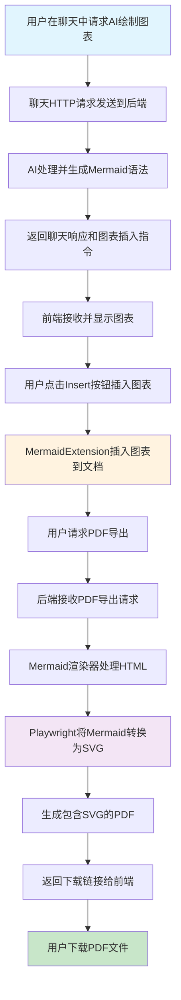
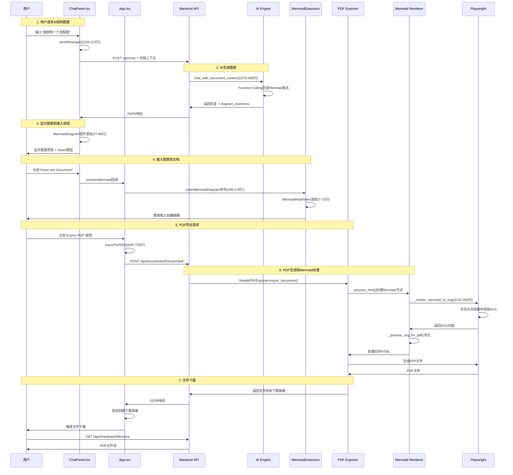

# Mermaid图表与PDF导出功能流程实现代码精讲

## 概述

本文档详细分析了专利审查系统中从用户请求AI绘制Mermaid图表，到插入文档，再到导出包含图表的PDF文件的完整实现流程。

## 功能流程总览



## 详细流程分析

### 1. 用户请求AI绘制Mermaid图

**文件位置**: `client/src/ChatPanel.tsx`

#### 1.1 聊天界面的创建 (行号: 233-350)

```typescript
return (
  <div className={`flex flex-col h-full bg-white rounded-lg shadow-sm ${className}`}>
    {/* Chat title */}
    <div className="px-4 py-3 border-b">
      <p className="text-xs text-gray-500">Ask patent-related questions or request diagram generation</p>
    </div>

    {/* Messages area */}
    <div className="flex-1 overflow-y-auto p-4 space-y-4">
      {messages.map((message, index) => (
        <div key={index} className={`${message.role === 'user' ? 'text-right' : 'text-left'}`}>
          {/* Message content with Markdown and Mermaid diagram support */}
          <ReactMarkdown
            components={{
              code({ node, inline, className, children, ...props }) {
                const match = /language-(\w+)/.exec(className || '');
                const language = match ? match[1] : '';
                
                if (language === 'mermaid') {
                  return (
                    <MermaidDiagram 
                      chart={String(children)} 
                      onInsert={onInsertMermaid} 
                    />
                  );
                }
                // ... other code handling
              }
            }}
          >
            {message.content}
          </ReactMarkdown>
        </div>
      ))}
    </div>

    {/* Input area */}
    <div className="px-4 py-3 border-t relative">
      <textarea
        value={inputMessage}
        onChange={(e) => setInputMessage(e.target.value)}
        onKeyPress={handleKeyPress}
        placeholder="Ask questions about patents or request diagram generation..."
        className="w-full h-20 p-3 pr-16 border rounded-lg resize-none focus:outline-none focus:ring-2 focus:ring-blue-500"
        disabled={isLoading}
      />
      <button
        onClick={sendMessage}
        disabled={!inputMessage.trim() || isLoading}
        className="send-button"
      >
        {isLoading ? '⏳' : '📤'}
      </button>
    </div>
  </div>
);
```

#### 1.2 Mermaid图表组件渲染 (行号: 27-99)

```typescript
// Mermaid diagram component
function MermaidDiagram({ chart, onInsert }: { chart: string; onInsert?: (mermaidSyntax: string, title?: string) => void }) {
  const ref = useRef<HTMLDivElement>(null);
  const [isRendered, setIsRendered] = useState(false);

  useEffect(() => {
    const renderMermaid = async () => {
      if (!ref.current || !chart.trim()) return;
      
      try {
        setIsRendered(false);
        
        // Clear previous content
        ref.current.innerHTML = '';
        
        // Generate unique ID with timestamp to ensure uniqueness
        const uniqueId = `mermaid-${Date.now()}-${Math.random().toString(36).substr(2, 6)}`;
        
        // Re-initialize mermaid to ensure proper rendering
        mermaid.initialize({ 
          startOnLoad: false, 
          theme: 'default',
          securityLevel: 'loose',
          fontFamily: 'Arial, sans-serif'
        });
        
        // Render Mermaid chart
        const { svg } = await mermaid.render(uniqueId, chart);
        
        if (ref.current && svg) {
          ref.current.innerHTML = svg;
          setIsRendered(true);
        }
      } catch (error) {
        console.error('Mermaid rendering failed:', error);
        if (ref.current) {
          ref.current.innerHTML = '<div class="text-red-500 text-sm p-2 border border-red-300 rounded bg-red-50">⚠️ Chart rendering failed, please check syntax</div>';
          setIsRendered(true);
        }
      }
    };
    
    const timeoutId = setTimeout(renderMermaid, 10);
    return () => clearTimeout(timeoutId);
  }, [chart]);

  return (
    <div className="mermaid-preview bg-gray-50 p-4 rounded-lg border my-4">
      <div ref={ref} className="text-center" />
      
      {/* Insert button - only show if callback exists and diagram is rendered */}
      {onInsert && isRendered && (
        <div className="mt-3 text-center">
          <button
            onClick={() => {
              console.log("📊 Insert button clicked, mermaid syntax:", chart);
              onInsert(chart.trim(), "Generated Diagram");
            }}
            className="px-4 py-2 bg-blue-600 text-white text-sm rounded-lg hover:bg-blue-700 transition-colors"
          >
            📊 Insert into Document
          </button>
        </div>
      )}
    </div>
  );
}
```

**关键点**:
- 使用`mermaid.js`库在聊天界面实时渲染图表
- 提供"Insert into Document"按钮供用户手动插入
- 使用唯一ID避免图表渲染冲突

### 2. 聊天HTTP通信与AI图表生成

**文件位置**: `client/src/ChatPanel.tsx`

#### 2.1 发送聊天消息 (行号: 158-223)

```typescript
const sendMessage = async () => {
  if (!inputMessage.trim() || isLoading) return;

  const userMessage: ChatMessage = {
    role: "user",
    content: inputMessage,
    timestamp: new Date()
  };

  // Add user message
  setMessages(prev => [...prev, userMessage]);
  setInputMessage("");
  setIsLoading(true);

  try {
    // Build message history
    const messageHistory = [...messages, userMessage];

    // Get current document content as context
    const currentDocumentContent = getCurrentDocumentContent ? getCurrentDocumentContent() : "";
    console.log("📄 Sending document context length:", currentDocumentContent.length);

    // Call backend chat API
    const response = await axios.post("http://localhost:8000/api/chat", {
      messages: messageHistory.map(({ role, content }) => ({ role, content })),
      current_document_content: currentDocumentContent  // 关键：文档上下文
    });

    // Add AI response
    const assistantMessage: ChatMessage = {
      role: "assistant",
      content: response.data.response,
      timestamp: new Date()
    };

    setMessages(prev => [...prev, assistantMessage]);

    // Handle diagram insertion requests
    if (response.data.diagram_insertions && response.data.diagram_insertions.length > 0) {
      console.log("📊 Chat received diagram insertion request:", response.data.diagram_insertions);
      if (onDiagramInsertions) {
        console.log("📊 Calling diagram insertion callback...");
        onDiagramInsertions(response.data.diagram_insertions);
      }
    }
  } catch (error) {
    console.error("Chat error:", error);
    // Error handling...
  } finally {
    setIsLoading(false);
  }
};
```

**关键点**:
- 发送消息历史和当前文档内容作为上下文
- 接收AI响应和可能的图表插入指令
- 通过回调函数处理图表插入请求

### 3. 后端AI图表生成处理

**文件位置**: `server/app/enhanced_endpoints.py`

#### 3.1 聊天API端点 (行号: 148-192)

```python
@app.post("/api/chat")
async def chat_with_ai(request: ChatRequest):
    """
    Enhanced AI chat functionality endpoint
    
    Supports AI conversation with document context, including:
    - Patent Q&A based on current document content
    - Precise diagram insertion in documents
    - Patent claims analysis and suggestions
    """
    try:
        ai = get_ai_enhanced()
        
        # Build message history
        messages = [{"role": msg.role, "content": msg.content} for msg in request.messages]
        
        # Use chat functionality with document context
        response_chunks = []
        diagram_insertions = []
        
        # Stream processing with diagram insertion detection
        async for chunk in ai.chat_with_document_context(messages, request.current_document_content):
            if chunk:
                # Check if it's a diagram insertion instruction
                if chunk.startswith("DIAGRAM_INSERT:"):
                    try:
                        diagram_data = json.loads(chunk[15:])  # Remove prefix
                        diagram_insertions.append(diagram_data)
                        logger.info(f"📊 Collected diagram insertion request: {diagram_data}")
                    except json.JSONDecodeError as e:
                        logger.error(f"❌ Diagram insertion data parsing failed: {e}")
                else:
                    response_chunks.append(chunk)
        
        full_response = "".join(response_chunks)
        
        # Build response, including diagram insertion information
        result = {"response": full_response}
        if diagram_insertions:
            result["diagram_insertions"] = diagram_insertions
            logger.info(f"✅ Returning response contains {len(diagram_insertions)} diagram insertions")
        
        return result
        
    except Exception as e:
        logger.error(f"Chat processing error: {e}")
        raise HTTPException(status_code=500, detail=str(e))
```

#### 3.2 AI聊天与图表生成 (行号: 276-400)

**文件位置**: `server/app/internal/ai_enhanced.py`

```python
async def chat_with_document_context(self, messages: List[Dict[str, str]], document_content: str = "") -> AsyncGenerator[str | None, None]:
    """
    Chat functionality with document context, supports diagram insertion
    """
    # Convert HTML document content to plain text
    plain_text_content = ""
    if document_content.strip():
        plain_text_content = html_to_plain_text(document_content)
        logger.info(f"Document content length: {len(plain_text_content)}")

    # Build enhanced message list, including system prompts and document context
    enhanced_messages = []
    
    if messages and len(messages) > 0:
        last_user_message = messages[-1].get("content", "")
        
        # Create patent assistant system prompt with document context
        system_prompt = format_patent_chat_prompt(plain_text_content, last_user_message)
        enhanced_messages.append({
            "role": "system",
            "content": system_prompt
        })
        
        # Add message history
        enhanced_messages.extend(messages[:-1])
        enhanced_messages.append({
            "role": "user", 
            "content": last_user_message
        })

    logger.info(f"Starting AI chat with document context, message count: {len(enhanced_messages)}")

    # Use Function Calling for chat
    stream = await self._client.chat.completions.create(
        model=self.model,
        temperature=0.2,  # Slightly higher temperature for creative responses
        messages=enhanced_messages,
        tools=FUNCTION_TOOLS,  # Includes diagram insertion functions
        tool_choice="auto",
        stream=True,
    )
    
    # Process streaming response and function calls
    function_calls = []
    current_function_calls = {}
    
    async for chunk in stream:
        delta = chunk.choices[0].delta
        
        # Handle regular text response
        if delta.content:
            yield delta.content
        
        # Process function calls for diagram insertion
        if delta.tool_calls:
            for tool_call in delta.tool_calls:
                call_index = tool_call.index
                
                if tool_call.function.name:
                    # New function call starts
                    current_function_calls[call_index] = {
                        "name": tool_call.function.name,
                        "arguments": tool_call.function.arguments or ""
                    }
                elif call_index in current_function_calls:
                    # Continue accumulating arguments
                    current_function_calls[call_index]["arguments"] += tool_call.function.arguments or ""

    # Process diagram insertion function calls
    for call_index, func_call in current_function_calls.items():
        function_calls.append(func_call)
    
    # Handle diagram insertion functions
    for func_call in function_calls:
        if func_call["name"] == "insert_diagram":
            try:
                args = json.loads(func_call["arguments"])
                # Yield diagram insertion instruction
                yield f"DIAGRAM_INSERT:{json.dumps(args)}"
                logger.info(f"📊 Generated diagram insertion: {args}")
            except Exception as e:
                logger.error(f"❌ Diagram insertion processing failed: {e}")
```

**关键技术**:
- 使用OpenAI Function Calling生成结构化图表插入指令
- 流式处理AI响应，分离文本内容和图表指令
- 基于文档上下文的智能图表生成

### 4. Mermaid图表插入到文档

**文件位置**: `client/src/internal/MermaidExtension.tsx`

#### 4.1 MermaidExtension TipTap扩展 (行号: 90-180)

```typescript
export const MermaidNode = Node.create<MermaidOptions>({
  name: 'mermaidDiagram',

  addOptions() {
    return {
      HTMLAttributes: {},
    };
  },

  group: 'block',
  atom: true,

  addAttributes() {
    return {
      syntax: {
        default: '',
        parseHTML: element => element.getAttribute('data-syntax'),
        renderHTML: attributes => {
          if (!attributes.syntax) return {};
          return { 'data-syntax': attributes.syntax };
        },
      },
      title: {
        default: '',
        parseHTML: element => element.getAttribute('data-title'),
        renderHTML: attributes => {
          if (!attributes.title) return {};
          return { 'data-title': attributes.title };
        },
      },
    };
  },

  parseHTML() {
    return [
      {
        tag: 'div[data-type="mermaid-diagram"]',
        getAttrs: element => {
          const syntax = (element as HTMLElement).getAttribute('data-syntax');
          const title = (element as HTMLElement).getAttribute('data-title');
          return { syntax, title };
        },
      }
    ];
  },

  renderHTML({ HTMLAttributes }) {
    return [
      'div',
      mergeAttributes(
        { 'data-type': 'mermaid-diagram', 'class': 'mermaid-node' },
        this.options.HTMLAttributes,
        HTMLAttributes
      ),
    ];
  },

  addNodeView() {
    return ReactNodeViewRenderer(MermaidNodeView);
  },

  addCommands() {
    return {
      insertMermaidDiagram:
        (options) =>
        ({ commands }) => {
          return commands.insertContent({
            type: this.name,
            attrs: options,
          });
        },
    };
  },
});
```

#### 4.2 Mermaid节点视图组件 (行号: 7-72)

```typescript
function MermaidNodeView({ node }: { node: any; updateAttributes?: any }) {
  const ref = useRef<HTMLDivElement>(null);
  const { syntax, title } = node.attrs;
  
  useEffect(() => {
    if (ref.current) {
      if (syntax && syntax.trim()) {
        // Initialize mermaid with settings
        mermaid.initialize({ 
          startOnLoad: false, 
          theme: 'default',
          securityLevel: 'loose',
          htmlLabels: false,
          flowchart: {
            htmlLabels: false,
            curve: 'basis',
            useMaxWidth: true
          },
          maxTextSize: 90000
        });
        
        // Clear previous content
        ref.current.innerHTML = '';
        
        // Render the diagram
        mermaid.render('mermaid-' + Date.now(), syntax)
          .then(({ svg }) => {
            if (ref.current) {
              ref.current.innerHTML = svg;
            }
          })
          .catch((error) => {
            console.error('Mermaid rendering error:', error);
            if (ref.current) {
              ref.current.innerHTML = `<div class="text-red-500 text-sm p-2 border border-red-300 rounded bg-red-50">⚠️ Chart rendering failed: ${error.message}</div>`;
            }
          });
      }
    }
  }, [syntax]);

  return (
    <NodeViewWrapper 
      className="mermaid-node-wrapper mermaid-node" 
      data-syntax={syntax}
      data-title={title}
      data-type="mermaid-diagram"
    >
      {title && (
        <div className="mermaid-title text-sm font-semibold text-gray-700 mb-2 text-center">
          {title}
        </div>
      )}
      <div 
        ref={ref} 
        className="mermaid-diagram border rounded-lg p-2 bg-gray-50 my-2"
        style={{maxWidth: "100%", overflow: "auto"}}
      />
    </NodeViewWrapper>
  );
}
```

#### 4.3 图表插入辅助函数 (行号: 182-230)

```typescript
// Helper function to insert diagram after specific text
export function insertDiagramAfterText(
  editor: any, 
  searchText: string, 
  mermaidSyntax: string, 
  title?: string
): boolean {
  console.log(`🔍 Searching for text: "${searchText}"`);
  console.log(`📊 Diagram syntax: "${mermaidSyntax.substring(0, 50)}..."`);
  
  const { state } = editor;
  let insertPosition: number | null = null;
  
  // Find the text in the document
  state.doc.descendants((node: any, pos: number) => {
    if (insertPosition !== null) return false; // Already found
    
    if (node.isText && node.text) {
      const textIndex = node.text.toLowerCase().indexOf(searchText.toLowerCase());
      if (textIndex >= 0) {
        // Found the text, calculate insertion position
        insertPosition = pos + textIndex + searchText.length;
        console.log(`✅ Found text at position ${insertPosition}`);
        return false; // Stop searching
      }
    }
  });
  
  if (insertPosition !== null) {
    // Insert the diagram at the found position
    editor
      .chain()
      .focus()
      .setTextSelection(insertPosition)
      .insertContent([
        { type: 'paragraph', content: [] }, // Add line break
        { 
          type: 'mermaidDiagram', 
          attrs: { 
            syntax: mermaidSyntax,
            title: title || ''
          }
        },
        { type: 'paragraph', content: [] }, // Add line break after
      ])
      .run();
    
    console.log(`✅ Diagram inserted after text: "${searchText}"`);
    return true;
  } else {
    // Text not found, insert at cursor position
    console.log(`⚠️ Text not found: "${searchText}", inserting at cursor position`);
    editor
      .chain()
      .focus()
      .insertMermaidDiagram({ syntax: mermaidSyntax, title })
      .run();
    return false;
  }
}
```

**核心功能**:
- 自定义TipTap节点扩展支持Mermaid图表
- 实时渲染图表在编辑器中
- 支持精确定位插入和光标位置插入

### 5. PDF导出请求处理

**文件位置**: `client/src/App.tsx`

#### 5.1 PDF导出按钮和处理函数 (行号: 665-725)

```typescript
const exportToPDF = useCallback(async () => {
  if (!appState.currentDocument) {
    console.error('❌ No document selected');
    alert('Please select a document first');
    return;
  }

  try {
    console.log('📄 Starting backend PDF export...');
    
    // Set export status
    setAppState(prev => ({ ...prev, isLoading: true }));

    // Call backend API to export PDF
    const response = await axios.post(
      `${BACKEND_URL}/api/documents/${appState.currentDocument.id}/export/pdf`,
      {},
      { 
        headers: { 'Content-Type': 'application/json' },
        timeout: 30000 // 30 second timeout
      }
    );

    if (response.data.status === 'success') {
      console.log('✅ PDF export successful:', response.data.filename);
      
      // Create download link and auto-click download
      const downloadUrl = `${BACKEND_URL}${response.data.download_url}`;
      const link = document.createElement('a');
      link.href = downloadUrl;
      link.download = response.data.filename;
      link.target = '_blank';
      document.body.appendChild(link);
      link.click();
      document.body.removeChild(link);
      
      // Display success message
      alert(`PDF export successful!\nDocument: ${response.data.document_title}\nVersion: v${response.data.version}`);
    } else {
      throw new Error('PDF export API returned failure status');
    }

  } catch (error: any) {
    console.error('❌ PDF export failed:', error);
    
    let errorMessage = 'PDF export failed, please try again later';
    
    if (error.code === 'ECONNABORTED') {
      errorMessage = 'PDF export timeout, please check network connection';
    } else if (error.response?.status === 404) {
      errorMessage = 'Document not found, please refresh page';
    } else if (error.response?.status === 500) {
      errorMessage = 'Server error during PDF generation';
    }
    
    alert(errorMessage);
  } finally {
    setAppState(prev => ({ ...prev, isLoading: false }));
  }
}, [appState.currentDocument]);

// PDF导出按钮渲染 (行号: 1081-1086)
<button
  onClick={exportToPDF}
  disabled={!appState.currentDocument}
  className="w-full p-2 text-sm bg-orange-600 text-white rounded-md hover:bg-orange-700 disabled:bg-gray-300 disabled:cursor-not-allowed transition-colors duration-200"
>
  📄 Export PDF
</button>
```

**功能特点**:
- 30秒超时保护
- 自动下载PDF文件
- 完善的错误处理和用户反馈
- 加载状态管理

### 6. 后端PDF生成与Mermaid渲染

**文件位置**: `server/app/__main__.py`

#### 6.1 PDF导出API端点 (行号: 591-660)

```python
@app.post("/api/documents/{document_id}/export/pdf")
async def export_document_to_pdf(
    document_id: int, 
    background_tasks: BackgroundTasks,
    db: Session = Depends(get_db)
):
    """
    Export document to PDF with Mermaid diagram support
    """
    try:
        logger.info(f"Starting PDF export for document {document_id}...")
        
        # 1. Get document
        document = db.scalar(select(models.Document).where(models.Document.id == document_id))
        if not document:
            raise HTTPException(status_code=404, detail="Document not found")
        
        # 2. Get current active version
        current_version = db.scalar(
            select(models.DocumentVersion)
            .where(models.DocumentVersion.document_id == document_id)
            .where(models.DocumentVersion.is_active == True)
        )
        
        if not current_version:
            raise HTTPException(status_code=404, detail="No active version found")
        
        # 3. Import PDF exporter
        try:
            from app.internal.pdf_export_simple import SimplePDFExporter as PDFExporter
        except ImportError as e:
            logger.error(f"PDF export functionality not available: {e}")
            raise HTTPException(
                status_code=500, 
                detail="PDF export functionality is not available. Please check server configuration."
            )
        
        # 4. Generate PDF
        exporter = PDFExporter()
        filename = await exporter.export_document(document, current_version)
        
        # 5. Schedule file cleanup after 24 hours
        background_tasks.add_task(cleanup_old_files, "app/static/exports", hours=24)
        
        logger.info(f"PDF export successful: {filename}")
        
        return {
            "status": "success",
            "filename": filename,
            "download_url": f"/api/downloads/{filename}",
            "document_title": document.title,
            "version": current_version.version_number
        }
        
    except HTTPException:
        raise
    except Exception as e:
        logger.error(f"PDF export failed: {str(e)}")
        raise HTTPException(status_code=500, detail=f"PDF export failed: {str(e)}")
```

#### 6.2 PDF导出器实现 (行号: 163-200)

**文件位置**: `server/app/internal/pdf_export_simple.py`

```python
async def export_document(self, document: Document, version: DocumentVersion) -> str:
    """
    Export document version to PDF
    
    Args:
        document: Document object
        version: Document version object
        
    Returns:
        Generated PDF filename
    """
    try:
        # 1. Process Mermaid diagrams in HTML
        logger.info("Processing Mermaid diagrams...")
        from app.internal.mermaid_render import MermaidRenderer
        mermaid_renderer = MermaidRenderer()
        processed_html = await mermaid_renderer.process_html(version.content)
        
        # 2. Clean HTML content
        logger.info("Preprocessing HTML content...")
        cleaned_html = self._clean_html_content(processed_html)
        
        # 3. Apply PDF styling
        logger.info("Applying PDF styling...")
        styled_html = self._create_pdf_html(cleaned_html, document.title, version.version_number)
        
        # 4. Generate PDF filename
        timestamp = datetime.now().strftime("%Y%m%d_%H%M%S")
        safe_title = re.sub(r'[^\w\-_\.]', '_', document.title)[:50]
        filename = f"{safe_title}_v{version.version_number}_{timestamp}.pdf"
        pdf_path = self.export_dir / filename
        
        # 5. Generate PDF using Playwright
        logger.info(f"Generating PDF: {filename}")
        async with async_playwright() as p:
            browser = await p.chromium.launch(headless=True)
            page = await browser.new_page()
            
            # Set content and wait for full load
            await page.set_content(styled_html, wait_until="networkidle")
            
            # Additional wait to ensure all content is rendered
            await page.wait_for_timeout(2000)
            
            # Generate PDF
            pdf_bytes = await page.pdf(
                path=str(pdf_path),
                format='A4',
                margin={
                    'top': '2cm',
                    'right': '2cm',
                    'bottom': '2cm',
                    'left': '2cm'
                },
                print_background=True,
                prefer_css_page_size=True
            )
            
            await browser.close()
        
        logger.info(f"✅ PDF generated successfully: {filename}")
        return filename
        
    except Exception as e:
        logger.error(f"❌ PDF export failed: {e}")
        raise
```

### 7. Mermaid图表渲染处理

**文件位置**: `server/app/internal/mermaid_render.py`

#### 7.1 Mermaid渲染器核心功能 (行号: 29-100)

```python
async def process_html(self, html_content: str) -> str:
    """
    Process HTML content, rendering Mermaid nodes within it as SVG
    
    Args:
        html_content: HTML content containing Mermaid nodes
        
    Returns:
        Processed HTML content with Mermaid code replaced by SVG
    """
    try:
        logger.info("Beginning Mermaid diagram processing...")
        
        # Parse HTML
        soup = BeautifulSoup(html_content, 'html.parser')
        
        # Find all mermaid-node elements
        mermaid_nodes = soup.find_all(['mermaid-node', 'div'], class_='mermaid-node')
        
        # Additional search for elements with data-type="mermaid-diagram"
        mermaid_diagrams = soup.find_all(['div'], attrs={'data-type': 'mermaid-diagram'})
        logger.info(f"🔍 Found {len(mermaid_diagrams)} elements with data-type='mermaid-diagram'")
        
        # Merge results from both search methods
        all_mermaid_elements = list(set(mermaid_nodes + mermaid_diagrams))
        
        if not all_mermaid_elements:
            logger.info("❌ No Mermaid nodes found, returning original HTML")
            return html_content
        
        logger.info(f"✅ Found {len(all_mermaid_elements)} Mermaid nodes")
        
        # Render each Mermaid node
        for i, node in enumerate(all_mermaid_elements):
            try:
                # Extract Mermaid syntax and title
                syntax = self._extract_mermaid_syntax(node)
                title = self._extract_mermaid_title(node)
                
                if syntax:
                    logger.info(f"Rendering Mermaid diagram {i+1}...")
                    logger.info(f"📊 Using syntax: {syntax[:100]}...")
                    svg_content = await self._render_mermaid_to_svg(syntax)
                    
                    if svg_content:
                        # Create new SVG container
                        svg_container = self._create_svg_container(svg_content, title)
                        node.replace_with(BeautifulSoup(svg_container, 'html.parser'))
                        logger.info(f"✅ Mermaid diagram {i+1} rendered successfully")
                    else:
                        logger.error(f"❌ Failed to render Mermaid diagram {i+1}")
                        
            except Exception as e:
                logger.error(f"❌ Error processing Mermaid node {i+1}: {e}")
                continue
        
        return str(soup)
        
    except Exception as e:
        logger.error(f"❌ Mermaid processing failed: {e}")
        return html_content
```

#### 7.2 SVG渲染实现 (行号: 142-260)

```python
async def _render_mermaid_to_svg(self, mermaid_syntax: str) -> str:
    """
    Render Mermaid syntax to SVG using Playwright
    
    Args:
        mermaid_syntax: Mermaid syntax string
        
    Returns:
        Rendered SVG string
    """
    try:
        async with async_playwright() as p:
            browser = await p.chromium.launch(headless=True)
            page = await browser.new_page()
            
            # Create HTML page containing Mermaid
            html_template = f"""
            <!DOCTYPE html>
            <html>
            <head>
                <script src="https://cdn.jsdelivr.net/npm/mermaid/dist/mermaid.min.js"></script>
                <style>
                    body {{ 
                        margin: 20px; 
                        font-family: 'Arial', sans-serif;
                        background: white;
                    }}
                    .mermaid {{ 
                        text-align: center;
                        background: white;
                        width: 100%;
                        overflow: visible;
                    }}
                    svg {{
                        max-width: none !important;
                        width: auto !important;
                        height: auto !important;
                        display: block !important;
                        margin: 0 auto !important;
                    }}
                </style>
            </head>
            <body>
                <div class="mermaid" id="mermaid-diagram">
                    {mermaid_syntax}
                </div>
                <script>
                    mermaid.initialize({{
                        startOnLoad: true,
                        theme: 'default',
                        securityLevel: 'loose',
                        fontFamily: 'Arial, sans-serif',
                        htmlLabels: false,
                        flowchart: {{
                            htmlLabels: false,
                            curve: 'basis',
                            useMaxWidth: false,
                            nodeSpacing: 30,
                            rankSpacing: 40,
                            padding: 10,
                            wrapping: false
                        }},
                        sequence: {{
                            htmlLabels: false
                        }},
                        themeVariables: {{
                            fontSize: '14px',
                            fontSizeNode: '12px',
                            primaryColor: '#fff',
                            primaryTextColor: '#000',
                            primaryBorderColor: '#000',
                            lineColor: '#000'
                        }}
                    }});
                </script>
            </body>
            </html>
            """
            
            # Set content and wait for rendering
            await page.set_content(html_template, wait_until="networkidle")
            await page.wait_for_timeout(3000)  # Wait for Mermaid to render
            
            # Extract SVG content
            svg_element = await page.query_selector('.mermaid svg')
            if svg_element:
                svg_content = await svg_element.inner_html()
                # Get SVG attributes
                svg_outer_html = await svg_element.evaluate('el => el.outerHTML')
                
                # Process SVG for PDF compatibility
                processed_svg = self._process_svg_for_pdf(svg_outer_html)
                
                await browser.close()
                return processed_svg
            else:
                logger.error("❌ No SVG element found after Mermaid rendering")
                await browser.close()
                return ""
                
    except Exception as e:
        logger.error(f"❌ Mermaid SVG rendering failed: {e}")
        return ""
```

#### 7.3 SVG处理优化 (行号: 262-320)

```python
def _process_svg_for_pdf(self, svg_content: str) -> str:
    """
    Process SVG content for PDF compatibility
    
    Args:
        svg_content: Original SVG content
        
    Returns:
        Processed SVG content
    """
    try:
        # Parse SVG content
        soup = BeautifulSoup(svg_content, 'html.parser')
        svg_element = soup.find('svg')
        
        if not svg_element:
            return svg_content
        
        # Remove foreignObject elements (not supported in PDF)
        for foreign_obj in svg_element.find_all('foreignObject'):
            foreign_obj.decompose()
        
        # Apply explicit styling to ensure PDF compatibility
        for element in svg_element.find_all(['rect', 'circle', 'ellipse', 'line', 'polyline', 'polygon', 'path']):
            # Ensure fill and stroke are explicitly set
            if not element.get('fill'):
                element['fill'] = '#ffffff'
            if not element.get('stroke'):
                element['stroke'] = '#000000'
        
        # Process text elements
        for text_elem in svg_element.find_all('text'):
            if not text_elem.get('fill'):
                text_elem['fill'] = '#000000'
            if not text_elem.get('font-family'):
                text_elem['font-family'] = 'Arial, sans-serif'
            if not text_elem.get('font-size'):
                text_elem['font-size'] = '14px'
        
        # Remove CSS animations (not supported in PDF)
        for animate in svg_element.find_all(['animate', 'animateMotion', 'animateTransform']):
            animate.decompose()
        
        # Ensure proper viewBox for scaling
        if not svg_element.get('viewBox'):
            width = svg_element.get('width', '400')
            height = svg_element.get('height', '300')
            # Remove 'px' if present
            width = re.sub(r'px$', '', str(width))
            height = re.sub(r'px$', '', str(height))
            svg_element['viewBox'] = f"0 0 {width} {height}"
        
        # Set explicit dimensions
        svg_element['width'] = '100%'
        svg_element['height'] = 'auto'
        
        return str(svg_element)
        
    except Exception as e:
        logger.error(f"❌ SVG processing failed: {e}")
        return svg_content
```

**核心技术**:
- 使用Playwright在无头浏览器中渲染Mermaid图表
- 将图表转换为PDF兼容的SVG格式
- 移除不兼容的元素（如foreignObject、动画）
- 确保文本和图形元素的正确样式

### 8. PDF下载和文件管理

**文件位置**: `server/app/__main__.py`

#### 8.1 文件下载端点 (行号: 662-705)

```python
@app.get("/api/downloads/{filename}")
async def download_pdf_file(filename: str):
    """
    Download PDF file with security validation
    
    Args:
        filename: PDF filename
        
    Returns:
        PDF file stream
    """
    try:
        # Validate filename security (prevent path traversal attacks)
        if ".." in filename or "/" in filename or "\\" in filename:
            raise HTTPException(status_code=400, detail="Invalid filename")
        
        # Ensure it's a PDF file
        if not filename.endswith('.pdf'):
            raise HTTPException(status_code=400, detail="Only PDF files are allowed")
        
        # Build file path
        file_path = Path("app/static/exports") / filename
        
        # Check if file exists
        if not file_path.exists() or not file_path.is_file():
            raise HTTPException(status_code=404, detail="File not found")
        
        logger.info(f"Downloading PDF file: {filename}")
        
        # Return file with proper headers
        import urllib.parse
        encoded_filename = urllib.parse.quote(filename)
        
        return FileResponse(
            path=file_path,
            filename=filename,
            media_type='application/pdf',
            headers={
                "Content-Disposition": f"attachment; filename*=UTF-8''{encoded_filename}"
            }
        )
        
    except HTTPException:
        raise
    except Exception as e:
        logger.error(f"File download failed: {e}")
        raise HTTPException(status_code=500, detail="File download failed")
```

#### 8.2 文件清理机制

```python
def cleanup_old_files(directory: str, hours: int = 24):
    """
    Clean up old files in specified directory
    
    Args:
        directory: Directory path to clean
        hours: Files older than this many hours will be deleted
    """
    try:
        import os
        import time
        
        now = time.time()
        cutoff = now - (hours * 3600)  # Convert hours to seconds
        
        for filename in os.listdir(directory):
            file_path = os.path.join(directory, filename)
            if os.path.isfile(file_path):
                file_mtime = os.path.getmtime(file_path)
                if file_mtime < cutoff:
                    os.remove(file_path)
                    logger.info(f"Cleaned up old file: {filename}")
                    
    except Exception as e:
        logger.error(f"File cleanup failed: {e}")
```

**安全特性**:
- 路径遍历攻击防护
- 文件类型验证（仅允许PDF）
- URL编码文件名处理
- 24小时后自动清理临时文件

## 完整数据流时序图



## 技术栈总结

### 前端技术
- **React + TypeScript**: 主要UI框架
- **TipTap Editor**: 富文本编辑器，支持自定义节点
- **Mermaid.js**: 图表渲染库
- **ReactMarkdown**: Markdown渲染，支持代码块
- **Axios**: HTTP客户端

### 后端技术
- **FastAPI**: Python Web框架
- **OpenAI API**: GPT-4模型，Function Calling
- **Playwright**: 无头浏览器，图表和PDF渲染
- **BeautifulSoup4**: HTML解析和处理
- **SQLAlchemy**: ORM数据库操作

### 图表和PDF技术
- **Mermaid**: 图表语法和渲染
- **SVG**: 矢量图形格式
- **Playwright PDF**: 高质量PDF生成
- **HTML/CSS**: 文档样式和布局

## 关键设计模式

1. **插件式扩展模式**
   - TipTap自定义节点扩展
   - 模块化的图表渲染器

2. **流式处理模式**
   - AI响应流式处理
   - 图表指令分离处理

3. **多步骤渲染模式**
   - HTML → SVG → PDF的转换链
   - 每个步骤都有优化处理

4. **安全下载模式**
   - 路径验证和文件类型检查
   - 临时文件自动清理

## 性能优化要点

1. **图表渲染优化**
   - 唯一ID避免冲突
   - 延时渲染避免DOM未就绪
   - SVG优化移除不兼容元素

2. **PDF生成优化**
   - 页面完全加载后再生成PDF
   - CSS样式优化适配PDF格式
   - 图表SVG处理确保兼容性

3. **文件管理优化**
   - 后台任务清理临时文件
   - 安全文件名处理
   - 30秒超时保护

4. **内存管理**
   - Playwright浏览器及时关闭
   - 大文件流式处理
   - HTML解析后及时释放

## 错误处理策略

1. **图表渲染错误**
   - 语法错误显示友好提示
   - 渲染失败回退到错误消息

2. **PDF生成错误**
   - 详细错误日志记录
   - 用户友好的错误消息
   - 超时和网络错误处理

3. **文件下载错误**
   - 路径遍历攻击防护
   - 文件不存在处理
   - 权限错误处理

## FastAPI框架作用分析

### 在Mermaid图表与PDF导出功能中的核心作用

#### 1. **HTTP REST API端点管理**
```python
# server/app/__main__.py:591-660
@app.post("/api/documents/{document_id}/export/pdf")
async def export_document_to_pdf(
    document_id: int, 
    background_tasks: BackgroundTasks,
    db: Session = Depends(get_db)
):
```

**关键作用**:
- **RESTful API设计**: 标准的HTTP方法和路径结构
- **路径参数自动解析**: `document_id`自动类型转换和验证
- **依赖注入**: 自动注入数据库会话和后台任务管理器

#### 2. **聊天API端点处理**
```python
# server/app/enhanced_endpoints.py:148-192
@app.post("/api/chat")
async def chat_with_ai(request: ChatRequest):
    # 处理聊天请求和图表生成指令
    ai = get_ai_enhanced()
    async for chunk in ai.chat_with_document_context(messages, request.current_document_content):
        # 流式处理AI响应和图表插入指令
```

**功能优势**:
- **请求体自动验证**: 使用Pydantic模型验证聊天数据
- **异步AI处理**: 支持流式AI响应，不阻塞其他请求
- **结构化响应**: 返回聊天内容和图表插入指令的JSON格式

#### 3. **静态文件服务**
```python
# server/app/__main__.py:662-705
@app.get("/api/downloads/{filename}")
async def download_pdf_file(filename: str):
    return FileResponse(
        path=file_path,
        filename=filename,
        media_type='application/pdf',
        headers={"Content-Disposition": f"attachment; filename*=UTF-8''{encoded_filename}"}
    )
```

**安全特性**:
- **路径遍历防护**: 验证文件名防止`../`攻击
- **文件类型验证**: 仅允许PDF文件下载
- **正确HTTP头**: 确保浏览器正确处理文件下载

#### 4. **后台任务管理**
```python
# 自动文件清理
background_tasks.add_task(cleanup_old_files, "app/static/exports", hours=24)
```

**资源管理**:
- **非阻塞后台任务**: 文件清理不影响用户响应时间
- **自动生命周期管理**: 任务在响应完成后执行
- **资源优化**: 防止存储空间无限增长

### FastAPI在多端点协调中的优势

#### 1. **统一的异步处理模型**
```python
# 所有端点都支持异步处理
async def chat_with_ai(request: ChatRequest):  # 聊天API
async def export_document_to_pdf(...):        # PDF导出API
async def download_pdf_file(filename: str):   # 文件下载API
```

**性能优势**:
- **高并发处理**: 单进程处理大量并发请求
- **I/O优化**: 文件操作、AI API调用都是异步的
- **资源效率**: 比传统同步框架节省内存和CPU

#### 2. **类型安全的数据模型**
```python
class ChatRequest(BaseModel):
    messages: List[ChatMessage]
    current_document_content: str = ""

class ChatMessage(BaseModel):
    role: str
    content: str
```

**开发优势**:
- **自动数据验证**: 请求格式错误时自动返回400错误
- **IDE支持**: 完整的类型提示和自动补全
- **API文档生成**: 自动生成Swagger文档

#### 3. **依赖注入和中间件**
```python
# 数据库会话管理
def get_db():
    db = SessionLocal()
    try:
        yield db
    finally:
        db.close()

# 自动注入到需要的端点
@app.post("/api/documents/{document_id}/export/pdf")
async def export_document_to_pdf(db: Session = Depends(get_db)):
```

**架构优势**:
- **资源自动管理**: 数据库连接自动创建和清理
- **代码复用**: 依赖可在多个端点间共享
- **测试友好**: 依赖可以轻松模拟和替换

### 与传统框架对比

#### **vs Flask**:
- ✅ **原生异步支持**: Flask需要额外的asyncio配置
- ✅ **自动API文档**: Swagger UI开箱即用
- ✅ **类型验证**: Pydantic集成，Flask需要手动验证
- ✅ **后台任务**: 内置BackgroundTasks，Flask需要Celery

#### **vs Django**:
- ✅ **轻量级**: 专注API开发，启动更快
- ✅ **现代Python**: 充分利用async/await语法
- ✅ **微服务友好**: 更适合容器化部署
- ✅ **性能优势**: 异步处理的吞吐量更高

### 实际项目价值体现

#### 1. **开发效率提升**
- **自动API文档**: 前端开发者访问`/docs`即可查看所有端点
- **热重载**: 开发时代码变更自动重启，提高调试效率
- **类型安全**: 减少运行时错误，提前发现问题

#### 2. **运维友好特性**
- **内置日志**: 自动记录请求和错误信息
- **健康检查**: 易于集成Kubernetes等容器编排
- **监控集成**: 支持Prometheus等监控系统

#### 3. **扩展性优势**
- **模块化设计**: 端点可以轻松拆分到不同模块
- **插件生态**: 丰富的第三方扩展
- **云原生**: 适合现代微服务架构

## 总结

整个Mermaid图表与PDF导出功能通过以下关键技术实现：

1. **AI驱动的图表生成**：使用OpenAI Function Calling生成结构化图表指令
2. **实时图表渲染**：前端使用Mermaid.js实时预览图表
3. **编辑器集成**：自定义TipTap扩展无缝集成图表到文档
4. **高质量PDF导出**：Playwright渲染引擎确保图表在PDF中完美显示
5. **安全文件管理**：完善的安全检查和自动清理机制

**FastAPI作为后端框架**在整个流程中发挥了关键作用：

- **多端点协调**: 统一管理聊天API、PDF导出API、文件下载API
- **异步处理优势**: 提高并发性能，优化资源利用
- **类型安全保障**: 自动数据验证，减少错误
- **开发友好**: 自动文档生成、热重载、依赖注入
- **运维优化**: 后台任务管理、日志记录、健康检查

这个系统展示了现代Web应用中AI、实时渲染、文档处理和PDF生成技术的完美结合，FastAPI作为胶水层将各个组件有机整合在一起。