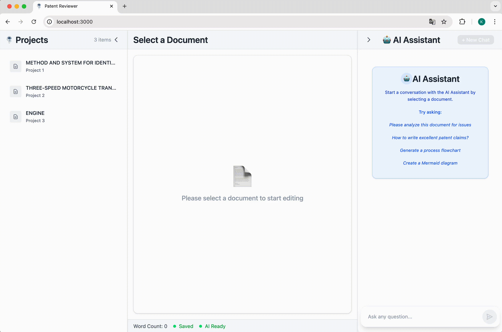
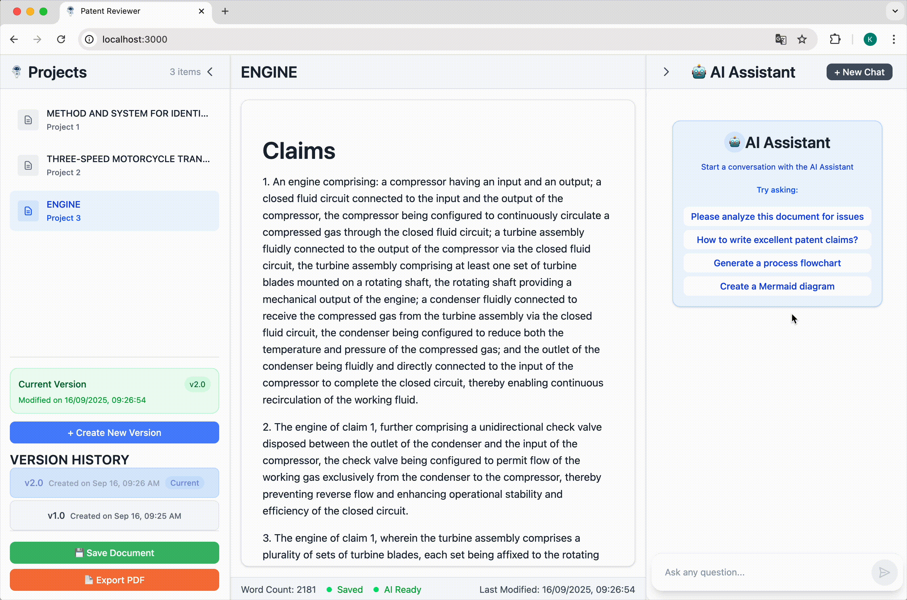
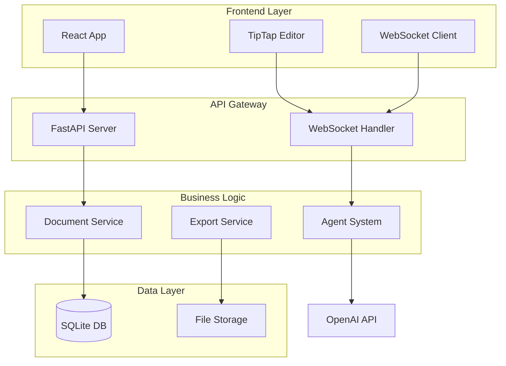

# Document Intelligence System

An intelligent document analysis platform that combines modern full-stack development with advanced AI engineering. This project explores the intersection of real-time web applications and multi-agent AI systems, tackling complex challenges in document processing and collaborative editing.

## 🎯 Project Overview

Built as a comprehensive solution for document review and analysis, this application integrates multiple sophisticated technologies to create a seamless user experience. The system demonstrates expertise in distributed architectures, real-time communication patterns, and AI workflow orchestration through practical implementation of complex features like version control, streaming AI analysis, and collaborative document editing.

## 🛠️ Technical Architecture

### Full-Stack Implementation
- **Frontend**: React with TypeScript, TipTap/ProseMirror rich text editing, TanStack Query
- **Backend**: FastAPI async Python, SQLAlchemy ORM, WebSocket server
- **AI Integration**: OpenAI GPT-4.1, LangGraph multi-agent workflows
- **Database**: Custom SQLite schema with document versioning and chat persistence

### Key Engineering Solutions
- **Multi-Agent AI System**: Specialized agents orchestrated through LangGraph workflows
- **Real-time Communication**: WebSocket implementation with streaming AI responses
- **Document Version Control**: Git-like versioning with atomic operations and diff tracking
- **Custom Editor Extensions**: ProseMirror plugins for suggestion cards and diagram integration
- **Intelligent Processing**: Fuzzy text matching and context-aware document analysis

## 🚀 Technical Stack

### Frontend
- **React 18** with TypeScript for type-safe component development
- **TipTap/ProseMirror** for advanced rich text editing capabilities
- **TanStack React Query** for efficient server state management
- **WebSocket** real-time bidirectional communication
- **TailwindCSS** for responsive, utility-first styling
- **Vite** for lightning-fast development and optimized production builds

### Backend
- **FastAPI** async Python framework with WebSocket support
- **SQLAlchemy ORM** with custom schema design for document versioning
- **OpenAI GPT-4.1** integration with streaming responses
- **LangGraph Multi-Agent System**: Coordinated AI workflows with specialized agents
- **Real-time Communication**: WebSocket server with connection management
- **Data Persistence**: Chat history and document version storage
- **PDF Generation**: Playwright-based server-side rendering
- **Error Handling**: Graceful degradation and connection recovery

### DevOps & Tools
- **Docker** containerization for consistent deployment
- **GitHub Actions** CI/CD pipeline
- **ESLint & TypeScript** for code quality enforcement
- **Automated testing** infrastructure

## ✨ Feature Demonstrations

### Document Version Control System
A Git-inspired versioning system that maintains complete document history with visual diff tracking. Users can create new versions, switch between versions, and compare changes with atomic transaction support.



### Multi-Agent AI Analysis
Real-time document analysis using specialized AI agents (Technical, Legal, Novelty) coordinated through LangGraph workflows. The system streams suggestions with contextual understanding and confidence scoring.

  

### Suggestion Card Insertion
Interactive suggestion cards that appear inline within the document editor. AI-generated recommendations are presented as actionable cards with accept/reject options, allowing users to seamlessly incorporate or dismiss suggestions while maintaining document flow.


### AI-Powered Diagram Generation
Natural language to Mermaid diagram conversion with custom TipTap extensions. Users can describe flowcharts or processes, and the AI generates interactive diagrams that integrate seamlessly into documents.




## 🏗️ System Architecture



## 🔧 Technical Implementation

### Advanced Features
- **Real-time Streaming**: WebSocket implementation with automatic reconnection and error recovery
- **Multi-Agent Coordination**: LangGraph workflows managing parallel AI agent execution with state reducers
- **Document Version Control**: Git-like versioning system with atomic operations and rollback capability
- **Intelligent Text Processing**: Fuzzy matching algorithms for robust text location and context awareness
- **Custom Editor Integration**: ProseMirror extensions for suggestion cards and diagram embedding
- **Performance Optimization**: Debounced AI triggers, virtual scrolling, and strategic memoization

### Production Considerations
- **Error Handling**: Graceful degradation with comprehensive error boundaries
- **Security**: Input sanitization, CORS configuration, and secure API key management
- **Scalability**: Modular architecture supporting horizontal scaling and database migration
- **Testing**: Comprehensive test suite covering WebSocket communication and AI integration

## 🔒 Security Implementation

- **Environment Variables**: Secure API key management
- **Input Sanitization**: XSS protection with DOMPurify
- **CORS Configuration**: Whitelist-based origin control
- **Path Traversal Protection**: Secure file operations
- **Rate Limiting**: Token bucket algorithm for API protection
- **Error Handling**: Graceful degradation without exposing internals

## 🚦 Development Workflow

### Environment Setup
**First-time setup requires creating isolated virtual environments:**
```bash
# Backend Python environment
cd server
python3 -m venv .venv
source .venv/bin/activate
pip install -r requirements.txt -r requirements-test.txt

# Frontend Node.js environment  
cd ../client
nvm use  # Uses Node.js v22.19.0 from .nvmrc
npm install
```

### Local Development
```bash
# Quick start with development scripts (uses virtual environments)
./start-dev.sh    # Starts both frontend and backend with proper environments
./logs-dev.sh     # Monitor service status
./stop-dev.sh     # Clean shutdown

# Manual setup for debugging
cd server
source .venv/bin/activate  # Activate Python virtual environment
uvicorn app.__main__:app --reload --host 0.0.0.0 --port 8080

cd client
nvm use           # Switch to project Node.js version
npm run dev       # Frontend on :3000
```

### Environment Verification
```bash
# Verify backend environment
cd server && source .venv/bin/activate && python -c "import fastapi; print('✅ Backend ready')"

# Verify frontend environment
cd client && nvm use && npm run lint --silent && echo "✅ Frontend ready"
```

### CI/CD Pipeline
```yaml
# GitHub Actions workflow
- Automated testing on PR
- Type checking and linting
- Build verification
- Docker image creation
- Deployment to staging
```

## 📈 Scalability Considerations

### Current Architecture Supports:
- **Horizontal scaling** of API servers
- **Database migration** to PostgreSQL/MySQL
- **Redis integration** for caching and sessions
- **CDN deployment** for static assets
- **Microservices migration** path

### Future Enhancements Roadmap:
1. **Multi-tenant Architecture**: User authentication and workspace isolation
2. **Collaborative Editing**: Real-time multi-user document editing with CRDTs
3. **Advanced AI Pipeline**: Multi-agent system for specialized analysis
4. **Enterprise Features**: SSO, audit logs, compliance reports
5. **Performance Monitoring**: OpenTelemetry integration