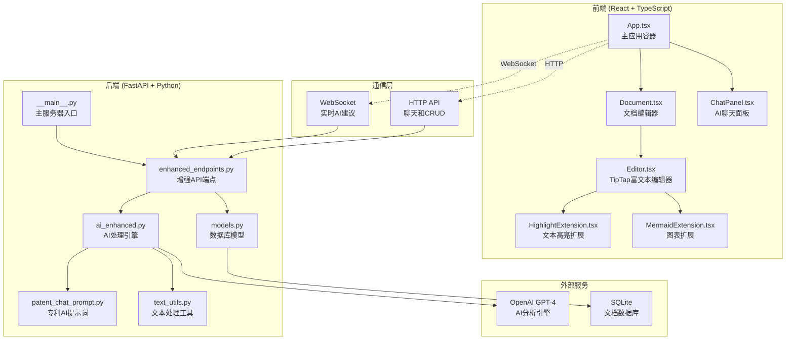
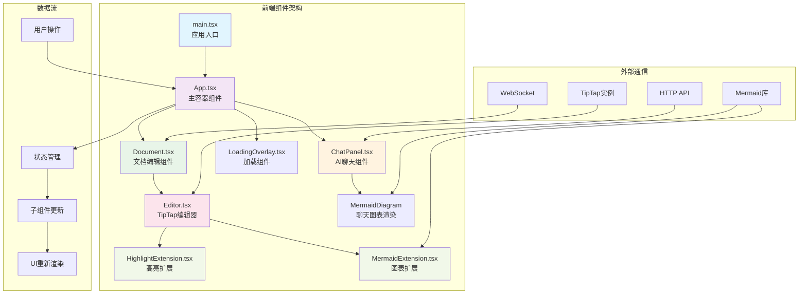
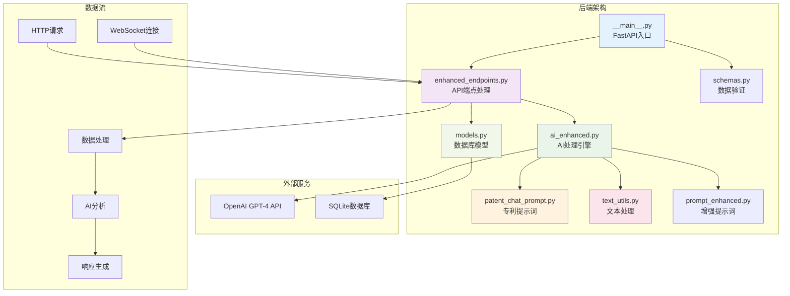
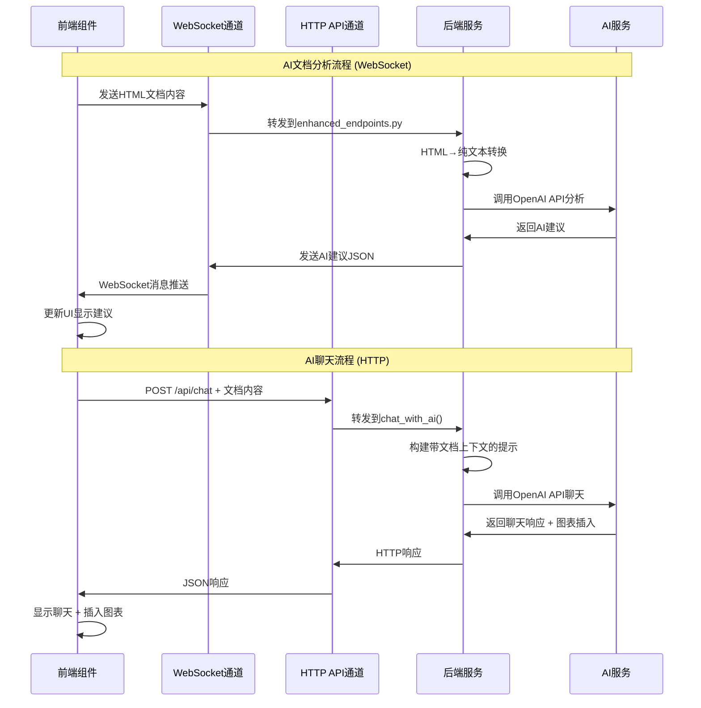

```mermaid
flowchart TB
    subgraph "用户界面交互"
        A[用户点击 'AI分析' 按钮] --> B{检查AI处理状态}
        B -->|空闲| C[按钮变为 '分析中...']
        B -->|忙碌| D[显示禁用状态]
    end
    
    subgraph "App.tsx - 主控制器"
        C --> E[调用 manualAnalysisFunction<br/>代码: manualAnalysisFunction&#40;&#41;]
        E --> F[触发注册的分析函数<br/>来自Document组件]
    end
    
    subgraph "Document.tsx - 文档处理"
        F --> G[triggerManualAnalysis 函数执行]
        G --> H{检查编辑器状态<br/>editorRef.current?}
        H -->|存在| I[获取HTML内容<br/>editorRef.current.getHTML&#40;&#41;]
        H -->|不存在| J[错误: 编辑器未就绪]
        
        I --> K{检查WebSocket状态<br/>isSocketActuallyReady&#40;&#41;}
        K -->|就绪| L[sendMessage&#40;htmlContent&#41;<br/>发送HTML到WebSocket]
        K -->|未就绪| M[错误: WebSocket未连接]
    end
    
    subgraph "WebSocket通信层"
        L --> N[WebSocket传输<br/>ws://localhost:8000/ws/enhanced]
        N --> O[后端接收HTML内容]
    end
    
    subgraph "enhanced_endpoints.py - WebSocket处理"
        O --> P[websocket_enhanced_endpoint函数]
        P --> Q[接收文本<br/>html_content = await websocket.receive_text&#40;&#41;]
        Q --> R[发送处理开始消息<br/>type: 'processing_start']
        
        R --> S[调用文本转换<br/>plain_text = html_to_plain_text&#40;html_content&#41;]
        S --> T[文本验证<br/>validate_text_for_ai&#40;plain_text&#41;]
        T -->|无效| U[发送验证错误<br/>type: 'validation_error']
        T -->|有效| V[继续AI处理]
    end
    
    subgraph "text_utils.py - 文本处理"
        S --> W[HTML解析<br/>soup = BeautifulSoup&#40;html_content, 'html.parser'&#41;]
        W --> X[段落处理<br/>for p in soup.find_all&#40;'p'&#41;:<br/>  p.insert_after&#40;'\\n\\n'&#41;]
        X --> Y[提取纯文本<br/>text = soup.get_text&#40;&#41;]
        Y --> Z[清理格式<br/>去除多余空格和换行]
    end
    
    subgraph "ai_enhanced.py - AI处理引擎"
        V --> AA[review_document_with_functions函数]
        AA --> AB[构建AI请求<br/>构建包含系统和用户消息的数组]
        AB --> AC[调用OpenAI API<br/>使用GPT-4模型，温度0.1，启用函数调用]
    end
    
    subgraph "OpenAI API处理"
        AC --> AD[AI分析文档内容]
        AD --> AE[识别专利问题]
        AE --> AF[调用create_suggestion函数<br/>多次调用，每个问题一次]
        AF --> AG[生成函数调用参数<br/>包含原文本、替换文本和问题类型]
    end
    
    subgraph "响应处理和解析"
        AG --> AH[收集流式响应<br/>async for chunk in stream]
        AH --> AI[累积函数调用<br/>按索引存储函数调用数据]
        AI --> AJ[解析所有函数调用<br/>for func_call in function_calls]
        AJ --> AK[构建建议列表<br/>将每个建议添加到issues数组]
        AK --> AL[生成JSON响应<br/>将建议列表转换为JSON格式]
    end
    
    subgraph "前端响应处理"
        AL --> AM[WebSocket发送响应<br/>type: 'ai_suggestions']
        AM --> AN[Document.tsx接收<br/>lastMessage处理]
        AN --> AO[解析消息<br/>解析WebSocket接收的JSON数据]
        AO --> AP[调用回调<br/>触发AI建议处理回调函数]
        
        AP --> AQ[App.tsx更新状态<br/>更新应用状态中的AI建议]
        AQ --> AR[aiSuggestions状态更新]
    end
    
    subgraph "UI渲染和交互"
        AR --> AS[建议卡片渲染<br/>遍历建议数组生成UI卡片]
        AS --> AT[显示建议信息<br/>类型/严重度/描述]
        AT --> AU[用户点击建议卡片]
        AU --> AV[高亮显示原文<br/>在编辑器中临时高亮问题文本]
        
        AV --> AW[用户点击'接受'按钮]
        AW --> AX[调用acceptSuggestion函数]
        AX --> AY[执行文本替换<br/>在编辑器中替换原文为改进文本]
        AY --> AZ[更新编辑器内容]
        AZ --> BA[移除已接受的建议<br/>过滤aiSuggestions数组]
    end
    
    style A fill:#e1f5fe
    style E fill:#f3e5f5
    style G fill:#e8f5e9
    style P fill:#fff3e0
    style AA fill:#fce4ec
    style AD fill:#f1f8e9
    style AS fill:#e8eaf6
```

# 专利审查系统技术架构详解

> **目标读者**: TypeScript初学者和软件开发新手
> 
> **本文档目的**: 深入解析专利审查系统的完整技术架构，包括前端、后端、通信机制和核心功能实现

## 📋 目录

1. [系统概览](#系统概览)
2. [前端架构详解](#前端架构详解)
3. [后端架构详解](#后端架构详解)
4. [前后端通信机制](#前后端通信机制)
5. [核心功能实现流程](#核心功能实现流程)
6. [关键技术栈](#关键技术栈)

---

## 系统概览

这是一个基于AI的专利文档审查系统，支持实时编辑、AI建议、图表插入和版本管理。

### 🏗️ 整体架构图



---

## 前端架构详解

### 📁 前端文件结构

```
client/src/
├── main.tsx              # 应用入口点
├── App.tsx               # 主应用组件
├── Document.tsx          # 文档编辑器组件
├── ChatPanel.tsx         # AI聊天面板组件
├── internal/
│   ├── Editor.tsx        # TipTap编辑器封装
│   ├── HighlightExtension.tsx  # 文本高亮功能
│   ├── MermaidExtension.tsx    # 图表渲染功能
│   └── LoadingOverlay.tsx      # 加载动画组件
└── assets/               # 静态资源
```

### 🎯 核心组件详解

#### 1. main.tsx - 应用入口
**作用**: React应用的启动点
**关键代码**:
```typescript
import React from 'react'
import ReactDOM from 'react-dom/client'
import App from './App.tsx'

ReactDOM.createRoot(document.getElementById('root')!).render(
  <React.StrictMode>
    <App />
  </React.StrictMode>,
)
```
- **输入**: HTML DOM根节点
- **输出**: 渲染完整的React应用
- **调用**: App组件

#### 2. App.tsx - 主应用容器
**作用**: 应用状态管理、布局管理、组件协调
**关键功能**:
```typescript
// 主要状态管理
const [appState, setAppState] = useState<AppState>({
  currentDocument: null,
  documentVersions: [],
  aiSuggestions: [],
  isAIProcessing: false,
  activeRightTab: 'suggestions'
});

// AI建议处理
const handleAISuggestions = useCallback((suggestions: AISuggestion[]) => {
  setAppState(prev => ({
    ...prev,
    aiSuggestions: suggestions
  }));
}, []);

// 图表插入处理
const handleDiagramInsertions = useCallback((insertions: DiagramInsertion[]) => {
  insertions.forEach((insertion) => {
    const success = insertDiagramAfterText(
      editorRef.current,
      insertion.insert_after_text,
      insertion.mermaid_syntax,
      insertion.title
    );
  });
}, []);
```

**输入**: 用户交互事件、WebSocket消息、HTTP响应
**输出**: 渲染Document、ChatPanel等子组件
**调用关系**: 
- → Document.tsx (文档编辑)
- → ChatPanel.tsx (AI聊天)
- → 后端API调用

#### 3. Document.tsx - 文档编辑器组件
**作用**: 管理文档编辑、WebSocket通信、AI建议集成
**关键功能**:
```typescript
// WebSocket连接管理
const { sendMessage, lastMessage, readyState } = useWebSocket(SOCKET_URL, {
  onOpen: () => {
    setIsWebSocketReady(true);
    onProcessingStatus?.(false, "AI助手已连接");
  },
  // ... 其他配置
});

// AI建议处理
useEffect(() => {
  if (lastMessage !== null) {
    const message: WebSocketMessage = JSON.parse(lastMessage.data);
    switch (message.type) {
      case 'ai_suggestions':
        if (message.data?.issues) {
          onAISuggestions?.(message.data.issues);
        }
        // 处理图表插入
        if (message.data?.diagram_insertions) {
          onDiagramInsertions?.(message.data.diagram_insertions);
        }
        break;
      // ... 其他消息类型
    }
  }
}, [lastMessage]);

// 手动AI分析
const triggerManualAnalysis = useCallback(() => {
  if (editorRef.current) {
    const htmlContent = editorRef.current.getHTML();
    sendMessage(htmlContent);
  }
}, [sendMessage]);
```

**输入**: HTML文档内容、用户编辑操作
**输出**: AI建议、图表插入、状态更新
**调用关系**: 
- → Editor.tsx (编辑器实例)
- ← App.tsx (状态和回调)
- ↔ 后端WebSocket

#### 4. Editor.tsx - TipTap编辑器封装
**作用**: 富文本编辑器配置和扩展管理
**关键代码**:
```typescript
const extensions = [
  StarterKit,                    // 基础编辑功能
  Highlight.configure({          // 文本高亮扩展
    multicolor: true,
    HTMLAttributes: { class: 'text-highlight' },
  }),
  MermaidNode.configure({        // 图表渲染扩展
    HTMLAttributes: { class: 'mermaid-node' },
  }),
];

const editor = useEditor({
  content: content,
  extensions: extensions,
  onUpdate: ({ editor }) => {
    const html = editor.getHTML();
    handleEditorChange(html);    // 向上传递内容变化
  },
});
```

**输入**: 文档内容、配置参数
**输出**: 编辑器实例、HTML内容变化
**调用关系**: 
- → HighlightExtension.tsx (高亮功能)
- → MermaidExtension.tsx (图表功能)
- ← Document.tsx (内容和配置)

#### 5. HighlightExtension.tsx - 文本高亮扩展
**作用**: 实现精确文本匹配、高亮显示、文本替换
**核心函数**:
```typescript
// 文档中查找文本
export function findTextInDocument(doc: any, searchText: string): { from: number; to: number } | null {
  let result: { from: number; to: number } | null = null;
  const normalizedSearch = searchText.toLowerCase().trim();

  doc.descendants((node: any, pos: number) => {
    if (node.isText && node.text) {
      const normalizedText = node.text.toLowerCase();
      const index = normalizedText.indexOf(normalizedSearch);
      
      if (index !== -1) {
        result = {
          from: pos + index,
          to: pos + index + searchText.length,
        };
        return false; // 停止搜索
      }
    }
  });
  return result;
}

// 替换文本
export function replaceText(editor: any, searchText: string, replaceWith: string): boolean {
  const { state } = editor;
  const result = findTextInDocument(state.doc, searchText);

  if (result) {
    editor
      .chain()
      .focus()
      .setTextSelection(result)
      .deleteSelection()
      .insertContent(replaceWith)
      .run();
    return true;
  }
  return false;
}
```

**输入**: 编辑器实例、搜索文本、替换文本
**输出**: 文本位置、替换结果
**调用关系**: 
- ← App.tsx (AI建议应用)
- ← MermaidExtension.tsx (图表插入定位)

#### 6. MermaidExtension.tsx - 图表扩展
**作用**: 在文档中渲染和管理Mermaid图表
**核心组件**:
```typescript
// Mermaid图表渲染组件
function MermaidNodeView({ node }: { node: any }) {
  const ref = useRef<HTMLDivElement>(null);
  const { syntax, title } = node.attrs;
  
  useEffect(() => {
    if (ref.current && syntax) {
      mermaid.initialize({ 
        startOnLoad: false, 
        theme: 'default',
        securityLevel: 'loose'
      });
      
      mermaid.render('mermaid-' + Date.now(), syntax)
        .then(({ svg }) => {
          if (ref.current) {
            ref.current.innerHTML = svg;
          }
        });
    }
  }, [syntax]);

  return (
    <div className="mermaid-node-wrapper" contentEditable={false}>
      {title && <div className="mermaid-title">{title}</div>}
      <div ref={ref} className="mermaid-diagram" />
    </div>
  );
}

// 图表插入函数
export function insertDiagramAfterText(
  editor: any, 
  searchText: string, 
  mermaidSyntax: string, 
  title?: string
): boolean {
  const { state } = editor;
  let insertPosition: number | null = null;
  
  // 使用文本查找定位插入位置
  state.doc.descendants((node: any, pos: number) => {
    if (node.isText && node.text) {
      const index = node.text.toLowerCase().indexOf(searchText.toLowerCase());
      if (index !== -1) {
        insertPosition = pos + index + searchText.length;
        return false;
      }
    }
  });
  
  if (insertPosition !== null) {
    editor
      .chain()
      .focus()
      .setTextSelection(insertPosition)
      .insertContent('\n\n')
      .insertMermaidDiagram({ syntax: mermaidSyntax, title })
      .insertContent('\n')
      .run();
    return true;
  }
  return false;
}
```

**输入**: 编辑器实例、搜索文本、Mermaid语法、标题
**输出**: 渲染的图表、插入成功状态
**调用关系**: 
- ← App.tsx (AI图表插入)
- → HighlightExtension.tsx (文本定位)

#### 7. ChatPanel.tsx - AI聊天面板
**作用**: 处理用户与AI的对话、图表生成请求
**关键功能**:
```typescript
// 发送消息到AI
const sendMessage = async () => {
  const userMessage: ChatMessage = {
    role: "user",
    content: inputMessage,
    timestamp: new Date()
  };

  setMessages(prev => [...prev, userMessage]);
  
  try {
    // 获取当前文档内容
    const currentDocumentContent = getCurrentDocumentContent ? getCurrentDocumentContent() : "";
    
    // 调用聊天API，包含文档上下文
    const response = await axios.post("http://localhost:8000/api/chat", {
      messages: messageHistory.map(({ role, content }) => ({ role, content })),
      current_document_content: currentDocumentContent
    });

    // 处理AI响应
    const assistantMessage: ChatMessage = {
      role: "assistant",
      content: response.data.response,
      timestamp: new Date()
    };
    setMessages(prev => [...prev, assistantMessage]);
    
    // 处理图表插入请求
    if (response.data.diagram_insertions && response.data.diagram_insertions.length > 0) {
      onDiagramInsertions?.(response.data.diagram_insertions);
    }
  } catch (error) {
    console.error("聊天错误:", error);
  }
};

// Mermaid图表渲染
function MermaidDiagram({ chart }: { chart: string }) {
  const ref = useRef<HTMLDivElement>(null);
  
  useEffect(() => {
    if (ref.current) {
      mermaid.initialize({ startOnLoad: true, theme: 'default' });
      ref.current.innerHTML = chart;
      mermaid.contentLoaded();
    }
  }, [chart]);
  
  return <div ref={ref} className="mermaid my-4" />;
}
```

**输入**: 用户消息、当前文档内容
**输出**: AI响应、图表插入请求
**调用关系**: 
- ← App.tsx (文档内容获取、图表插入回调)
- → 后端/api/chat
- → Mermaid渲染

### 🔄 前端组件关系图



---

## 后端架构详解

### 📁 后端文件结构

```
server/app/
├── __main__.py           # FastAPI应用入口
├── enhanced_endpoints.py # 增强API端点
├── models.py            # SQLAlchemy数据模型
├── schemas.py           # Pydantic数据验证
├── internal/
│   ├── ai_enhanced.py   # 增强AI处理引擎
│   ├── patent_chat_prompt.py  # 专利AI提示词
│   ├── text_utils.py    # 文本处理工具
│   ├── ai.py            # 基础AI处理
│   ├── prompt.py        # 基础提示词
│   ├── prompt_enhanced.py  # 增强提示词
│   ├── db.py            # 数据库连接
│   └── data.py          # 数据处理工具
```

### 🎯 核心模块详解

#### 1. __main__.py - FastAPI应用入口
**作用**: 创建FastAPI应用、注册路由、配置中间件
**关键代码**:
```python
from fastapi import FastAPI, WebSocket
from fastapi.middleware.cors import CORSMiddleware

app = FastAPI(title="Patent Review System")

# CORS配置
app.add_middleware(
    CORSMiddleware,
    allow_origins=["http://localhost:3000"],  # 前端地址
    allow_credentials=True,
    allow_methods=["*"],
    allow_headers=["*"],
)

# 注册增强版端点
try:
    from app.enhanced_endpoints import websocket_enhanced_endpoint, chat_with_ai, ChatRequest
    
    @app.websocket("/ws/enhanced")
    async def enhanced_websocket_route(websocket: WebSocket):
        await websocket_enhanced_endpoint(websocket)
    
    @app.post("/api/chat")
    async def chat_endpoint(request: ChatRequest):
        return await chat_with_ai(request)
    
except ImportError as e:
    logger.warning(f"增强版端点不可用: {e}")

# 基础文档CRUD端点
@app.get("/document/{doc_id}")
async def get_document(doc_id: int):
    # 获取文档逻辑
    
@app.post("/save/{doc_id}")
async def save_document(doc_id: int, content: dict):
    # 保存文档逻辑
```

**输入**: HTTP请求、WebSocket连接
**输出**: API响应、WebSocket消息
**调用关系**: 
- → enhanced_endpoints.py (增强功能)
- → models.py (数据操作)

#### 2. enhanced_endpoints.py - 增强API端点
**作用**: 处理AI聊天、WebSocket通信、图表插入
**关键功能**:

##### WebSocket端点处理
```python
async def websocket_enhanced_endpoint(websocket: WebSocket):
    await websocket.accept()
    
    try:
        ai = get_ai_enhanced()  # 获取AI实例
        
        while True:
            # 接收HTML内容
            html_content = await websocket.receive_text()
            
            # 发送处理开始通知
            processing_msg = {
                "type": "processing_start",
                "message": "正在分析文档...",
                "timestamp": datetime.utcnow().isoformat()
            }
            await websocket.send_text(json.dumps(processing_msg))
            
            # HTML转纯文本
            plain_text = html_to_plain_text(html_content)
            
            # AI分析
            response_chunks = []
            async for chunk in ai.review_document_with_functions(plain_text):
                if chunk:
                    response_chunks.append(chunk)
            
            # 解析并发送结果
            full_response = "".join(response_chunks)
            parsed_result = json.loads(full_response)
            
            success_response = {
                "type": "ai_suggestions",
                "data": parsed_result,
                "timestamp": datetime.utcnow().isoformat()
            }
            await websocket.send_text(json.dumps(success_response))
            
    except WebSocketDisconnect:
        logger.info("WebSocket连接已断开")
```

##### 聊天API端点
```python
class ChatRequest(BaseModel):
    messages: List[ChatMessage]
    current_document_content: str = ""  # 当前文档内容

async def chat_with_ai(request: ChatRequest):
    try:
        ai = get_ai_enhanced()
        
        # 构建消息历史
        messages = [{"role": msg.role, "content": msg.content} for msg in request.messages]
        
        # 使用带文档上下文的聊天功能
        response_chunks = []
        diagram_insertions = []
        
        async for chunk in ai.chat_with_document_context(messages, request.current_document_content):
            if chunk:
                # 检查是否是图表插入指令
                if chunk.startswith("DIAGRAM_INSERT:"):
                    diagram_data = json.loads(chunk[15:])
                    diagram_insertions.append(diagram_data)
                else:
                    response_chunks.append(chunk)
        
        # 构建响应
        result = {"response": "".join(response_chunks)}
        if diagram_insertions:
            result["diagram_insertions"] = diagram_insertions
        
        return result
        
    except Exception as e:
        raise HTTPException(status_code=500, detail=str(e))
```

**输入**: WebSocket消息、HTTP请求、文档内容
**输出**: AI建议、聊天响应、图表插入指令
**调用关系**: 
- → ai_enhanced.py (AI处理)
- → text_utils.py (文本转换)
- ← __main__.py (路由注册)

#### 3. ai_enhanced.py - AI处理引擎
**作用**: 集成OpenAI API、处理Function Calling、生成AI建议
**核心方法**:

##### 文档分析方法
```python
async def review_document_with_functions(self, document: str) -> AsyncGenerator[str | None, None]:
    # 使用Function Calling进行分析
    stream = await self._client.chat.completions.create(
        model=self.model,
        temperature=0.1,  # 低温度保证分析准确性
        messages=[
            {"role": "system", "content": ENHANCED_PROMPT},
            {"role": "user", "content": document}
        ],
        tools=FUNCTION_TOOLS,  # AI可调用的函数
        tool_choice="auto",
        stream=True,
    )
    
    # 收集函数调用
    function_calls = []
    current_function_calls = {}
    
    async for chunk in stream:
        delta = chunk.choices[0].delta
        
        # 处理函数调用
        if delta.tool_calls:
            for tool_call in delta.tool_calls:
                call_index = tool_call.index
                
                if tool_call.function.name:
                    current_function_calls[call_index] = {
                        "name": tool_call.function.name,
                        "arguments": tool_call.function.arguments or ""
                    }
                elif call_index in current_function_calls:
                    current_function_calls[call_index]["arguments"] += tool_call.function.arguments or ""
    
    # 处理收集到的函数调用
    issues = []
    diagram_insertions = []
    
    for func_call in function_calls:
        if func_call["name"] == "create_suggestion":
            args = json.loads(func_call["arguments"])
            issues.append({
                "type": args.get("type", ""),
                "severity": args.get("severity", "medium"),
                "paragraph": args.get("paragraph", 1),
                "description": args.get("description", ""),
                "originalText": args.get("originalText", ""),
                "replaceTo": args.get("replaceTo", ""),
            })
        elif func_call["name"] == "insert_diagram":
            args = json.loads(func_call["arguments"])
            diagram_insertions.append({
                "insert_after_text": args.get("insert_after_text", ""),
                "mermaid_syntax": args.get("mermaid_syntax", ""),
                "diagram_type": args.get("diagram_type", "flowchart"),
                "title": args.get("title", "")
            })
    
    # 生成响应
    response = {
        "issues": issues,
        "diagram_insertions": diagram_insertions
    }
    yield json.dumps(response, ensure_ascii=False)
```

##### 带文档上下文的聊天方法
```python
async def chat_with_document_context(self, messages: List[Dict[str, str]], document_content: str = "") -> AsyncGenerator[str | None, None]:
    # 转换HTML文档内容为纯文本
    plain_text_content = ""
    if document_content.strip():
        plain_text_content = html_to_plain_text(document_content)

    # 构建增强的消息列表
    enhanced_messages = []
    
    if messages and len(messages) > 0:
        last_user_message = messages[-1].get("content", "")
        
        # 创建专利助手系统提示
        system_prompt = format_patent_chat_prompt(plain_text_content, last_user_message)
        enhanced_messages.append({
            "role": "system",
            "content": system_prompt
        })
        
        # 添加用户消息历史
        enhanced_messages.extend(messages[:-1])
        enhanced_messages.append({
            "role": "user", 
            "content": last_user_message
        })

    # 使用Function Calling进行聊天
    stream = await self._client.chat.completions.create(
        model=self.model,
        temperature=0.2,  # 聊天稍高温度保持创造性
        messages=enhanced_messages,
        tools=FUNCTION_TOOLS,
        tool_choice="auto",
        stream=True,
    )
    
    # 处理流式响应和函数调用
    async for chunk in stream:
        delta = chunk.choices[0].delta
        
        # 处理普通文本响应
        if delta.content:
            yield delta.content
        
        # 处理函数调用（图表插入等）
        if delta.tool_calls:
            for tool_call in delta.tool_calls:
                if tool_call.function.name == "insert_diagram":
                    args = json.loads(tool_call.function.arguments)
                    # 发送特殊格式的图表插入指令
                    insert_command = json.dumps({
                        "insert_after_text": args.get("insert_after_text", ""),
                        "mermaid_syntax": args.get("mermaid_syntax", ""),
                        "diagram_type": args.get("diagram_type", "flowchart"),
                        "title": args.get("title", "")
                    })
                    yield f"DIAGRAM_INSERT:{insert_command}"
```

**输入**: 文档文本、聊天消息、AI模型配置
**输出**: AI建议、聊天响应、图表插入指令
**调用关系**: 
- → OpenAI API (外部)
- → patent_chat_prompt.py (提示词)
- → text_utils.py (文本处理)
- ← enhanced_endpoints.py (API调用)

#### 4. patent_chat_prompt.py - 专利AI提示词
**作用**: 为AI提供专业的专利分析指导和功能说明
**核心内容**:
```python
PATENT_CHAT_SYSTEM_PROMPT = """You are a professional patent attorney assistant specializing in patent claims analysis and document drafting. You have access to the user's current patent document content and can help them with various patent-related tasks.

## Current Document Context
The user is working on a patent document. The current document content is provided in the DOCUMENT_CONTENT variable below. Use this context to provide accurate, relevant assistance.

DOCUMENT_CONTENT: {current_document_content}

## Your Capabilities

### 1. Patent Claims Analysis
- Analyze claim structure and identify issues
- Check for proper antecedent basis
- Verify claim dependencies
- Suggest improvements for clarity and scope

### 2. Document Enhancement
- Answer questions about the current document content
- Provide writing suggestions for better patent language
- Explain technical concepts in the document

### 3. Diagram Insertion (IMPORTANT)
When users request diagrams or flowcharts to be inserted into their document:
- Use the `insert_diagram` function
- Find EXACT text from the document for the `insert_after_text` parameter
- Create appropriate Mermaid syntax for the diagram
- Supported diagram types: flowchart, sequence, class, er, gantt, pie, mindmap

Example diagram insertion:
If user says "please insert a diagram after 'polymer substrate housing'" and you find this exact text in the document, use:
```
insert_diagram(
    insert_after_text="polymer substrate housing the first and second flow channels",
    mermaid_syntax="flowchart TD\\n    A[Polymer Substrate] --> B[First Flow Channel]\\n    A --> C[Second Flow Channel]",
    diagram_type="flowchart",
    title="Microfluidic Device Structure"
)
```

USER_INPUT: {user_input}

Provide helpful, professional assistance based on the user's request and the current document content."""

def format_patent_chat_prompt(current_document_content: str, user_input: str) -> str:
    # 限制文档内容长度，避免token过多
    max_content_length = 3000
    if len(current_document_content) > max_content_length:
        current_document_content = current_document_content[:max_content_length] + "\n\n[Document content truncated for length...]"
    
    return PATENT_CHAT_SYSTEM_PROMPT.format(
        current_document_content=current_document_content,
        user_input=user_input
    )
```

**输入**: 文档内容、用户输入
**输出**: 格式化的AI提示词
**调用关系**: 
- ← ai_enhanced.py (提示词生成)

#### 5. text_utils.py - 文本处理工具
**作用**: HTML到纯文本转换、文本验证
**核心函数**:
```python
def html_to_plain_text(html_content: str) -> str:
    """将HTML内容转换为AI可处理的纯文本"""
    
    if not html_content or html_content.strip() == "":
        return ""
    
    try:
        # 使用BeautifulSoup解析HTML
        soup = BeautifulSoup(html_content, 'html.parser')
        
        # 处理段落标签
        for p in soup.find_all('p'):
            p.insert_after('\n\n')
        
        # 处理换行标签  
        for br in soup.find_all('br'):
            br.insert_after('\n')
        
        # 提取纯文本
        text = soup.get_text()
        
        # 清理文本
        text = re.sub(r'\n{3,}', '\n\n', text)  # 最多两个连续换行
        text = re.sub(r'[ \t]+', ' ', text)     # 合并空格
        text = text.strip()
        
        return text
        
    except Exception as e:
        logger.error(f"HTML转换失败: {e}")
        return html_content  # 返回原始内容作为备用

def validate_text_for_ai(text: str) -> tuple[bool, str]:
    """验证文本是否适合AI处理"""
    
    if not text or len(text.strip()) < 10:
        return False, "文档内容太短，请添加更多内容后再试"
    
    if len(text) > 50000:
        return False, "文档内容太长，请缩短后再试"
    
    return True, ""
```

**输入**: HTML内容、纯文本
**输出**: 纯文本、验证结果
**调用关系**: 
- ← enhanced_endpoints.py (内容转换)
- ← ai_enhanced.py (文本处理)

#### 6. models.py - 数据库模型
**作用**: 定义文档和版本的数据结构
**核心模型**:
```python
from sqlalchemy import Column, Integer, String, Text, DateTime, Boolean, ForeignKey
from sqlalchemy.ext.declarative import declarative_base
from sqlalchemy.orm import relationship

Base = declarative_base()

class Document(Base):
    __tablename__ = "documents"
    
    id = Column(Integer, primary_key=True, index=True)
    title = Column(String, nullable=False)
    current_version_id = Column(Integer, ForeignKey("document_versions.id"))
    created_at = Column(DateTime)
    updated_at = Column(DateTime)
    
    # 关系
    versions = relationship("DocumentVersion", back_populates="document")
    current_version = relationship("DocumentVersion", foreign_keys=[current_version_id])

class DocumentVersion(Base):
    __tablename__ = "document_versions"
    
    id = Column(Integer, primary_key=True, index=True)
    document_id = Column(Integer, ForeignKey("documents.id"))
    version_number = Column(String, nullable=False)  # v1.0, v2.0等
    content = Column(Text, nullable=False)
    is_active = Column(Boolean, default=False)
    created_at = Column(DateTime)
    
    # 关系
    document = relationship("Document", back_populates="versions")
```

**输入**: 数据库操作请求
**输出**: 数据模型实例
**调用关系**: 
- ← __main__.py (CRUD操作)
- → SQLite数据库

### 🔄 后端模块关系图



---

## 前后端通信机制

### 🔄 通信架构概览

系统使用双通道通信模式：
1. **WebSocket通道**: 实时AI文档分析
2. **HTTP API通道**: 聊天、CRUD操作



### 📡 具体通信实现

#### 1. WebSocket通信 - AI文档分析

**前端发送 (Document.tsx)**:
```typescript
// 触发AI分析
const triggerManualAnalysis = useCallback(() => {
  if (editorRef.current && isSocketActuallyReady()) {
    // 获取编辑器HTML内容
    const htmlContent = editorRef.current.getHTML();
    console.log("🚀 发送文档内容进行AI分析:", htmlContent.length, "字符");
    
    // 通过WebSocket发送
    sendMessage(htmlContent);
  }
}, [sendMessage, isSocketActuallyReady]);

// 接收AI响应
useEffect(() => {
  if (lastMessage !== null) {
    try {
      const message: WebSocketMessage = JSON.parse(lastMessage.data);
      
      switch (message.type) {
        case 'processing_start':
          setIsAIProcessing(true);
          onProcessingStatus?.(true, message.message);
          break;
          
        case 'ai_suggestions':
          setIsAIProcessing(false);
          
          // 处理AI建议
          if (message.data?.issues) {
            onAISuggestions?.(message.data.issues);
          }
          
          // 处理图表插入
          if (message.data?.diagram_insertions) {
            onDiagramInsertions?.(message.data.diagram_insertions);
          }
          break;
          
        case 'validation_error':
        case 'ai_error':
          setIsAIProcessing(false);
          onProcessingStatus?.(false, message.message);
          break;
      }
    } catch (error) {
      console.error("WebSocket消息解析失败:", error);
    }
  }
}, [lastMessage, onAISuggestions, onDiagramInsertions, onProcessingStatus]);
```

**后端处理 (enhanced_endpoints.py)**:
```python
async def websocket_enhanced_endpoint(websocket: WebSocket):
    await websocket.accept()
    
    try:
        ai = get_ai_enhanced()
        
        while True:
            # 1. 接收前端发送的HTML内容
            html_content = await websocket.receive_text()
            logger.info(f"📥 接收到文档内容: {len(html_content)} 字符")
            
            # 2. 发送处理开始通知
            processing_msg = {
                "type": "processing_start",
                "message": "正在分析文档...",
                "timestamp": datetime.utcnow().isoformat()
            }
            await websocket.send_text(json.dumps(processing_msg))
            
            # 3. 文本预处理
            plain_text = html_to_plain_text(html_content)
            is_valid, error_message = validate_text_for_ai(plain_text)
            
            if not is_valid:
                validation_error = {
                    "type": "validation_error",
                    "message": error_message,
                    "timestamp": datetime.utcnow().isoformat()
                }
                await websocket.send_text(json.dumps(validation_error))
                continue
            
            # 4. AI分析处理
            response_chunks = []
            async for chunk in ai.review_document_with_functions(plain_text):
                if chunk:
                    response_chunks.append(chunk)
            
            # 5. 解析AI响应
            full_response = "".join(response_chunks)
            parsed_result = json.loads(full_response)
            
            # 6. 发送分析结果
            success_response = {
                "type": "ai_suggestions",
                "data": parsed_result,  # 包含issues和diagram_insertions
                "timestamp": datetime.utcnow().isoformat()
            }
            await websocket.send_text(json.dumps(success_response))
            
    except WebSocketDisconnect:
        logger.info("WebSocket连接断开")
    except Exception as e:
        logger.error(f"WebSocket处理错误: {e}")
```

#### 2. HTTP通信 - AI聊天

**前端发送 (ChatPanel.tsx)**:
```typescript
const sendMessage = async () => {
  const userMessage: ChatMessage = {
    role: "user",
    content: inputMessage,
    timestamp: new Date()
  };

  setMessages(prev => [...prev, userMessage]);
  setIsLoading(true);

  try {
    // 获取当前文档内容
    const currentDocumentContent = getCurrentDocumentContent ? getCurrentDocumentContent() : "";
    
    // 发送HTTP请求
    const response = await axios.post("http://localhost:8000/api/chat", {
      messages: messageHistory.map(({ role, content }) => ({ role, content })),
      current_document_content: currentDocumentContent  // 包含文档上下文
    });

    // 处理AI响应
    const assistantMessage: ChatMessage = {
      role: "assistant",
      content: response.data.response,
      timestamp: new Date()
    };
    setMessages(prev => [...prev, assistantMessage]);
    
    // 处理图表插入
    if (response.data.diagram_insertions && response.data.diagram_insertions.length > 0) {
      console.log("📊 收到图表插入请求:", response.data.diagram_insertions);
      onDiagramInsertions?.(response.data.diagram_insertions);
    }
    
  } catch (error) {
    console.error("聊天错误:", error);
  } finally {
    setIsLoading(false);
  }
};
```

**后端处理 (enhanced_endpoints.py)**:
```python
class ChatRequest(BaseModel):
    messages: List[ChatMessage]
    current_document_content: str = ""

async def chat_with_ai(request: ChatRequest):
    try:
        ai = get_ai_enhanced()
        
        # 1. 构建消息历史
        messages = [{"role": msg.role, "content": msg.content} for msg in request.messages]
        
        # 2. 使用带文档上下文的聊天
        response_chunks = []
        diagram_insertions = []
        
        async for chunk in ai.chat_with_document_context(messages, request.current_document_content):
            if chunk:
                # 检查是否是图表插入指令
                if chunk.startswith("DIAGRAM_INSERT:"):
                    try:
                        diagram_data = json.loads(chunk[15:])
                        diagram_insertions.append(diagram_data)
                    except json.JSONDecodeError:
                        pass
                else:
                    response_chunks.append(chunk)
        
        # 3. 构建响应
        result = {"response": "".join(response_chunks)}
        if diagram_insertions:
            result["diagram_insertions"] = diagram_insertions
        
        return result
        
    except Exception as e:
        raise HTTPException(status_code=500, detail=str(e))
```

### 📊 数据格式详解

#### WebSocket消息格式
```typescript
// 前端 → 后端: 发送文档内容
string  // HTML文档内容

// 后端 → 前端: AI分析结果
interface WebSocketMessage {
  type: 'processing_start' | 'ai_suggestions' | 'validation_error' | 'ai_error';
  message?: string;
  data?: {
    issues: AISuggestion[];           // AI建议列表
    diagram_insertions?: DiagramInsertion[];  // 图表插入请求
  };
  timestamp: string;
}
```

#### HTTP API格式
```typescript
// 前端 → 后端: 聊天请求
interface ChatRequest {
  messages: Array<{
    role: "user" | "assistant";
    content: string;
  }>;
  current_document_content: string;  // 当前文档HTML内容
}

// 后端 → 前端: 聊天响应
interface ChatResponse {
  response: string;                  // AI聊天回复
  diagram_insertions?: Array<{       // 可选的图表插入
    insert_after_text: string;
    mermaid_syntax: string;
    diagram_type: string;
    title?: string;
  }>;
}
```

---

## 核心功能实现流程

### 🎯 功能1: AI文档分析与建议

这是系统的核心功能，通过AI分析专利文档并提供改进建议。

#### 🔄 完整工作流程（详细版）



#### 💻 关键代码实现

**1. 前端触发分析 (App.tsx)**:
```typescript
// 在App.tsx中注册分析函数
const registerManualAnalysis = useCallback((analysisFunction: () => void) => {
  setManualAnalysisFunction(() => analysisFunction);
}, []);

// UI按钮绑定
<button 
  onClick={() => {
    if (manualAnalysisFunction) {
      manualAnalysisFunction();
    }
  }}
  disabled={appState.isAIProcessing}
>
  {appState.isAIProcessing ? "分析中..." : "AI分析"}
</button>
```

**2. WebSocket发送内容 (Document.tsx)**:
```typescript
const triggerManualAnalysis = useCallback(() => {
  if (editorRef.current && isSocketActuallyReady()) {
    // 获取实时编辑器内容
    const htmlContent = editorRef.current.getHTML();
    
    // 发送到后端进行分析
    sendMessage(htmlContent);
  }
}, [sendMessage, isSocketActuallyReady]);

// 注册到App组件
useEffect(() => {
  if (onManualAnalysis) {
    onManualAnalysis(triggerManualAnalysis);
  }
}, [onManualAnalysis, triggerManualAnalysis]);
```

**3. 后端AI分析 (ai_enhanced.py)**:
```python
async def review_document_with_functions(self, document: str) -> AsyncGenerator[str | None, None]:
    # 调用OpenAI API进行分析
    stream = await self._client.chat.completions.create(
        model=self.model,
        temperature=0.1,  # 低温度确保分析准确性
        messages=[
            {"role": "system", "content": ENHANCED_PROMPT},
            {"role": "user", "content": document}
        ],
        tools=FUNCTION_TOOLS,  # 提供AI可调用的函数
        tool_choice="auto",    # 让AI自主选择调用函数
        stream=True,
    )
    
    # 收集Function Calling结果
    function_calls = []
    current_function_calls = {}
    
    async for chunk in stream:
        delta = chunk.choices[0].delta
        
        # 处理工具调用
        if delta.tool_calls:
            for tool_call in delta.tool_calls:
                call_index = tool_call.index
                
                if tool_call.function.name:
                    # 新的函数调用开始
                    current_function_calls[call_index] = {
                        "name": tool_call.function.name,
                        "arguments": tool_call.function.arguments or ""
                    }
                elif call_index in current_function_calls:
                    # 继续累积参数
                    current_function_calls[call_index]["arguments"] += tool_call.function.arguments or ""
    
    # 处理所有收集到的函数调用
    issues = []
    for func_call in function_calls:
        if func_call["name"] == "create_suggestion":
            args = json.loads(func_call["arguments"])
            
            # 创建建议对象
            issue = {
                "type": args.get("type", ""),
                "severity": args.get("severity", "medium"),
                "paragraph": args.get("paragraph", 1),
                "description": args.get("description", ""),
                "originalText": args.get("originalText", ""),  # 精确匹配用
                "replaceTo": args.get("replaceTo", ""),       # 建议替换内容
            }
            issues.append(issue)
    
    # 返回结构化响应
    response = {"issues": issues}
    yield json.dumps(response, ensure_ascii=False)
```

**4. 前端处理建议 (Document.tsx)**:
```typescript
useEffect(() => {
  if (lastMessage !== null) {
    try {
      const message: WebSocketMessage = JSON.parse(lastMessage.data);
      
      switch (message.type) {
        case 'ai_suggestions':
          if (message.data?.issues) {
            // 传递建议到App组件
            onAISuggestions?.(message.data.issues);
            
            // 更新状态信息
            onProcessingStatus?.(false, `AI分析完成，发现${message.data.issues.length}个建议`);
          }
          break;
      }
    } catch (error) {
      console.error("消息解析失败:", error);
    }
  }
}, [lastMessage, onAISuggestions, onProcessingStatus]);
```

**5. 建议应用 (App.tsx)**:
```typescript
// 接受AI建议
const acceptSuggestion = useCallback((suggestion: AISuggestion, index: number) => {
  if (!editorRef.current) return;
  
  // 使用精确文本匹配和替换
  const success = replaceText(
    editorRef.current,
    suggestion.originalText || suggestion.text || "",
    suggestion.replaceTo || suggestion.suggestion
  );
  
  if (success) {
    // 标记文档已修改
    setAppState(prev => ({
      ...prev,
      hasUnsavedChanges: true,
      aiSuggestions: prev.aiSuggestions.filter((_, i) => i !== index)
    }));
  }
}, []);
```

### 🎯 功能2: AI智能图表插入

AI根据文档内容和用户请求，在指定位置插入相关图表。

#### 🔄 完整工作流程（详细版）

```mermaid
flowchart TB
    subgraph "用户交互 - ChatPanel.tsx"
        A[用户输入: '在polymer substrate后插入流程图'] --> B[点击发送按钮]
        B --> C[sendMessage函数执行]
        C --> D[构建用户消息对象<br/>创建包含角色和内容的消息对象]
        D --> E[添加到消息历史<br/>将用户消息添加到聊天历史]
    end
    
    subgraph "获取文档上下文"
        E --> F{检查getCurrentDocumentContent<br/>回调是否存在}
        F -->|存在| G[调用回调获取文档<br/>getCurrentDocumentContent&#40;&#41;]
        F -->|不存在| H[使用空文档内容<br/>currentDocumentContent = '']
        
        G --> I[App.tsx提供的回调<br/>&#40;&#41; => editorRef.current?.getHTML&#40;&#41; || '']
        I --> J[从编辑器获取HTML<br/>包含完整文档内容]
    end
    
    subgraph "HTTP请求构建"
        J --> K[构建请求体<br/>包含消息历史和当前文档内容]
        H --> K
        K --> L[发送POST请求<br/>调用聊天API端点]
        L --> M[HTTP请求发送<br/>包含聊天历史和文档内容]
    end
    
    subgraph "后端处理 - enhanced_endpoints.py"
        M --> N[chat_with_ai函数接收请求]
        N --> O[解析ChatRequest<br/>messages + current_document_content]
        O --> P[获取AI实例<br/>ai = get_ai_enhanced&#40;&#41;]
        
        P --> Q[调用chat_with_document_context<br/>传入messages和文档内容]
    end
    
    subgraph "文档上下文处理 - ai_enhanced.py"
        Q --> R[HTML转纯文本<br/>plain_text = html_to_plain_text&#40;document_content&#41;]
        R --> S[提取最后用户消息<br/>last_user_message = messages[-1]['content']]
        S --> T[构建专利AI提示<br/>format_patent_chat_prompt&#40;plain_text, user_input&#41;]
        
        T --> U[生成系统消息<br/>包含完整文档内容和用户请求]
        U --> V[构建增强消息列表<br/>[system_prompt, ...history, user_message]]
    end
    
    subgraph "专利AI提示词 - patent_chat_prompt.py"
        T --> W[PATENT_CHAT_SYSTEM_PROMPT模板]
        W --> X[插入文档内容变量<br/>DOCUMENT_CONTENT: {current_document_content}]
        X --> Y[插入用户输入变量<br/>USER_INPUT: {user_input}]
        Y --> Z[生成完整提示词<br/>包含图表插入指导]
    end
    
    subgraph "OpenAI API调用"
        V --> AA[构建API请求<br/>temperature=0.2, tools=FUNCTION_TOOLS]
        AA --> AB[流式调用OpenAI<br/>stream = await client.chat.completions.create&#40;...&#41;]
        AB --> AC[AI理解用户意图<br/>'在polymer substrate后插入流程图']
        
        AC --> AD[AI在文档中搜索<br/>找到: 'a polymer substrate housing the first and second flow channels']
        AD --> AE[AI调用insert_diagram函数]
        AE --> AF[生成函数参数<br/>包含插入位置、图表语法、类型和标题]
    end
    
    subgraph "响应流处理"
        AF --> AG[处理流式响应<br/>async for chunk in stream]
        AG --> AH{检查chunk类型}
        AH -->|文本内容| AI[yield delta.content<br/>普通聊天回复]
        AH -->|函数调用| AJ[检查函数名称]
        
        AJ -->|insert_diagram| AK[解析函数参数<br/>从工具调用中提取JSON参数]
        AK --> AL[构建插入命令<br/>创建图表插入的JSON指令]
        AL --> AM[yield 'DIAGRAM_INSERT:' + insert_command]
    end
    
    subgraph "后端响应组装"
        AI --> AN[收集聊天文本<br/>将响应片段添加到数组]
        AM --> AO[识别图表插入指令<br/>检查响应片段是否为图表插入命令]
        AO --> AP[解析图表数据<br/>从指令中提取JSON图表数据]
        AP --> AQ[添加到插入列表<br/>将图表数据添加到插入数组]
        
        AN --> AR[组装最终响应<br/>包含聊天回复和图表插入数据]
        AQ --> AR
    end
    
    subgraph "前端响应处理 - ChatPanel.tsx"
        AR --> AS[axios响应返回]
        AS --> AT[创建助手消息<br/>构建AI响应的消息对象]
        AT --> AU[添加到消息列表<br/>将AI消息添加到聊天历史]
        
        AU --> AV{检查diagram_insertions}
        AV -->|存在| AW[记录图表插入请求<br/>输出调试信息]
        AV -->|不存在| AX[仅显示聊天回复]
        
        AW --> AY[调用图表插入回调<br/>触发图表插入处理函数]
    end
    
    subgraph "图表插入执行 - App.tsx"
        AY --> AZ[handleDiagramInsertions函数]
        AZ --> BA{检查编辑器实例<br/>editorRef.current?}
        BA -->|不存在| BB[错误: 编辑器未就绪]
        BA -->|存在| BC[遍历插入请求<br/>处理每个图表插入数据]
        
        BC --> BD[调用insertDiagramAfterText<br/>传入编辑器、搜索文本、图表语法、标题]
    end
    
    subgraph "文本定位和插入 - MermaidExtension.tsx"
        BD --> BE[获取编辑器状态<br/>const { state } = editor]
        BE --> BF[遍历文档节点<br/>state.doc.descendants&#40;&#40;node, pos&#41; => ...&#41;]
        BF --> BG{节点是文本?<br/>node.isText}
        BG -->|否| BH[继续下一个节点]
        BG -->|是| BI[规范化文本<br/>toLowerCase&#40;&#41;.trim&#40;&#41;]
        
        BI --> BJ[搜索目标文本<br/>indexOf&#40;normalizedSearch&#41;]
        BJ -->|找到| BK[计算插入位置<br/>pos + index + searchText.length]
        BJ -->|未找到| BH
        
        BK --> BL[执行编辑器命令链<br/>editor.chain&#40;&#41;]
        BL --> BM[设置光标位置<br/>.setTextSelection&#40;insertPosition&#41;]
        BM --> BN[插入间距<br/>.insertContent&#40;'\\n\\n'&#41;]
        BN --> BO[插入图表节点<br/>.insertMermaidDiagram&#40;{syntax, title}&#41;]
        BO --> BP[添加结束间距<br/>.insertContent&#40;'\\n'&#41;]
        BP --> BQ[执行命令<br/>.run&#40;&#41;]
    end
    
    subgraph "图表渲染 - MermaidNodeView"
        BQ --> BR[创建图表节点实例]
        BR --> BS[MermaidNodeView组件渲染]
        BS --> BT[初始化mermaid库<br/>设置默认主题和配置]
        BT --> BU[渲染图表<br/>将Mermaid语法转换为SVG]
        BU --> BV[SVG生成并显示<br/>ref.current.innerHTML = svg]
        
        BV --> BW[用户看到渲染的图表]
        BW --> BX[标记文档已修改<br/>hasUnsavedChanges: true]
    end
    
    style A fill:#e1f5fe
    style N fill:#f3e5f5
    style Q fill:#e8f5e9
    style AA fill:#fff3e0
    style AZ fill:#fce4ec
    style BE fill:#f1f8e9
    style BS fill:#e8eaf6
```

#### 💻 关键代码实现

**1. 用户发起图表请求 (ChatPanel.tsx)**:
```typescript
const sendMessage = async () => {
  // 构建用户消息
  const userMessage: ChatMessage = {
    role: "user",
    content: inputMessage,  // 例如："请在polymer substrate housing后插入流程图"
    timestamp: new Date()
  };

  try {
    // 获取当前文档内容（关键！）
    const currentDocumentContent = getCurrentDocumentContent ? getCurrentDocumentContent() : "";
    
    // 发送到后端，包含完整文档上下文
    const response = await axios.post("http://localhost:8000/api/chat", {
      messages: messageHistory.map(({ role, content }) => ({ role, content })),
      current_document_content: currentDocumentContent  // 实时文档内容
    });

    // 处理AI响应
    const assistantMessage: ChatMessage = {
      role: "assistant",
      content: response.data.response,
      timestamp: new Date()
    };
    setMessages(prev => [...prev, assistantMessage]);
    
    // 处理图表插入请求
    if (response.data.diagram_insertions && response.data.diagram_insertions.length > 0) {
      onDiagramInsertions?.(response.data.diagram_insertions);
    }
  } catch (error) {
    console.error("聊天错误:", error);
  }
};
```

**2. 后端AI图表分析 (ai_enhanced.py)**:
```python
async def chat_with_document_context(self, messages: List[Dict[str, str]], document_content: str = "") -> AsyncGenerator[str | None, None]:
    # 1. 转换文档内容
    plain_text_content = ""
    if document_content.strip():
        plain_text_content = html_to_plain_text(document_content)

    # 2. 构建带文档上下文的提示
    enhanced_messages = []
    if messages and len(messages) > 0:
        last_user_message = messages[-1].get("content", "")
        
        # 创建专利助手系统提示，包含完整文档内容
        system_prompt = format_patent_chat_prompt(plain_text_content, last_user_message)
        enhanced_messages.append({
            "role": "system",
            "content": system_prompt
        })
        
        enhanced_messages.extend(messages[:-1])
        enhanced_messages.append({
            "role": "user", 
            "content": last_user_message
        })

    # 3. AI分析和响应
    stream = await self._client.chat.completions.create(
        model=self.model,
        temperature=0.2,
        messages=enhanced_messages,
        tools=FUNCTION_TOOLS,  # 包含insert_diagram函数
        tool_choice="auto",
        stream=True,
    )
    
    # 4. 处理AI响应
    async for chunk in stream:
        delta = chunk.choices[0].delta
        
        # 普通聊天内容
        if delta.content:
            yield delta.content
        
        # 函数调用处理
        if delta.tool_calls:
            for tool_call in delta.tool_calls:
                if tool_call.function.name == "insert_diagram":
                    args = json.loads(tool_call.function.arguments)
                    
                    # 生成图表插入指令
                    insert_command = json.dumps({
                        "insert_after_text": args.get("insert_after_text", ""),
                        "mermaid_syntax": args.get("mermaid_syntax", ""),
                        "diagram_type": args.get("diagram_type", "flowchart"),
                        "title": args.get("title", "")
                    })
                    yield f"DIAGRAM_INSERT:{insert_command}"
```

**3. 专利AI提示词 (patent_chat_prompt.py)**:
```python
PATENT_CHAT_SYSTEM_PROMPT = """You are a professional patent attorney assistant...

## Current Document Context
The current document content is provided below:

DOCUMENT_CONTENT: {current_document_content}

## Diagram Insertion (IMPORTANT)
When users request diagrams:
- Use the `insert_diagram` function
- Find EXACT text from the document for the `insert_after_text` parameter
- Create appropriate Mermaid syntax

Example:
User: "insert a diagram after polymer substrate housing"
You find in document: "a polymer substrate housing the first and second flow channels"
Use: insert_diagram(
    insert_after_text="a polymer substrate housing the first and second flow channels",
    mermaid_syntax="flowchart TD\\n    A[Polymer Substrate] --> B[Flow Channels]",
    diagram_type="flowchart",
    title="Device Structure"
)
"""

def format_patent_chat_prompt(current_document_content: str, user_input: str) -> str:
    return PATENT_CHAT_SYSTEM_PROMPT.format(
        current_document_content=current_document_content,
        user_input=user_input
    )
```

**4. 前端图表插入 (App.tsx)**:
```typescript
const handleDiagramInsertions = useCallback((insertions: DiagramInsertion[]) => {
  if (!editorRef.current) {
    console.error('编辑器实例未准备就绪');
    return;
  }

  insertions.forEach((insertion, index) => {
    console.log(`插入图表 ${index + 1}:`, insertion);
    
    // 调用MermaidExtension的插入函数
    const success = insertDiagramAfterText(
      editorRef.current,
      insertion.insert_after_text,     // AI提供的精确文本
      insertion.mermaid_syntax,        // AI生成的图表语法
      insertion.title                  // 图表标题
    );
    
    if (success) {
      console.log(`图表 ${index + 1} 插入成功`);
      // 标记文档有未保存更改
      setAppState(prev => ({
        ...prev,
        hasUnsavedChanges: true
      }));
    } else {
      console.error(`图表插入失败: 找不到文本 "${insertion.insert_after_text}"`);
    }
  });
}, []);
```

**5. 图表插入实现 (MermaidExtension.tsx)**:
```typescript
export function insertDiagramAfterText(
  editor: any, 
  searchText: string, 
  mermaidSyntax: string, 
  title?: string
): boolean {
  const { state } = editor;
  let insertPosition: number | null = null;
  
  // 在文档中查找目标文本
  state.doc.descendants((node: any, pos: number) => {
    if (insertPosition !== null) return false;
    
    if (node.isText && node.text) {
      const normalizedText = node.text.toLowerCase();
      const normalizedSearch = searchText.toLowerCase().trim();
      const index = normalizedText.indexOf(normalizedSearch);
      
      if (index !== -1) {
        // 计算插入位置（文本之后）
        insertPosition = pos + index + searchText.length;
        return false;
      }
    }
  });
  
  if (insertPosition !== null) {
    // 插入图表节点
    editor
      .chain()
      .focus()
      .setTextSelection(insertPosition)
      .insertContent('\n\n')                     // 添加间距
      .insertMermaidDiagram({ 
        syntax: mermaidSyntax, 
        title 
      })
      .insertContent('\n')                       // 添加结束间距
      .run();
    return true;
  }
  
  return false;
}
```

### 🎯 功能3: 实时聊天对话

用户可以与AI就专利内容进行对话，获得专业建议。

#### 🔄 详细实现流程图（含代码）

```mermaid
flowchart TD
    A[用户在ChatPanel输入消息:<br/>"帮我生成流程图"] --> B[触发sendMessage函数<br/>ChatPanel.tsx:56]
    
    B --> C["构建用户消息对象:<br/>创建包含角色和内容的消息对象"]
    
    C --> D["更新消息列表:<br/>添加用户消息并设置加载状态"]
    
    D --> E["获取当前文档内容:<br/>调用回调获取编辑器HTML内容"]
    
    E --> F["App.tsx getCurrentDocumentContent回调:<br/>通过editorRef获取HTML内容"]
    
    F --> G["TipTap编辑器返回HTML:<br/>包含完整文档内容的HTML"]
    
    G --> H["构建HTTP请求数据:<br/>包含消息历史和当前文档内容"]
    
    H --> I["发送POST请求:<br/>调用聊天API端点"]
    
    I --> J["后端接收请求:<br/>FastAPI处理聊天请求"]
    
    J --> K["解析请求数据:<br/>提取消息列表和文档内容"]
    
    K --> L["调用AI处理器:<br/>传递消息和文档上下文给AI"]
    
    L --> M["HTML转纯文本:<br/>使用BeautifulSoup解析HTML"]
    
    M --> N["文本处理细节:<br/>处理段落标签并提取纯文本"]
    
    N --> O["构建专利AI提示词:<br/>使用模板格式化包含文档内容的提示"]
    
    O --> P["专利提示词模板:<br/>专业专利律师助手提示词模板"]
    
    P --> Q["构建OpenAI消息列表:<br/>组合系统提示和用户消息历史"]
    
    Q --> R["调用OpenAI API:<br/>使用GPT-4模型，启用流式响应和函数调用"]
    
    R --> S{AI响应类型判断}
    
    S -->|普通文本回复| T["流式处理文本响应:<br/>处理普通聊天回复的流式响应"]
    
    S -->|包含图表插入| U["处理Function Calling:<br/>检测AI函数调用并处理图表插入"]
    
    T --> V["收集响应片段:<br/>将流式响应片段收集到数组"]
    
    U --> W["解析图表插入参数:<br/>从函数调用中提取图表参数"]
    
    W --> X["构建图表插入数据:<br/>创建包含插入位置和图表语法的对象"]
    
    V --> Y["组装最终响应:<br/>创建包含聊天回复的响应对象"]
    
    X --> Z["组装包含图表的响应:<br/>创建包含聊天回复和图表插入的响应"]
    
    Y --> AA["返回HTTP响应:<br/>return result"]
    Z --> AA
    
    AA --> BB["前端接收响应:<br/>接收包含响应和可能的图表插入数据"]
    
    BB --> CC["添加AI消息到聊天:<br/>创建AI消息对象并添加到聊天历史"]
    
    CC --> DD{检查是否有图表插入}
    
    DD -->|有图表| EE["调用图表插入回调:<br/>触发图表插入处理函数"]
    
    DD -->|无图表| FF["仅显示文本回复"]
    
    EE --> GG["App.tsx处理图表插入:<br/>遍历图表插入数据并调用插入函数"]
    
    GG --> HH["MermaidExtension精确文本匹配:<br/>在编辑器中查找目标文本位置"]
    
    HH --> II["ProseMirror文档遍历:<br/>遍历文档节点进行文本匹配"]
    
    II --> JJ["插入Mermaid节点:<br/>在匹配位置插入图表节点"]
    
    FF --> KK["ReactMarkdown渲染AI回复:<br/>渲染包含Mermaid图表的聊天回复"]
    
    JJ --> LL["Mermaid图表渲染:<br/>初始化并渲染图表为SVG"]
    
    KK --> MM[显示完整聊天回复]
    LL --> NN[图表插入到文档完成]
    
    MM --> OO["设置加载状态:<br/>清除加载状态"]
    NN --> OO
    
    OO --> PP[用户看到AI回复和插入的图表]
    
    style A fill:#e1f5fe
    style J fill:#fff3e0
    style R fill:#f3e5f5
    style S fill:#fffde7
    style EE fill:#e8f5e8
    style GG fill:#fff8e1
    style JJ fill:#fce4ec
    style LL fill:#f1f8e9
```

#### 💻 关键代码实现

**1. 聊天消息渲染 (ChatPanel.tsx)**:
```typescript
// 消息列表渲染
<div className="flex-1 overflow-y-auto p-4 space-y-3">
  {messages.map((msg, index) => (
    <div
      key={index}
      className={`${
        msg.role === "user" ? "ml-auto" : "mr-auto"
      } max-w-[80%]`}
    >
      <div
        className={`rounded-lg px-4 py-2 ${
          msg.role === "user"
            ? "bg-blue-600 text-white"
            : "bg-gray-100 text-gray-800"
        }`}
      >
        {msg.role === "user" ? (
          <p className="text-sm whitespace-pre-wrap">{msg.content}</p>
        ) : (
          <div className="text-sm">
            <ReactMarkdown
              components={{
                // 自定义代码块渲染
                code({ className, children, ...props }: any) {
                  const match = /language-(\w+)/.exec(className || '');
                  const isMermaid = match && match[1] === 'mermaid';
                  const isInline = (props as any)?.inline;
                  
                  // 如果是Mermaid图表，使用专门的组件渲染
                  if (!isInline && isMermaid) {
                    return <MermaidDiagram chart={String(children).replace(/\n$/, '')} />;
                  }
                  
                  // 普通代码块
                  return (
                    <code
                      className={`${
                        !isInline 
                          ? 'block bg-gray-800 text-gray-100 p-3 rounded my-2 overflow-x-auto' 
                          : 'bg-gray-200 px-1 rounded'
                      }`}
                      {...props}
                    >
                      {children}
                    </code>
                  );
                }
              }}
            >
              {msg.content}
            </ReactMarkdown>
          </div>
        )}
      </div>
      {/* 时间戳显示 */}
      {msg.timestamp && (
        <p className="text-xs text-gray-400 mt-1 px-1">
          {msg.timestamp.toLocaleTimeString()}
        </p>
      )}
    </div>
  ))}
  
  {/* 加载动画 */}
  {isLoading && (
    <div className="mr-auto max-w-[80%]">
      <div className="bg-gray-100 rounded-lg px-4 py-2">
        <div className="flex items-center space-x-2">
          <div className="animate-bounce h-2 w-2 bg-gray-400 rounded-full"></div>
          <div className="animate-bounce h-2 w-2 bg-gray-400 rounded-full delay-100"></div>
          <div className="animate-bounce h-2 w-2 bg-gray-400 rounded-full delay-200"></div>
        </div>
      </div>
    </div>
  )}
</div>
```

**2. 专利AI系统提示词 (patent_chat_prompt.py)**:
```python
PATENT_CHAT_SYSTEM_PROMPT = """You are a professional patent attorney assistant specializing in patent claims analysis and document drafting. You have access to the user's current patent document content and can help them with various patent-related tasks.

## Current Document Context
The user is working on a patent document. The current document content is provided in the DOCUMENT_CONTENT variable below. Use this context to provide accurate, relevant assistance.

DOCUMENT_CONTENT: {current_document_content}

## Your Capabilities

### 1. Patent Claims Analysis
- Analyze claim structure and identify issues
- Check for proper antecedent basis
- Verify claim dependencies
- Suggest improvements for clarity and scope

### 2. Document Enhancement
- Answer questions about the current document content
- Provide writing suggestions for better patent language
- Explain technical concepts in the document

### 3. Diagram Insertion (IMPORTANT)
When users request diagrams or flowcharts to be inserted into their document:
- Use the `insert_diagram` function
- Find EXACT text from the document for the `insert_after_text` parameter
- Create appropriate Mermaid syntax for the diagram

### 4. General Patent Assistance
- Explain patent terminology
- Suggest claim language improvements
- Help with patent application structure
- Provide guidance on patent prosecution matters

## Instructions
1. Always reference the current document when providing advice
2. Use precise, professional patent language
3. When inserting diagrams, ensure exact text matching from the document
4. Provide actionable, specific suggestions
5. If the document content is empty or unclear, ask for clarification

## Response Guidelines
- Be concise but thorough
- Use bullet points for multiple suggestions
- Highlight critical issues with appropriate emphasis
- Always consider the technical and legal aspects of patent claims

USER_INPUT: {user_input}

Provide helpful, professional assistance based on the user's request and the current document content."""
```

### 🎯 功能4: 文档版本管理

支持创建、切换、删除文档版本，保持完整的编辑历史。

#### 🔄 工作流程
1. 用户创建新版本 → POST /api/documents/{id}/versions
2. 后端在DocumentVersion表创建新记录
3. 用户切换版本 → POST /api/documents/{id}/switch-version
4. 后端更新Document.current_version_id
5. 前端重新加载版本内容

#### 💻 数据库操作示例
```python
# 创建新版本
new_version = DocumentVersion(
    document_id=doc_id,
    version_number=f"v{next_version}",
    content="",
    is_active=True,
    created_at=datetime.utcnow()
)

# 更新当前版本指针
document.current_version_id = new_version.id
```

---

## 关键技术栈

### 🎨 前端技术栈
- **React 18**: 用户界面构建
- **TypeScript**: 类型安全的JavaScript
- **TipTap**: 富文本编辑器框架
- **ProseMirror**: 编辑器底层引擎
- **Mermaid**: 图表渲染库
- **Axios**: HTTP客户端
- **react-use-websocket**: WebSocket连接管理
- **Tailwind CSS**: 样式框架
- **Vite**: 构建工具

### 🔧 后端技术栈
- **FastAPI**: Python异步Web框架
- **SQLAlchemy**: ORM数据库操作
- **SQLite**: 数据库
- **OpenAI API**: AI分析引擎
- **BeautifulSoup**: HTML解析
- **WebSocket**: 实时通信
- **Pydantic**: 数据验证

### 🔄 核心设计模式
- **组件化架构**: React组件复用
- **状态提升**: App.tsx统一状态管理
- **回调函数**: 组件间通信
- **异步生成器**: 流式AI响应处理
- **函数调用**: OpenAI Function Calling
- **精确匹配**: 文本定位算法

---

## 总结

这个专利审查系统采用现代化的前后端分离架构，通过WebSocket和HTTP API实现实时通信。核心特色是AI驱动的文档分析和智能图表插入功能，为专利撰写提供专业的辅助工具。

系统的设计重点在于：
1. **精确的文本匹配算法**保证AI建议和图表插入的准确性
2. **实时双向通信**提供流畅的用户体验
3. **模块化的组件设计**便于功能扩展和维护
4. **专业的AI提示词**确保专利领域的专业性

通过这个详细的技术架构文档，开发者可以深入理解系统的每个组件、函数调用关系和数据流转过程。