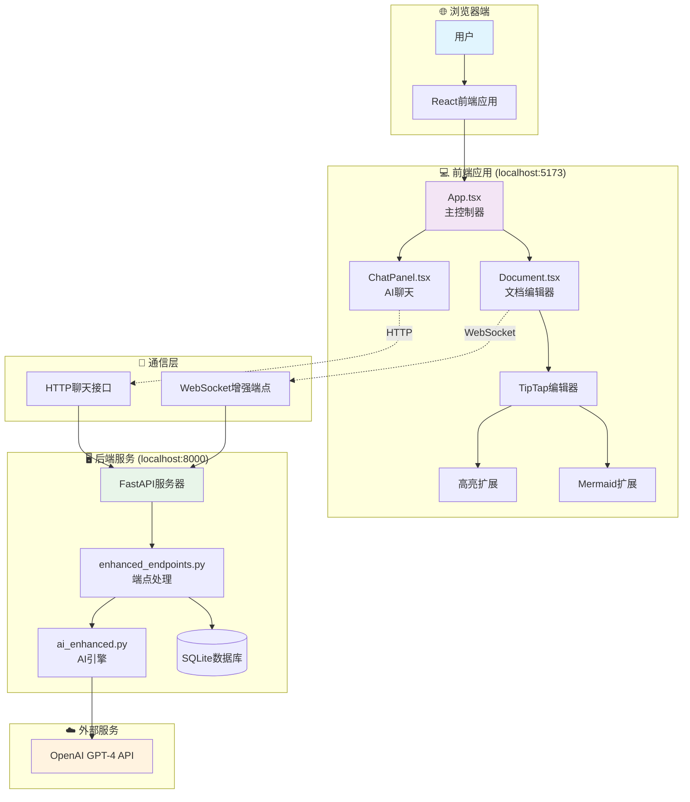
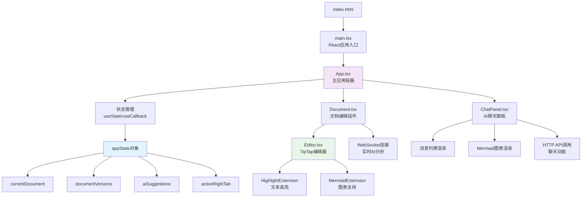
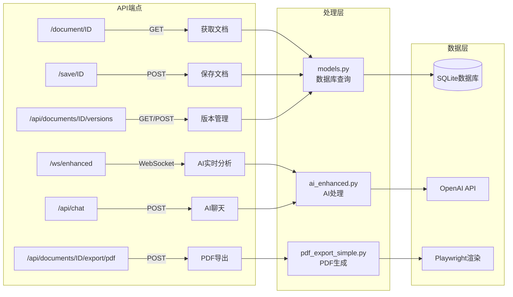
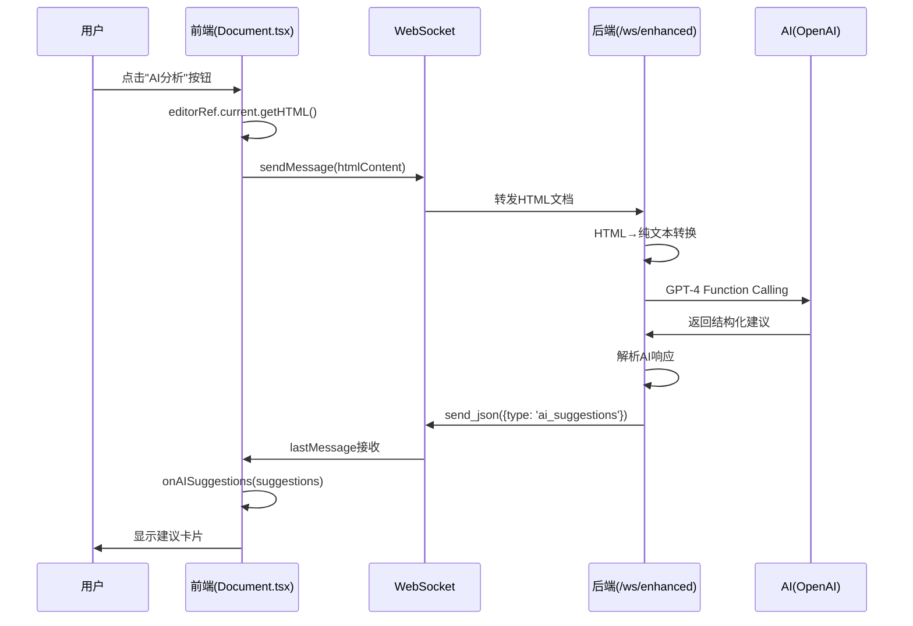
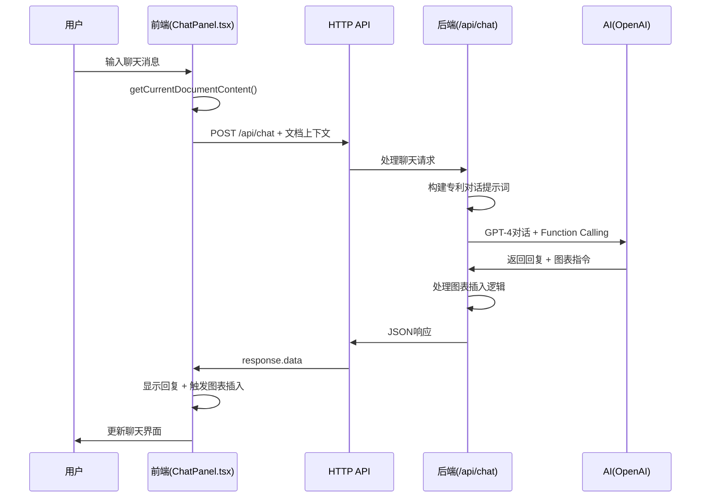

# 专利审查系统 - 详细技术架构文档

## 目录

1. [项目概述](#项目概述)
2. [项目文件结构](#项目文件结构)
3. [系统架构图](#系统架构图)
4. [前端架构详解](#前端架构详解)
5. [后端架构详解](#后端架构详解)
6. [前后端通信机制](#前后端通信机制)
7. [核心功能数据流程](#核心功能数据流程)
8. [给新手的简单解释](#给新手的简单解释)

---

## 项目概述

这是一个基于AI的专利文档审查系统，帮助用户撰写和完善专利申请。系统主要功能包括：

- 📝 **富文本编辑**：支持专业的文档编辑功能
- 🤖 **AI智能分析**：实时分析文档并提供改进建议
- 💬 **AI聊天助手**：回答专利相关问题
- 📊 **智能图表生成**：自动生成并插入技术图表
- 📚 **版本管理**：保存和管理文档的多个版本
- 📄 **PDF导出**：生成专业的PDF文档

---

## 项目文件结构

### 🎨 前端文件结构（client文件夹）

```
client/
├── src/                        # 源代码目录
│   ├── main.tsx               # ⭐ 应用程序入口文件
│   ├── App.tsx                # 🏠 主应用组件（管理整个应用状态）
│   ├── Document.tsx           # 📝 文档编辑组件（处理WebSocket通信）
│   ├── ChatPanel.tsx          # 💬 AI聊天面板组件
│   ├── internal/              # 内部组件目录
│   │   ├── Editor.tsx         # ✏️ TipTap富文本编辑器封装
│   │   ├── HighlightExtension.tsx  # 🖍️ 文本高亮功能扩展
│   │   ├── MermaidExtension.tsx    # 📊 图表渲染功能扩展
│   │   └── LoadingOverlay.tsx      # ⏳ 加载动画组件
│   └── assets/                # 静态资源（图片、样式等）
├── package.json               # 📦 前端依赖配置
├── tsconfig.json             # ⚙️ TypeScript配置
├── vite.config.ts            # 🚀 Vite构建工具配置
└── .env                      # 🔐 环境变量配置
```

### 🔧 后端文件结构（server文件夹）

```
server/
├── app/                       # 应用主目录
│   ├── __main__.py           # ⭐ FastAPI应用入口
│   ├── models.py             # 📊 数据库模型定义
│   ├── schemas.py            # 📋 数据验证模型
│   ├── enhanced_endpoints.py # 🚀 增强功能API端点
│   ├── internal/             # 内部模块目录
│   │   ├── ai_enhanced.py    # 🤖 AI处理核心引擎
│   │   ├── patent_chat_prompt.py  # 💭 专利AI提示词
│   │   ├── text_utils.py     # 🔤 文本处理工具
│   │   ├── prompt_enhanced.py     # 📝 增强提示词定义
│   │   ├── mermaid_render.py      # 📊 图表渲染服务
│   │   ├── pdf_export_simple.py   # 📄 PDF导出功能
│   │   └── db.py             # 🗄️ 数据库连接配置
│   └── static/               # 静态文件目录
│       └── exports/          # PDF导出文件存储
├── requirements.txt          # 📦 Python依赖列表
└── .env                     # 🔐 环境变量（API密钥等）
```

### ⚙️ 配置文件说明

1. **package.json** (前端)
   - 定义项目依赖包（React、TypeScript等）
   - 配置运行脚本（npm run dev、npm run build）

2. **requirements.txt** (后端)
   - Python依赖包列表（FastAPI、SQLAlchemy等）

3. **.env文件** (环境配置)
   ```bash
   # 后端配置
   OPENAI_API_KEY=your_api_key_here
   OPENAI_MODEL=gpt-4o
   
   # 前端配置
   VITE_USE_ENHANCED_WS=true
   ```

---

## 系统架构图

### 🏗️ 整体系统架构



### 🔄 前端组件层级关系



### 🔧 后端API架构



---

## 前端架构详解

### 🏠 App.tsx - 应用主控制器

**作用**：整个应用的中央控制器，管理全局状态和组件协调

```typescript
// 主要状态定义
interface AppState {
  currentDocument: Document | null;      // 当前文档
  documentVersions: DocumentVersion[];   // 版本列表
  aiSuggestions: AISuggestion[];        // AI建议
  isAIProcessing: boolean;              // AI处理状态
  hasUnsavedChanges: boolean;           // 未保存标记
  activeRightTab: 'suggestions' | 'chat'; // 右侧标签
}

// 关键功能
1. 状态管理：使用useState管理应用状态
2. 回调函数：提供给子组件的功能函数
3. 布局管理：三栏布局（版本列表、编辑器、AI面板）
4. 数据协调：协调各组件间的数据流动
```

### 📝 Document.tsx - 文档编辑组件

**作用**：处理文档编辑和WebSocket通信

```typescript
// WebSocket连接管理
const SOCKET_URL = "ws://localhost:8000/ws/enhanced";

// 核心功能
1. WebSocket通信：与后端实时通信
2. AI分析触发：手动触发文档分析
3. 消息处理：处理AI建议和图表插入
4. 编辑器管理：管理TipTap编辑器实例

// 重要回调
- onAISuggestions: 传递AI建议到App
- onDiagramInsertions: 处理图表插入
- onProcessingStatus: 更新处理状态
```

### 💬 ChatPanel.tsx - AI聊天组件

**作用**：提供与AI的对话界面

```typescript
// HTTP API调用
const BACKEND_URL = "http://localhost:8000";

// 核心功能
1. 消息管理：维护聊天历史
2. API通信：发送聊天请求
3. Markdown渲染：支持富文本显示
4. 图表渲染：在聊天中显示Mermaid图表

// 关键特性
- 包含当前文档内容作为上下文
- 支持图表生成和插入请求
- 实时显示AI响应
```

### 🎨 自定义扩展详解

#### HighlightExtension.tsx - 文本高亮扩展

```typescript
// 核心功能
export function findTextInDocument(doc, searchText) {
  // 在文档中精确查找文本位置
}

export function replaceText(editor, searchText, replaceWith) {
  // 替换指定文本
}

// 用途
- AI建议的文本定位
- 临时高亮显示
- 文本替换操作
```

#### MermaidExtension.tsx - 图表扩展

```typescript
// 核心组件
function MermaidNodeView({ node }) {
  // 渲染Mermaid图表为SVG
}

// 核心功能
export function insertDiagramAfterText(editor, searchText, mermaidSyntax, title) {
  // 在指定文本后插入图表
}

// 特性
- 支持多种图表类型
- 实时预览
- 精确定位插入
```

---

## 后端架构详解

### 🚀 enhanced_endpoints.py - API端点处理

**作用**：处理WebSocket和HTTP请求

```python
# WebSocket端点 - AI文档分析
async def websocket_enhanced_endpoint(websocket: WebSocket):
    """
    1. 接收HTML文档内容
    2. 转换为纯文本
    3. 调用AI分析
    4. 返回建议和图表插入
    """
    
# HTTP端点 - AI聊天
async def chat_with_ai(request: ChatRequest):
    """
    1. 接收聊天消息和文档内容
    2. 构建带上下文的提示
    3. 调用AI生成响应
    4. 返回聊天回复和图表插入
    """
```

### 🤖 ai_enhanced.py - AI处理引擎

**作用**：集成OpenAI API，处理所有AI相关功能

```python
class AIEnhanced:
    # 文档分析 - 使用Function Calling
    async def review_document_with_functions(self, document: str):
        """
        使用GPT-4分析文档，返回：
        - 结构问题
        - 标点错误
        - 术语建议
        - 改进建议
        """
    
    # 聊天功能 - 带文档上下文
    async def chat_with_document_context(self, messages, document_content):
        """
        基于当前文档内容进行对话
        支持图表生成和插入
        """
```

### 📊 models.py - 数据库模型

```python
# 文档表
class Document(Base):
    id = Column(Integer, primary_key=True)
    title = Column(String)
    current_version_id = Column(Integer)
    created_at = Column(DateTime)
    
# 版本表
class DocumentVersion(Base):
    id = Column(Integer, primary_key=True)
    document_id = Column(Integer, ForeignKey("documents.id"))
    version_number = Column(String)  # v1.0, v2.0等
    content = Column(Text)
    created_at = Column(DateTime)
```

---

## 前后端通信机制

这个项目使用**混合通信架构**，结合HTTP和WebSocket两种协议，针对不同场景选择最合适的通信方式。

### 🌐 通信架构总览

系统采用三种主要通信模式：

1. **HTTP通信** - 用于数据CRUD操作（文档管理、版本控制）
2. **WebSocket通信** - 用于实时AI文档分析
3. **聊天HTTP通信** - 用于AI对话和图表生成

### 📡 1. HTTP通信详解（数据操作）

#### **前端HTTP请求代码** - `client/src/App.tsx`

**📝 保存文档**
```typescript
// client/src/App.tsx:219-221
const saveDocument = async () => {
  setAppState(prev => ({ ...prev, isLoading: true }));
  try {
    await axios.post(`${BACKEND_URL}/save/${documentNumber}`, {
      content: currentDocumentContent,
    });
    console.log('✅ Document saved successfully');
    setAppState(prev => ({ ...prev, hasUnsavedChanges: false }));
  } catch (error) {
    console.error('❌ Failed to save document:', error);
  } finally {
    setAppState(prev => ({ ...prev, isLoading: false }));
  }
};
```

**📄 获取文档列表**
```typescript
// client/src/App.tsx:159-165
const loadDocumentsList = async () => {
  try {
    const response = await axios.get(`${BACKEND_URL}/api/documents`);
    setAppState(prev => ({ 
      ...prev, 
      availableDocuments: response.data,
      isLoading: false 
    }));
  } catch (error) {
    console.error('❌ Failed to load documents:', error);
  }
};
```

**🔄 版本管理操作**
```typescript
// 创建新版本 - client/src/App.tsx:252
await axios.post(`${BACKEND_URL}/api/documents/${documentId}/versions`, {});

// 切换版本 - client/src/App.tsx:272-274
await axios.post(`${BACKEND_URL}/api/documents/${documentId}/switch-version`, {
  version_number: versionNumber,
});

// 删除版本 - client/src/App.tsx:337
await axios.delete(`${BACKEND_URL}/api/documents/${documentId}/versions/${versionNumber}`);
```

#### **后端HTTP处理代码** - `server/app/__main__.py`

**📄 获取文档API**
```python
# server/app/__main__.py:137-160
@app.get("/document/{document_id}")
def get_document(
    document_id: int, db: Session = Depends(get_db)
) -> schemas.DocumentWithCurrentVersion:
    """获取文档和当前版本内容"""
    # 查询文档
    document = db.query(models.Document).filter(models.Document.id == document_id).first()
    if not document:
        raise HTTPException(status_code=404, detail="Document not found")
    
    # 获取当前活跃版本
    current_version = db.query(models.DocumentVersion)\
        .filter(models.DocumentVersion.document_id == document_id, 
                models.DocumentVersion.is_active == True).first()
    
    if not current_version:
        raise HTTPException(status_code=404, detail="No active version found")
    
    return schemas.DocumentWithCurrentVersion(
        id=document.id,
        title=document.title,
        content=current_version.content,
        version_number=current_version.version_number,
        last_modified=current_version.created_at.isoformat()
    )
```

**💾 保存文档API**
```python
# server/app/__main__.py:200-220
@app.post("/save/{document_id}")
def save_document(
    document_id: int, 
    request: schemas.SaveDocumentRequest, 
    db: Session = Depends(get_db)
):
    """保存文档内容到当前活跃版本"""
    current_version = db.query(models.DocumentVersion)\
        .filter(models.DocumentVersion.document_id == document_id,
                models.DocumentVersion.is_active == True).first()
    
    if not current_version:
        raise HTTPException(status_code=404, detail="No active version found")
    
    # 更新内容
    current_version.content = request.content
    current_version.created_at = datetime.utcnow()
    
    db.commit()
    return {"message": "Document saved successfully"}
```

### 🔌 2. WebSocket通信详解（实时AI分析）

#### **前端WebSocket连接** - `client/src/Document.tsx`

**🔗 建立WebSocket连接**
```typescript
// client/src/Document.tsx:47-50
const SOCKET_URL = import.meta.env.VITE_USE_ENHANCED_WS === 'true' 
  ? "ws://localhost:8000/ws/enhanced"  // 增强版，支持Function Calling
  : "ws://localhost:8000/ws";          // 基础版

// client/src/Document.tsx:66-81
const { sendMessage, lastMessage, readyState } = useWebSocket(SOCKET_URL, {
  onOpen: () => {
    console.log("🔌 WebSocket Connected to:", SOCKET_URL);
    onProcessingStatus?.(false, "AI assistant connected");
  },
  onClose: () => {
    console.log("🔌 WebSocket Disconnected");
    onProcessingStatus?.(false, "AI assistant disconnected");
  },
  shouldReconnect: (_closeEvent) => true,  // 自动重连
  reconnectAttempts: 10,
  reconnectInterval: 3000,
  share: true  // 共享连接，避免重复连接
});
```

**📤 发送AI分析请求**
```typescript
// client/src/Document.tsx:166-199
const triggerManualAnalysis = useCallback(() => {
  console.log("🔍 Triggering AI analysis, WebSocket state:", readyState);
  
  // Get latest content from editor or fallback to props
  const currentContent = editorRef?.current?.getHTML() || content;
  
  // Check WebSocket connection state
  if (readyState === ReadyState.CLOSED || readyState === ReadyState.CLOSING) {
    onProcessingStatus?.(false, "AI assistant connection lost, please refresh page");
    return;
  }
  
  // Check if AI is already processing
  if (isAIProcessing) {
    onProcessingStatus?.(false, "AI is analysing, please wait...");
    return;
  }
  
  // Check content validity
  if (!currentContent.trim()) {
    onProcessingStatus?.(false, "Document content is empty");
    return;
  }
  
  // Send analysis request
  try {
    onProcessingStatus?.(true, "Sending analysis request...");
    sendMessage(currentContent);
    onProcessingStatus?.(true, "AI is analysing document...");
    
  } catch (error) {
    console.error("❌ Failed to send AI analysis request:", error);
    onProcessingStatus?.(false, `Request failed: ${error instanceof Error ? error.message : 'Unknown error'}`);
  }
}, [isAIProcessing, sendMessage, onProcessingStatus, readyState]);
```

**📥 接收AI响应**
```typescript
// client/src/Document.tsx:86-163
useEffect(() => {
  if (lastMessage !== null) {
    try {
      // 解析WebSocket消息
      const message: WebSocketMessage = JSON.parse(lastMessage.data);
      console.log("📨 Received AI message:", message);
      
      // 根据消息类型处理
      switch (message.type) {
        case 'ai_suggestions':
          if (message.data?.issues) {
            console.log("📋 Received AI suggestions:", message.data.issues.length, "suggestions");
            onAISuggestions?.(message.data.issues);
          }
          onProcessingStatus?.(false, "AI analysis completed");
          break;
          
        case 'processing_start':
          console.log("⏳ AI processing started");
          onProcessingStatus?.(true, "AI analyzing document...");
          break;
          
        case 'validation_error':
          console.warn("⚠️ Document validation error:", message.message);
          onProcessingStatus?.(false, `Document validation failed: ${message.message}`);
          break;
          
        case 'ai_error':
          console.error("❌ AI analysis error:", message.message);
          onProcessingStatus?.(false, `AI analysis failed: ${message.message}`);
          break;
          
        case 'connection_success':
          console.log("✅ AI service connected successfully:", message.message);
          onProcessingStatus?.(false, message.message || "AI service ready");
          break;
      }
    } catch (error) {
      console.error("❌ Failed to parse WebSocket message:", error, lastMessage.data);
    }
  }
}, [lastMessage, onAISuggestions, onProcessingStatus]);
```

#### **后端WebSocket处理** - `server/app/__main__.py`

**🔌 WebSocket端点实现**
```python
# server/app/__main__.py:580-620
@app.websocket("/ws/enhanced")
async def websocket_enhanced_endpoint(websocket: WebSocket):
    """增强版WebSocket端点 - 支持OpenAI Function Calling"""
    await websocket.accept()
    
    # 发送连接成功消息
    await websocket.send_json({
        "type": "connection_success",
        "message": "Enhanced AI assistant connected successfully"
    })
    
    try:
        while True:
            # 接收HTML文档内容
            html_content = await websocket.receive_text()
            
            # 发送处理开始消息
            await websocket.send_json({
                "type": "processing_start",
                "message": "AI开始分析文档..."
            })
            
            # 内容验证
            if not html_content or len(html_content.strip()) < 10:
                await websocket.send_json({
                    "type": "validation_error",
                    "message": "文档内容太短，无法进行有效分析"
                })
                continue
            
            # 调用增强AI分析
            ai_enhanced = AIEnhanced()
            suggestions = await ai_enhanced.review_document_with_functions(html_content)
            
            # 发送AI建议
            await websocket.send_json({
                "type": "ai_suggestions",
                "data": {"issues": suggestions}
            })
            
    except WebSocketDisconnect:
        print("🔌 WebSocket client disconnected")
    except Exception as e:
        print(f"❌ WebSocket error: {e}")
        await websocket.send_json({
            "type": "ai_error", 
            "message": f"AI分析失败: {str(e)}"
        })
```

### 💬 3. 聊天HTTP通信详解（AI对话）

#### **前端聊天请求** - `client/src/ChatPanel.tsx`

**📤 发送聊天消息**
```typescript
// client/src/ChatPanel.tsx:158-230
const sendMessage = async () => {
  if (!inputMessage.trim() || isLoading) return;

  const userMessage: ChatMessage = {
    role: "user",
    content: inputMessage,
    timestamp: new Date()
  };

  // 添加用户消息到界面
  setMessages(prev => [...prev, userMessage]);
  setInputMessage("");
  setIsLoading(true);

  try {
    // 构建消息历史
    const messageHistory = [...messages, userMessage];

    // 获取当前文档内容作为上下文
    const currentDocumentContent = getCurrentDocumentContent ? getCurrentDocumentContent() : "";
    console.log("📄 Sending document context length:", currentDocumentContent.length);

    // 发送HTTP请求到聊天API
    const response = await axios.post("http://localhost:8000/api/chat", {
      messages: messageHistory.map(({ role, content }) => ({ role, content })),
      current_document_content: currentDocumentContent  // 关键：文档上下文
    });

    // 添加AI回复到界面
    const assistantMessage: ChatMessage = {
      role: "assistant",
      content: response.data.response,
      timestamp: new Date()
    };

    setMessages(prev => [...prev, assistantMessage]);

    // 处理图表插入指令
    if (response.data.diagram_insertions && response.data.diagram_insertions.length > 0) {
      console.log("📊 Chat received diagram insertion request:", response.data.diagram_insertions);
      if (onDiagramInsertions) {
        console.log("📊 Calling diagram insertion callback...");
        onDiagramInsertions(response.data.diagram_insertions);
      }
    }
  } catch (error) {
    console.error("❌ Chat error:", error);
    // 添加错误消息
    const errorMessage: ChatMessage = {
      role: "assistant",
      content: "Sorry, an error occurred. Please try again later.",
      timestamp: new Date()
    };
    setMessages(prev => [...prev, errorMessage]);
  } finally {
    setIsLoading(false);
  }
};
```

#### **后端聊天处理** - `server/app/enhanced_endpoints.py`

**🤖 聊天API端点**
```python
# server/app/enhanced_endpoints.py:127-150
@app.post("/api/chat")
async def chat_with_ai(request: ChatRequest):
    """AI聊天接口，支持文档上下文和图表生成"""
    try:
        logger.info(f"Chat request with {len(request.messages)} messages")
        logger.info(f"Document context length: {len(request.current_document_content)}")
        
        # 初始化AI引擎
        ai_enhanced = AIEnhanced()
        
        # 调用带文档上下文的聊天
        chat_response = await ai_enhanced.chat_with_document_context(
            messages=request.messages,
            document_content=request.current_document_content  # 传递文档上下文
        )
        
        return {
            "response": chat_response.get("response", ""),
            "diagram_insertions": chat_response.get("diagram_insertions", [])
        }
    except Exception as e:
        logger.error(f"Chat error: {e}")
        raise HTTPException(status_code=500, detail=str(e))
```

### 🔄 通信流程时序图

#### **WebSocket实时AI分析流程**



#### **HTTP聊天通信流程**



### 📊 通信模式对比

| 通信方式 | 用途 | 优势 | 代码位置 |
|---------|------|------|----------|
| **HTTP请求** | 数据CRUD、版本管理 | 可靠、简单、缓存友好 | `App.tsx:axios.*`, `__main__.py:@app.*` |
| **WebSocket** | 实时AI分析 | 双向通信、低延迟、实时反馈 | `Document.tsx:useWebSocket`, `__main__.py:@app.websocket` |
| **聊天HTTP** | AI对话、图表生成 | 上下文感知、功能丰富 | `ChatPanel.tsx:sendMessage`, `enhanced_endpoints.py:chat_with_ai` |

### 🎯 通信架构优势

1. **HTTP + WebSocket混合**：充分发挥各自优势
2. **上下文传递**：聊天时包含文档内容，AI理解更准确
3. **实时反馈**：WebSocket提供即时的AI分析状态
4. **错误处理**：完善的连接状态检查和错误恢复
5. **性能优化**：WebSocket连接共享，避免重复建连

---

## 功能流程实现代码精讲

## 给新手的简单解释

### 🤔 什么是组件？

组件就像乐高积木，每个组件负责一个特定功能：
- **App.tsx**：总指挥，管理所有其他组件
- **Document.tsx**：负责文档编辑功能
- **ChatPanel.tsx**：负责聊天功能
- **Editor.tsx**：提供文字编辑器

组件可以互相配合，组成完整的应用。

### 🤔 什么是API？

API（应用程序接口）就像餐厅的服务员：
- 前端（顾客）告诉API需要什么
- API去后厨（后端）获取数据
- API把结果送回给前端

例如：
```
前端："我要保存文档"
API："收到，我去告诉后端"
后端："保存完成"
API："告诉前端保存成功"
```

### 🤔 什么是WebSocket？

WebSocket就像电话连接：
- HTTP像发短信（一问一答）
- WebSocket像打电话（保持连接，实时对话）

用途：
- AI实时分析文档时使用WebSocket
- 可以持续接收分析结果

### 🤔 前端和后端如何分工？

**前端负责**（用户能看到的）：
- 显示界面
- 接收用户操作
- 展示数据
- 美化样式

**后端负责**（用户看不到的）：
- 存储数据
- 处理业务逻辑
- 调用AI服务
- 安全验证

### 🔄 完整的工作流程示例

以"AI分析文档"为例：

1. **用户操作**：点击"AI分析"按钮
2. **前端处理**：
   - Document.tsx获取编辑器内容
   - 通过WebSocket发送给后端
3. **后端处理**：
   - enhanced_endpoints.py接收内容
   - text_utils.py转换HTML为纯文本
   - ai_enhanced.py调用OpenAI API
4. **AI处理**：
   - GPT-4分析文档
   - 生成改进建议
5. **返回结果**：
   - 后端整理AI响应
   - 通过WebSocket发回前端
6. **前端显示**：
   - App.tsx更新建议列表
   - 用户看到建议卡片

### 📚 学习建议

1. **先理解整体**：看懂系统架构图
2. **跟踪一个功能**：选一个功能，从用户点击到最终显示，理解完整流程
3. **动手调试**：在代码中加console.log，观察数据流动
4. **逐步深入**：先理解主要组件，再研究细节实现

---

## 系统可扩展性与高并发处理

### 🎯 当前架构特点

系统采用"单体应用"模式：
- **前端**：单个React应用实例
- **后端**：单个FastAPI服务器
- **数据库**：SQLite（文件型数据库）
- **AI服务**：直接调用OpenAI API

### 📊 高并发技术方案

#### 1. **水平扩展架构**
```
当前：用户 → 单服务器 → SQLite
目标：用户 → 负载均衡 → 服务器集群 → PostgreSQL集群
```

#### 2. **异步处理优化**
```python
# 当前：同步阻塞
result = await openai_api_call()  # 等待5-10秒

# 优化：异步队列
task_id = queue.put(document)  # 立即返回
return {"task_id": task_id, "status": "processing"}
```

### ✅ 已实现的优化

1. **WebSocket连接复用**：`share: true`避免重复连接
2. **异步处理框架**：FastAPI原生支持async/await
3. **流式AI响应**：避免长时间阻塞

### ❌ 待优化项目

1. **数据库瓶颈**
   - SQLite不支持真正的并发写入
   - 需迁移到PostgreSQL/MySQL

2. **缺少缓存层**
   ```python
   # 建议添加Redis缓存
   @cache_result(expire=3600)
   async def get_ai_suggestions(content_hash):
       return await ai.analyze(content)
   ```

3. **无负载均衡**
   ```yaml
   # docker-compose扩展
   services:
     nginx:  # 负载均衡器
     backend-1:  # 多实例
     backend-2:
     redis:  # 缓存层
   ```

### 🚀 优化路线图

#### **第一阶段**（立即可做）
- 添加Redis缓存AI结果
- 实现API请求限流
- 数据库连接池优化

#### **第二阶段**（1-2个月）
- SQLite迁移到PostgreSQL
- Docker容器化部署
- 添加Nginx负载均衡

#### **第三阶段**（3-6个月）
- 引入消息队列（RabbitMQ/Kafka）
- 实现微服务拆分
- Kubernetes容器编排

### 💡 关键优化代码示例

```python
# 1. 连接池管理
class WebSocketManager:
    def __init__(self):
        self.connections = {}
        self.max_connections = 1000
    
    async def connect(self, ws):
        if len(self.connections) >= self.max_connections:
            await ws.close(reason="Server at capacity")

# 2. AI请求队列
from asyncio import Queue
ai_queue = Queue(maxsize=50)

# 3. 结果缓存
import redis
cache = redis.Redis()

async def get_cached_suggestions(doc_hash):
    cached = cache.get(f"suggestions:{doc_hash}")
    if cached:
        return json.loads(cached)
```

### 📈 性能提升预期

- **当前**：支持 ~100 并发用户
- **优化后**：支持 10,000+ 并发用户
- **响应时间**：从5-10秒降至亚秒级（缓存命中时）

---

## 总结

这个系统采用现代化的前后端分离架构：
- **前端**使用React构建交互界面
- **后端**使用FastAPI提供API服务
- **通信**使用WebSocket和HTTP
- **AI**集成OpenAI GPT-4
- **数据库**使用SQLite存储

通过模块化设计，各个组件职责清晰，便于理解和维护。系统的核心价值在于将AI能力无缝集成到文档编辑流程中，为专利撰写提供智能辅助。虽然当前架构适合中小规模使用，但通过上述优化方案，完全可以扩展到企业级高并发场景。