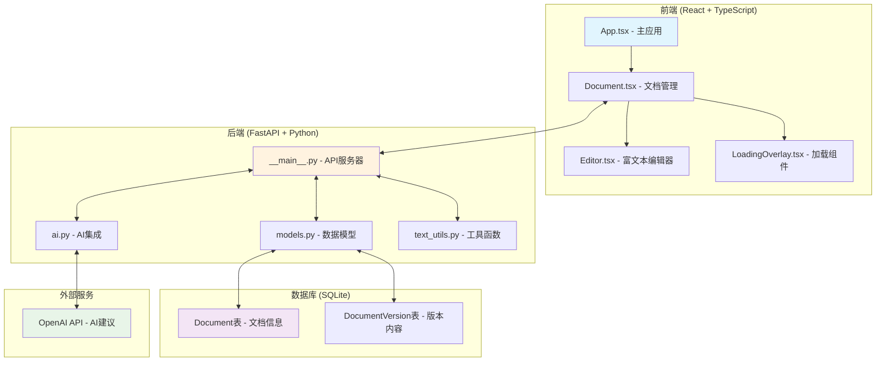
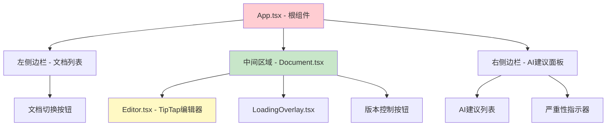
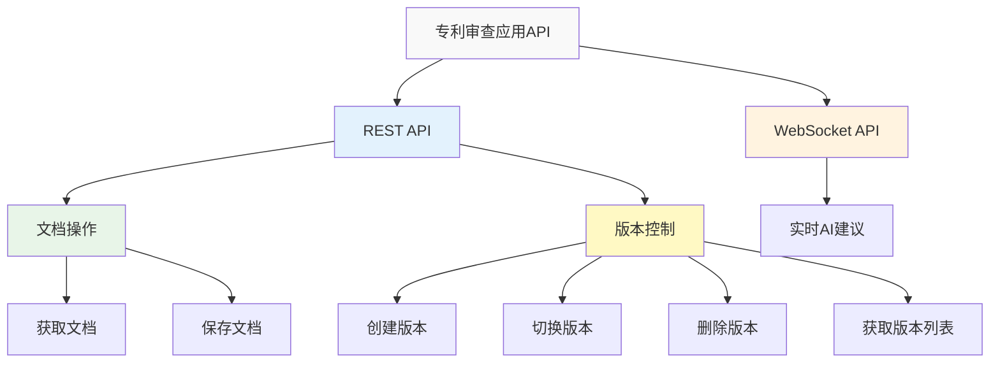
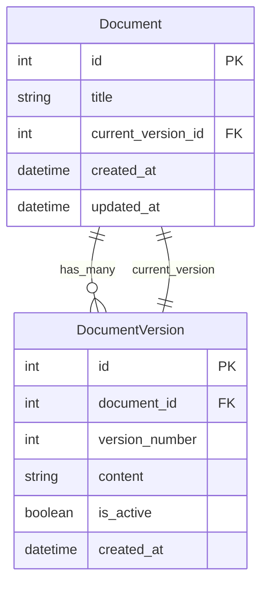
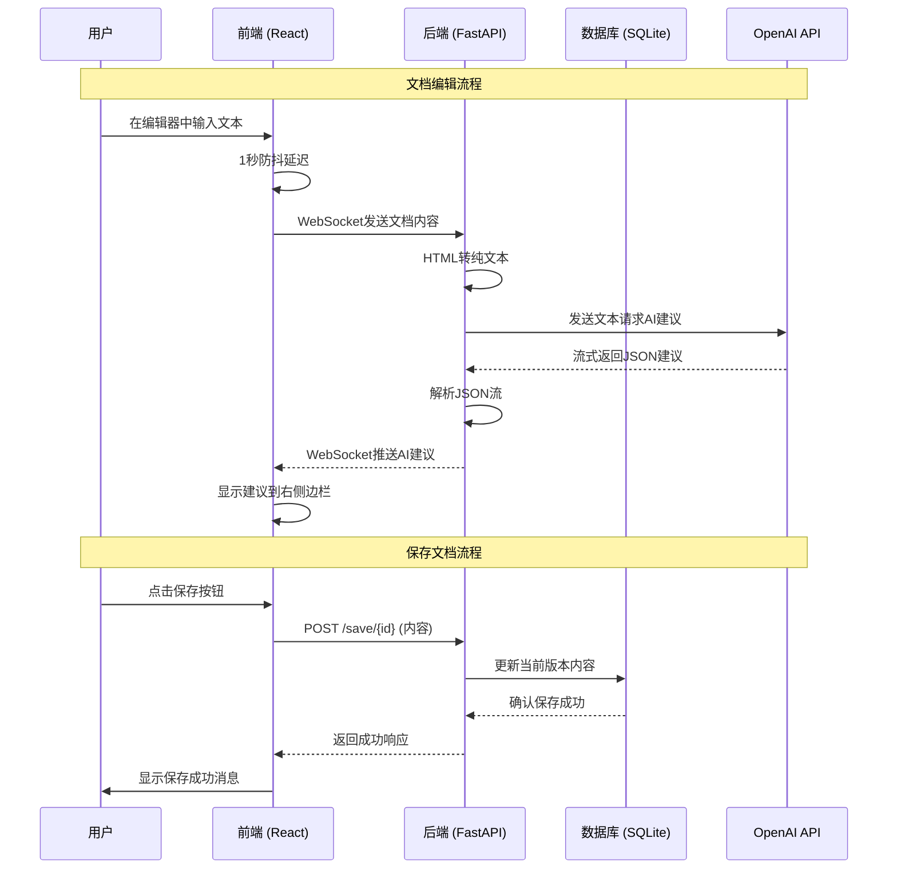
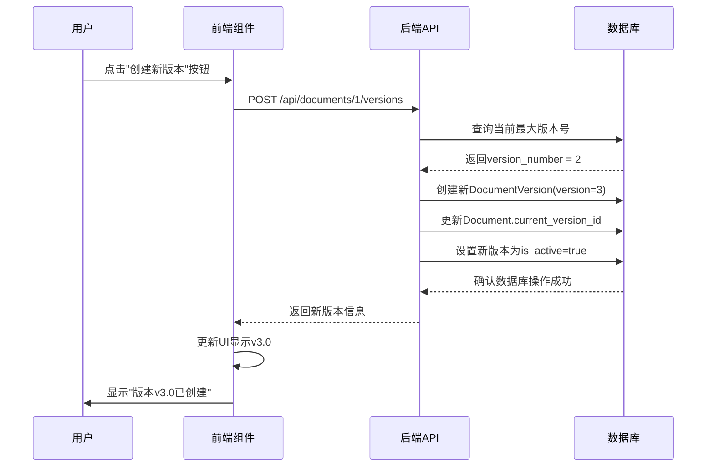

# 专利审查应用 - 系统设计文档

这是一个完整的专利审查应用，帮助用户编辑和审查专利文档，支持版本控制和AI实时建议功能。

## 1. 项目结构分析

### 🎨 前端文件夹结构 (client/)

```
client/
├── src/
│   ├── App.tsx              # 主应用组件 - 整个应用的入口和布局
│   ├── Document.tsx         # 文档组件 - 处理文档编辑和WebSocket通信
│   ├── main.tsx            # React应用启动文件
│   ├── index.css           # 全局样式
│   ├── internal/           # 内部组件文件夹
│   │   ├── Editor.tsx      # 富文本编辑器组件 (TipTap)
│   │   └── LoadingOverlay.tsx  # 加载动画组件 保存文档，加载文档时全屏半透明白色遮罩，中间旋转圆圈
│   └── assets/             # 静态资源
│       └── logo.png
├── package.json            # 项目依赖和脚本配置
├── tsconfig.json          # TypeScript配置
├── vite.config.ts         # Vite构建工具配置
└── Dockerfile             # Docker容器配置
```

**关键前端文件说明：**
- **App.tsx**: 应用的主界面，包含三栏布局（文档列表、编辑器、AI建议）
- **Document.tsx**: 负责文档的显示、编辑和实时AI通信
- **Editor.tsx**: 基于TipTap的富文本编辑器
- **LoadingOverlay.tsx**: 显示加载状态的组件

### 🚀 后端文件夹结构 (server/)

```
server/
├── app/
│   ├── __main__.py         # FastAPI主应用 - API路由和WebSocket端点
│   ├── models.py           # 数据库模型定义 (Document, DocumentVersion)
│   ├── schemas.py          # API请求/响应的数据结构定义
│   └── internal/           # 内部工具模块
│       ├── ai.py           # OpenAI集成和AI建议生成
│       ├── db.py           # 数据库连接和会话管理
│       ├── data.py         # 种子数据 (初始文档内容)
│       ├── prompt.py       # AI提示模板
│       └── text_utils.py   # HTML转文本工具和JSON解析
├── requirements.txt        # Python依赖包列表
└── Dockerfile             # Docker容器配置
```

**关键后端文件说明：**
- **__main__.py**: FastAPI应用，定义所有API端点和WebSocket连接
- **models.py**: 数据库表结构，包含Document和DocumentVersion两个模型
- **ai.py**: 与OpenAI API交互，生成专利审查建议
- **text_utils.py**: 处理HTML到纯文本的转换，解析AI返回的JSON

### 📋 配置文件的作用

```
项目根目录/
├── docker-compose.yml      # Docker编排文件 - 同时运行前后端服务
├── server/.env             # 后端环境变量 (OpenAI API密钥)
├── client/package.json     # 前端依赖管理和构建脚本
└── server/requirements.txt # 后端Python依赖包
```

## 2. 系统架构图

### 整体系统架构



### React组件层级关系



### API端点组织

#### REST API 端点
| 方法 | 端点 | 功能描述 |
|------|------|----------|
| GET | `/document/{id}` | 获取指定文档的内容 |
| POST | `/save/{id}` | 保存文档的修改 |
| GET | `/api/documents/{id}` | 获取文档及其所有版本信息 |
| POST | `/api/documents/{id}/versions` | 为文档创建新版本 |
| POST | `/api/documents/{id}/switch-version` | 切换到指定版本 |
| DELETE | `/api/documents/{id}/versions/{version}` | 删除指定版本 |

#### WebSocket 端点
| 类型 | 端点 | 功能描述 |
|------|------|----------|
| WebSocket | `/ws` | 实时AI建议流式传输 |

#### API分类说明



### 数据库关系图



## 3. 数据流程详解

### 用户操作时的数据流动



### 版本控制流程示例

让我用"创建新版本"功能举例说明完整的数据流程：



## 4. 核心概念简单解释

### 🧩 什么是组件，它们如何工作

**组件就像乐高积木**：
- **组件**是可重复使用的代码片段，每个组件负责界面的一个部分
- **例子**：Editor.tsx是一个编辑器组件，App.tsx把多个小组件组合成完整应用
- **工作原理**：组件接收数据（props），渲染界面，响应用户操作

```typescript
// 简单的组件示例
function Editor({ content, onChange }) {
  return (
    <div>
      <textarea 
        value={content} 
        onChange={onChange}  // 用户输入时调用父组件函数
      />
    </div>
  );
}
```

### 🔌 什么是API，为什么需要它

**API就像餐厅的服务员**：
- **API**是前端和后端之间沟通的桥梁
- **例子**：前端要保存文档时，调用`POST /save/1`这个API端点
- **为什么需要**：前端负责界面，后端负责数据处理，API让它们能够交流

```
前端: "请保存这篇文档" 
  ↓ (HTTP请求)
API: "收到，我来处理"
  ↓ (调用后端逻辑)
后端: "已保存到数据库"
  ↓ (HTTP响应)  
前端: "收到确认，显示成功消息"
```

### 🤝 前端和后端如何分工合作

**就像一家餐厅的分工**：

**前端 (React)** = **餐厅前台**
- 负责用户能看到和操作的所有界面
- 处理用户点击、输入等操作
- 美化界面，提供良好的用户体验
- 发送请求给后端获取数据

**后端 (FastAPI)** = **餐厅后厨**
- 处理业务逻辑（如版本控制、AI建议）
- 管理数据库操作
- 与外部服务（OpenAI）通信
- 确保数据安全和正确性

**合作流程**：
1. 用户在前端操作 → 前端发送请求给后端
2. 后端处理逻辑和数据 → 返回结果给前端  
3. 前端接收数据 → 更新界面显示给用户

### 🔄 WebSocket实时通信

**WebSocket就像电话通话**：
- **普通API**像发短信：一问一答，不连续
- **WebSocket**像打电话：保持连接，实时对话
- **应用示例**：用户输入文档内容时，AI实时返回建议，不需要刷新页面

## 5. 技术栈总结

### 前端技术栈
- **React 18**: JavaScript界面框架
- **TypeScript**: 提供类型安全的JavaScript
- **TipTap**: 富文本编辑器
- **TanStack Query**: 数据获取和缓存
- **Tailwind CSS**: 样式框架
- **Vite**: 快速构建工具

### 后端技术栈  
- **FastAPI**: Python Web框架
- **SQLAlchemy**: 数据库ORM（对象关系映射）
- **SQLite**: 轻量级数据库
- **OpenAI SDK**: AI服务集成
- **WebSockets**: 实时通信协议
- **BeautifulSoup4**: HTML文本处理

### 开发工具
- **Docker**: 容器化部署
- **ESLint**: 代码质量检查
- **TypeScript编译器**: 类型检查

---

*这个系统设计采用了现代的前后端分离架构，通过REST API和WebSocket实现高效的数据交互，为用户提供流畅的专利文档编辑和AI辅助审查体验。*